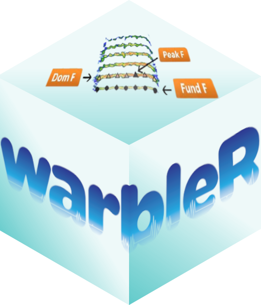

<!-- README.md is generated from README.Rmd. Please edit that file -->

<!-- badges: start -->
[](https://lifecycle.r-lib.org/articles/stages.html)
[](https://cran.r-project.org/package=warbleR)
[](https://www.repostatus.org/#active)
[](https://www.gnu.org/licenses/gpl-3.0.en.html)
[](https://cran.r-project.org/package=warbleR)
[](https://cranlogs.r-pkg.org/badges/grand-total/warbleR)
[](https://app.codecov.io/gh/maRce10/warbleR?branch=master)
[](https://github.com/maRce10/baRulho/actions/workflows/R-CMD-check.yaml)
<!-- badges: end -->




[warbleR](https://cran.r-project.org/package=warbleR) is intended to facilitate the analysis of the structure of animal acoustic signals in R. Users can collect open-access avian recordings or enter their own data into a workflow that facilitates spectrographic visualization and measurement of acoustic parameters. [warbleR](https://cran.r-project.org/package=warbleR) makes use of the fundamental sound analysis tools of the seewave package, and offers new tools for acoustic structure analysis. These tools are available for batch analysis of acoustic signals.

The main features of the package are:
 
 - Diverse tools for measuring acoustic structure
 - The use of loops to apply tasks through acoustic signals referenced in a selection table
 - The production of images in the working directory with spectrograms to allow users organize data and verify acoustic analyses

The package offers functions to:

 - Explore and download [Xeno‐Canto](https://xeno-canto.org/) recordings
 - Explore, organize and manipulate multiple sound files
 - Detect signals automatically (in frequency and time) (but check the R package [ohun](https://docs.ropensci.org/ohun/) for a more thorough and friendly implementation)
 - Create spectrograms of complete recordings or individual signals
 - Run different measures of acoustic signal structure
 - Evaluate the performance of measurement methods
 - Catalog signals
 - Characterize different structural levels in acoustic signals
 - Statistical analysis of duet coordination
 - Consolidate databases and annotation tables

Most of the functions allow the parallelization of tasks, which distributes the tasks among several processors to improve computational efficiency. Tools to evaluate the performance of the analysis at each step are also available.

## Installing

Install/load the package from CRAN as follows:

```{r, eval = FALSE}
install.packages("warbleR")

# load package
library(warbleR)
```

To install the latest developmental version from [github](https://github.com/) you will need the R package [remotes](https://cran.r-project.org/package=remotes):

```{r, eval = FALSE}
remotes::install_github("maRce10/warbleR")

# load package
library(warbleR)
```

## Usage

Take a look at the [package vignettes](https://marce10.github.io/warbleR/articles/) with detailed examples on how to organize functions in an acoustic analysis workflow. 

A full description of the package (although a bit outdated) can be found in this [journal article](https://doi.org/10.1111/2041-210X.12624).

## Other packages

The packages [seewave](https://cran.r-project.org/package=seewave) and  [tuneR](https://cran.r-project.org/package=seewave) provide a huge variety of functions for acoustic analysis and manipulation. They moslty works on wave objects already imported into the R environment. The package  [baRulho](https://cran.r-project.org/package=baRulho) focuses on quantifying habitat-induced degradatio of acoustic signals with data inputs and ouputs similar to those of [warbleR](https://cran.r-project.org/package=warbleR). The package [Rraven](https://cran.r-project.org/package=Rraven) facilitates the exchange of data between R and [Raven sound analysis software](https://www.ravensoundsoftware.com/) ([Cornell Lab of Ornithology](https://www.birds.cornell.edu/home)) and can be very helpful for incorporating Raven as the annotating tool into acoustic analysis workflow in R. The package [ohun](https://docs.ropensci.org/ohun/) works on automated detection of sound events, providing functions to diagnose and optimize detection routines. [dynaSpec](https://cran.r-project.org/package=seewave) is allows to create dynamic spectrograms (i.e. spectrogram videos).

## Citation

Please cite [warbleR](https://cran.r-project.org/package=warbleR) as follows:

Araya-Salas, M. and Smith-Vidaurre, G. (2017), *warbleR: an r package to streamline analysis of animal acoustic signals*.   Methods Ecol Evol. 8, 184-191.

NOTE: please also cite the [tuneR](https://cran.r-project.org/package=tuneR) and [seewave](https://cran.r-project.org/package=seewave) packages if you use any spectrogram-creating or acoustic-measuring functions
