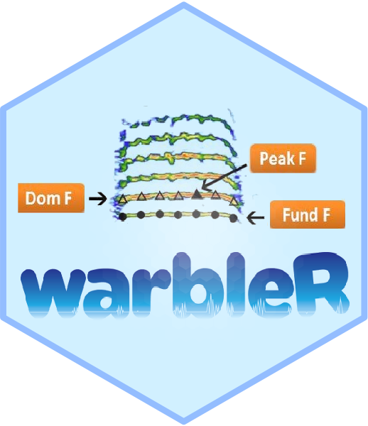

warbleR: Streamline Bioacoustic Analysis
================

<!-- README.md is generated from README.Rmd. Please edit that file -->

[](https://lifecycle.r-lib.org/articles/stages.html)
[](https://cran.r-project.org/package=warbleR)
[](https://www.repostatus.org/#active)
[](https://www.gnu.org/licenses/gpl-3.0.en.html)
[](https://cran.r-project.org/)
[](commits/develop)
[](/commits/master)
[](https://cran.r-project.org/package=warbleR)
[](https://cranlogs.r-pkg.org/badges/grand-total/warbleR)



[warbleR](https://cran.r-project.org/package=warbleR) is intended to
facilitate the analysis of the structure of animal acoustic signals in
R. Users can collect open-access avian recordings or enter their own
data into a workflow that facilitates spectrographic visualization and
measurement of acoustic parameters.
[warbleR](https://cran.r-project.org/package=warbleR) makes use of the
fundamental sound analysis tools of the seewave package, and offers new
tools for acoustic structure analysis. These tools are available for
batch analysis of acoustic signals.

The main features of the package are:

-   Diverse tools for measuring acoustic structure
-   The use of loops to apply tasks through acoustic signals referenced
    in a selection table
-   The production of images in the working directory with spectrograms
    to allow users organize data and verify acoustic analyses

The package offers functions to:

-   Explore and download Xeno ‐ Canto recordings
-   Explore, organize and manipulate multiple sound files
-   Detect signals automatically (in frequency and time) (but check the
    R package [ohun](https://marce10.github.io/ohun/index.html) for a
    more thorough and friendly implementation)
-   Create spectrograms of complete recordings or individual signals
-   Run different measures of acoustic signal structure
-   Evaluate the performance of measurement methods
-   Catalog signals
-   Characterize different structural levels in acoustic signals
-   Statistical analysis of duet coordination
-   Consolidate databases and annotation tables

Most of the functions allow the parallelization of tasks, which
distributes the tasks among several processors to improve computational
efficiency. Tools to evaluate the performance of the analysis at each
step are also available.

Install/load the package from CRAN as follows:

``` r
install.packages("warbleR")

#load package
library(warbleR)
```

To install the latest developmental version from
[github](https://github.com/) you will need the R package
[remotes](https://cran.r-project.org/package=remotes):

``` r
remotes::install_github("maRce10/warbleR")

#load package
library(warbleR)
```

For details and example usage, visit the [warbleR package
website](https://marce10.github.io/warbleR/index.html).

A full description of the package can be found in this [journal
article](https://besjournals.onlinelibrary.wiley.com/doi/epdf/10.1111/2041-210X.12624).

------------------------------------------------------------------------

Please cite [warbleR](https://cran.r-project.org/package=warbleR) as
follows:

Araya-Salas, M. and Smith-Vidaurre, G. (2017), *warbleR: an r package to
streamline analysis of animal acoustic signals*. Methods Ecol Evol. 8,
184-191.
[PDF](https://besjournals.onlinelibrary.wiley.com/doi/epdf/10.1111/2041-210X.12624)

NOTE: please also cite the
[tuneR](https://cran.r-project.org/package=tuneR) and
[seewave](https://cran.r-project.org/package=seewave) packages if you
use any spectrogram-creating or acoustic-measuring functions
