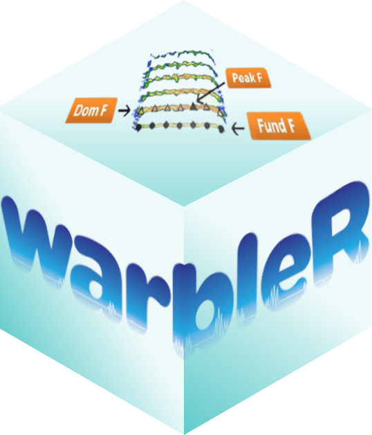
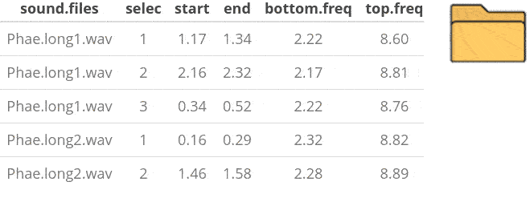
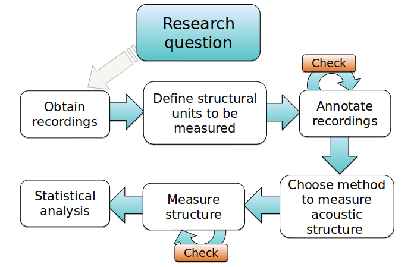

# Package overview



The [warbleR](https://cran.r-project.org/package=warbleR) package is
intended to facilitate the analysis of the structure of the animal
acoustic signals in R. Users can enter their own data into a workflow
that facilitates spectrographic visualization and measurement of
acoustic parameters **warbleR** makes use of the fundamental sound
analysis tools of the **seewave** package, and offers new tools for
acoustic structure analysis. These tools are available for batch
analysis of acoustic signals.

 

The main features of the package are:

- The use of loops to apply tasks through acoustic signals referenced in
  a selection table
- The production of image files with spectrograms that let users
  organize data and verify acoustic analyzes

 



 

The package offers functions for:

- Browse and download recordings of
  [Xeno-Canto](https://www.xeno-canto.org/)
- Explore, organize and manipulate multiple sound files
- Create spectrograms of complete recordings or individual signals
- Run different measures of acoustic signal structure
- Evaluate the performance of measurement methods
- Catalog signals
- Characterize different structural levels in acoustic signals
- Statistical analysis of duet coordination
- Consolidate databases and annotation tables

Most of the functions allow the parallelization of tasks, which
distributes the tasks among several cores to improve computational
efficiency. Tools to evaluate the performance of the analysis at each
step are also available. All these tools are provided in a standardized
workflow for the analysis of the signal structure, making them
accessible to a wide range of users, including those without much
knowledge of R. **warbleR** is a young package (officially published in
2017) currently in a maturation stage.

 

## Input acoustic data in warbleR

Most **warbleR** functions take as input annotation tables. An
annotation table (or selection table in Raven’s and warbleR’s
terminology) is a data set that contains information about the location
in time (and sometimes in frequency) of the sounds of interest in one or
more sound files. **warbleR** can take sound file annotations
represented in the following **R** objects:

- Data frames
- Selection tables
- Extended selection tables

The data “lbh_selec_table” that comes with the package provides a good
example will on the annotation data format used in **warbleR**:

``` r
data("lbh_selec_table")

lbh_selec_table
```

|  sound.files   | channel | selec |   start   |    end    | bottom.freq | top.freq  |
|:--------------:|:-------:|:-----:|:---------:|:---------:|:-----------:|:---------:|
| Phae.long1.wav |    1    |   1   | 1.1693549 | 1.3423884 |  2.220105   | 8.604378  |
| Phae.long1.wav |    1    |   2   | 2.1584085 | 2.3214565 |  2.169437   | 8.807053  |
| Phae.long1.wav |    1    |   3   | 0.3433366 | 0.5182553 |  2.218294   | 8.756604  |
| Phae.long2.wav |    1    |   1   | 0.1595983 | 0.2921692 |  2.316862   | 8.822316  |
| Phae.long2.wav |    1    |   2   | 1.4570585 | 1.5832087 |  2.284006   | 8.888027  |
| Phae.long3.wav |    1    |   1   | 0.6265520 | 0.7577715 |  3.006834   | 8.822316  |
| Phae.long3.wav |    1    |   2   | 1.9742132 | 2.1043921 |  2.776843   | 8.888027  |
| Phae.long3.wav |    1    |   3   | 0.1233643 | 0.2545812 |  2.316862   | 9.315153  |
| Phae.long4.wav |    1    |   1   | 1.5168116 | 1.6622365 |  2.513997   | 9.216586  |
| Phae.long4.wav |    1    |   2   | 2.9326920 | 3.0768784 |  2.579708   | 10.235116 |
| Phae.long4.wav |    1    |   3   | 0.1453977 | 0.2904966 |  2.579708   | 9.742279  |

 

Take a look at the vignette [‘Annotation data
format’](https://marce10.github.io/warbleR/articles/annotation_data_format.html)
for more details on annotation data formats.

## **warbleR** functions and the workflow of analysis in bioacoustics

Bioacoustic analyzes generally follow a specific processing sequence and
analysis. This sequence can be represented schematically like this:



 

We can group **warbleR** functions according to the bioacoustic analysis
stages.

 

### Get and prepare recordings

The
[`query_xc()`](https://marce10.github.io/warbleR/reference/query_xc.md)
function allows you to search and download sounds from the free access
database [Xeno-Canto](https://www.xeno-canto.org/). You can also convert
.mp3 files to .wav, change the sampling rate of the files and correct
corrupt files, among other functions.

|                                           Function                                            |                      Description                      |          Works on           |          Output           |
|:---------------------------------------------------------------------------------------------:|:-----------------------------------------------------:|:---------------------------:|:-------------------------:|
|    [check_sound_files](https://marce10.github.io/warbleR/reference/check_sound_files.html)    |           verify if sound files can be read           |     multiple wave files     |        data frame         |
|          [consolidate](https://marce10.github.io/warbleR/reference/consolidate.html)          |      consolidate sound files in a single folder       |     multiple wave files     | data frame and wave files |
|             [fix_wavs](https://marce10.github.io/warbleR/reference/fix_wavs.html)             |          fix waves that cannot be read in R           |     multiple wave files     |        wave files         |
|              [mp32wav](https://marce10.github.io/warbleR/reference/mp32wav.html)              |       convert multiple mp3 files to wav format        |     multiple mp3 files      |        wave files         |
|             [query_xc](https://marce10.github.io/warbleR/reference/query_xc.html)             |     Search and download mp3 files from Xeno-Canto     | Scientific names/data frame |         mp3 files         |
|         [resample_est](https://marce10.github.io/warbleR/reference/resample_est.html)         |    resample wave objects in ext. selection tables     |  extended selection tables  | extended selection tables |
|      [remove_channels](https://marce10.github.io/warbleR/reference/remove_channels.html)      |        remove channels in multiple wave files         |     multiple wave files     |        wave files         |
|       [remove_silence](https://marce10.github.io/warbleR/reference/remove_silence.html)       |        remove silences in multiple wave files         |     multiple wave files     |        wave files         |
| [duration_sound_files](https://marce10.github.io/warbleR/reference/duration_sound_files.html) |       measures duration in multiple wave files        |     multiple wave files     |        data frame         |
|     [info_sound_files](https://marce10.github.io/warbleR/reference/info_sound_files.html)     | extract recording parameters from multiple wave files |     multiple wave files     |        data frame         |

 

### Annotating sound

It is recommended to make annotations in other programs and then import
them into R (for example in Raven and import them with the **Rraven**
package). However, **warbleR** offers some functions to facilitate
manual or automatic annotation of sound files, as well as the subsequent
manipulation:

|                                  Function                                   |                Description                 |      Works on       |      Output      |
|:---------------------------------------------------------------------------:|:------------------------------------------:|:-------------------:|:----------------:|
|  [freq_range](https://marce10.github.io/warbleR/reference/freq_range.html)  | detect frequency range in selection tables | multiple wave files |    data frame    |
| [tailor_sels](https://marce10.github.io/warbleR/reference/tailor_sels.html) |    interactive tailoring of selections     |  selection tables   | selection tables |

 

### Organize annotations

The annotations (or selection tables) can be manipulated and refined
with a variety of functions. Selection tables can also be converted into
the compact format *extended selection tables*:

|                                                   Function                                                    |                               Description                                |                    Works on                     |                 Output                  |
|:-------------------------------------------------------------------------------------------------------------:|:------------------------------------------------------------------------:|:-----------------------------------------------:|:---------------------------------------:|
|                  [tailor_sels](https://marce10.github.io/warbleR/reference/tailor_sels.html)                  |                   interactive tailoring of selections                    |                selection tables                 |            selection tables             |
|                   [sort_colms](https://marce10.github.io/warbleR/reference/sort_colms.html)                   |                    order columns in an intuitive way                     |                selection tables                 |            selection tables             |
|                     [cut_sels](https://marce10.github.io/warbleR/reference/cut_sels.html)                     |                 save selections as individual wave files                 |                selection tables                 |               wave files                |
|                  [filter_sels](https://marce10.github.io/warbleR/reference/filter_sels.html)                  |          subset selection tables based on filtered image files           | selection tables, ext. selection tables, images | selection tables, ext. selection tables |
| [fix_extended_selection_table](https://marce10.github.io/warbleR/reference/fix_extended_selection_table.html) |              add wave objects to extended selection tables               |                selection tables                 |        extended selection tables        |
|              [selection_table](https://marce10.github.io/warbleR/reference/selection_table.html)              |          create selection tables and extended selection tables           |                selection tables                 | selection tables, ext. selection tables |
|                [song_analysis](https://marce10.github.io/warbleR/reference/song_analysis.html)                | measures acoustic parameters at higher structural levels of organization |     selection tables, ext. selection tables     |      data frame, selection tables       |

 

### Measure acoustic signal structure

Most **warbleR** functions are dedicated to quantifying the structure of
acoustic signals listed in selection tables using batch processing. For
this, 4 main measurement methods are offered:

1.  Spectrographic parameters
2.  Cross correlation
3.  Dynamic time warping (DTW)
4.  Statistical descriptors of cepstral coefficients

Most functions gravitate around these methods, or variations of these
methods:

|                                        Function                                         |                                  Description                                   |                Works on                 |                 Output                  |
|:---------------------------------------------------------------------------------------:|:------------------------------------------------------------------------------:|:---------------------------------------:|:---------------------------------------:|
|        [freq_range](https://marce10.github.io/warbleR/reference/freq_range.html)        |                   detect frequency range in selection tables                   |           multiple wave files           |               data frame                |
|     [song_analysis](https://marce10.github.io/warbleR/reference/song_analysis.html)     |    measures acoustic parameters at higher structural levels of organization    | selection tables, ext. selection tables |      data frame, selection tables       |
|   [compare_methods](https://marce10.github.io/warbleR/reference/compare_methods.html)   |        compare the performance of methods to measure acoustic structure        | selection tables, ext. selection tables |                 images                  |
|          [freq_DTW](https://marce10.github.io/warbleR/reference/freq_DTW.html)          | measures dynamic time warping (DTW) on dominant/fundamental frequency contours | selection tables, ext. selection tables |      (di)similarity matrix, images      |
|           [freq_ts](https://marce10.github.io/warbleR/reference/freq_ts.html)           |                mesaures dominant/fundamental frequency contours                | selection tables, ext. selection tables |   data frame with frequency contours    |
|       [inflections](https://marce10.github.io/warbleR/reference/inflections.html)       |              measures number of inflections in frequency contours              |   data frame with frequency contours    |               data frame                |
|        [mfcc_stats](https://marce10.github.io/warbleR/reference/mfcc_stats.html)        |         measures statistical descriptors of Mel cepstral coefficients          | selection tables, ext. selection tables |               data frame                |
|         [multi_DTW](https://marce10.github.io/warbleR/reference/multi_DTW.html)         |            measures dynamic time warping (DTW) on multiple contours            | selection tables, ext. selection tables |          (di)similarity matrix          |
|         [sig2noise](https://marce10.github.io/warbleR/reference/sig2noise.html)         |                         measures signal-to-noise ratio                         | selection tables, ext. selection tables | selection tables, ext. selection tables |
|  [spectro_analysis](https://marce10.github.io/warbleR/reference/spectro_analysis.html)  |                       measures spectrographic parameters                       | selection tables, ext. selection tables |               data frame                |
| [cross_correlation](https://marce10.github.io/warbleR/reference/cross_correlation.html) |                   measurec spectrographic cross-correlation                    | selection tables, ext. selection tables |          (di)similarity matrix          |

 

### Verify annotations

Functions are provided to detect inconsistencies in the selection tables
or modify selection tables. The package also offers several functions to
generate spectrograms showing the annotations, which can be organized by
annotation categories. This allows you to verify if the annotations
match the previously defined categories, which is particularly useful if
the annotations were automatically generated.

|                                           Function                                            |               Description                |                           Works on                           |                 Output                  |
|:---------------------------------------------------------------------------------------------:|:----------------------------------------:|:------------------------------------------------------------:|:---------------------------------------:|
|           [check_sels](https://marce10.github.io/warbleR/reference/check_sels.html)           |      double-check selection tables       |                       selection tables                       |            selection tables             |
|     [overlapping_sels](https://marce10.github.io/warbleR/reference/overlapping_sels.html)     |   finds (time) overlapping selections    |           selection tables, ext. selection tables            | selection tables, ext. selection tables |
|              [catalog](https://marce10.github.io/warbleR/reference/catalog.html)              |       creates spectrogram catalog        |           selection tables, ext. selection tables            |                 images                  |
|          [catalog2pdf](https://marce10.github.io/warbleR/reference/catalog2pdf.html)          |         convert catalogs to .pdf         |                            images                            |                 images                  |
|         [spectrograms](https://marce10.github.io/warbleR/reference/spectrograms.html)         |        create spectrogram images         |           selection tables, ext. selection tables            |                 images                  |
|    [full_spectrograms](https://marce10.github.io/warbleR/reference/full_spectrograms.html)    | create spectrograms of whole sound files | multiple wave files, selection tables, ext. selection tables |                 images                  |
| [full_spectrogram2pdf](https://marce10.github.io/warbleR/reference/full_spectrogram2pdf.html) |    convert full spectrograms to .pfg     |                            images                            |                 images                  |

 

### Visual inspection of annotations and measurements

|                                         Function                                          |                                  Description                                  |                           Works on                           | Output |
|:-----------------------------------------------------------------------------------------:|:-----------------------------------------------------------------------------:|:------------------------------------------------------------:|:------:|
|   [snr_spectrograms](https://marce10.github.io/warbleR/reference/snr_spectrograms.html)   | plots spectrograms highlighting areas where signal-to-noise ratio is measured |           selection tables, ext. selection tables            | images |
|       [spectrograms](https://marce10.github.io/warbleR/reference/spectrograms.html)       |                           create spectrogram images                           |           selection tables, ext. selection tables            | images |
| [track_freq_contour](https://marce10.github.io/warbleR/reference/track_freq_contour.html) |            create spectrogram images including frequency contours             |           selection tables, ext. selection tables            | images |
|  [plot_coordination](https://marce10.github.io/warbleR/reference/plot_coordination.html)  |                 create schematic plots of coordinated signals                 |                          data frame                          | images |
|  [full_spectrograms](https://marce10.github.io/warbleR/reference/full_spectrograms.html)  |                   create spectrograms of whole sound files                    | multiple wave files, selection tables, ext. selection tables | images |

 

### Additional functions

Finally, **warbleR** offers functions to simplify the use of extended
selection tables, organize large numbers of images with spectrograms and
generate elaborated signal visualizations:

|                                                  Function                                                   |                               Description                                |                Works on                 |                   Output                   |
|:-----------------------------------------------------------------------------------------------------------:|:------------------------------------------------------------------------:|:---------------------------------------:|:------------------------------------------:|
| [is_extended_selection_table](https://marce10.github.io/warbleR/reference/is_extended_selection_table.html) |               check if object is extended selection tables               |               data frame                |                 TRUE/FALSE                 |
|          [is_selection_table](https://marce10.github.io/warbleR/reference/is_selection_table.html)          |                   check if object is selection tables                    |               data frame                |                 TRUE/FALSE                 |
|                 [catalog2pdf](https://marce10.github.io/warbleR/reference/catalog2pdf.html)                 |                         convert catalogs to .pdf                         |                 images                  |                   images                   |
|                   [move_imgs](https://marce10.github.io/warbleR/reference/move_imgs.html)                   |                        moves images among folders                        |                 images                  |                   images                   |
|                      [map_xc](https://marce10.github.io/warbleR/reference/map_xc.html)                      |                 created maps from Xeno-Canto recordings                  |               data frame                |                   images                   |
|           [test_coordination](https://marce10.github.io/warbleR/reference/test_coordination.html)           |           test statistical significance of vocal coordination            |               data frame                |                 data frame                 |
|        [full_spectrogram2pdf](https://marce10.github.io/warbleR/reference/full_spectrogram2pdf.html)        |                    convert full spectrograms to .pfg                     |                 images                  |                   images                   |
|               [color_spectro](https://marce10.github.io/warbleR/reference/color_spectro.html)               |              highlight signals with colors in a spectrogram              |               wave object               |                 plot in R                  |
|            [freq_range_detec](https://marce10.github.io/warbleR/reference/freq_range_detec.html)            |                  detect frequency range in wave objetcs                  |               wave object               |           data frame, plot in R            |
|                     [open_wd](https://marce10.github.io/warbleR/reference/open_wd.html)                     |                          open working directory                          |                                         |                                            |
|               [phylo_spectro](https://marce10.github.io/warbleR/reference/phylo_spectro.html)               |                plots phylogenetic trees with spectrograms                |            selection tables             |                 plot in R                  |
|             [read_sound_file](https://marce10.github.io/warbleR/reference/read_sound_file.html)             |                    read sound files and wave objects                     | selection tables, ext. selection tables |                wave object                 |
|              [simulate_songs](https://marce10.github.io/warbleR/reference/simulate_songs.html)              |                              simulate songs                              |                                         | wave object, wave file and selection table |
|               [tweak_spectro](https://marce10.github.io/warbleR/reference/tweak_spectro.html)               | creates mosaic plots with spectrograms with different display parameters | selection tables, ext. selection tables |                   images                   |
|             [warbleR_options](https://marce10.github.io/warbleR/reference/warbleR_options.html)             |              define global parameters for warbleR functions              |                                         |                                            |

 

------------------------------------------------------------------------

## References

1.  Araya-Salas M, G Smith-Vidaurre & M Webster. 2017. Assessing the
    effect of sound file compression and background noise on measures of
    acoustic signal structure. Bioacoustics 4622, 1-17
2.  Araya-Salas M, Smith-Vidaurre G (2017) warbleR: An R package to
    streamline analysis of animal acoustic signals. Methods Ecol Evol
    8:184-191.

 

------------------------------------------------------------------------

Session information

    R version 4.5.3 (2026-03-11)
    Platform: x86_64-pc-linux-gnu
    Running under: Ubuntu 24.04.4 LTS

    Matrix products: default
    BLAS:   /usr/lib/x86_64-linux-gnu/openblas-pthread/libblas.so.3 
    LAPACK: /usr/lib/x86_64-linux-gnu/openblas-pthread/libopenblasp-r0.3.26.so;  LAPACK version 3.12.0

    locale:
     [1] LC_CTYPE=C.UTF-8       LC_NUMERIC=C           LC_TIME=C.UTF-8        LC_COLLATE=C.UTF-8    
     [5] LC_MONETARY=C.UTF-8    LC_MESSAGES=C.UTF-8    LC_PAPER=C.UTF-8       LC_NAME=C             
     [9] LC_ADDRESS=C           LC_TELEPHONE=C         LC_MEASUREMENT=C.UTF-8 LC_IDENTIFICATION=C   

    time zone: UTC
    tzcode source: system (glibc)

    attached base packages:
    [1] stats     graphics  grDevices utils     datasets  methods   base     

    other attached packages:
    [1] kableExtra_1.4.0   warbleR_1.1.37     NatureSounds_1.0.5 knitr_1.51         seewave_2.2.4     
    [6] tuneR_1.4.7       

    loaded via a namespace (and not attached):
     [1] jsonlite_2.0.0     compiler_4.5.3     brio_1.1.5         Rcpp_1.1.1-1       xml2_1.5.2        
     [6] stringr_1.6.0      parallel_4.5.3     signal_1.8-1       jquerylib_0.1.4    systemfonts_1.3.2 
    [11] scales_1.4.0       textshaping_1.0.5  yaml_2.3.12        fastmap_1.2.0      R6_2.6.1          
    [16] dtw_1.23-2         curl_7.1.0         htmlwidgets_1.6.4  MASS_7.3-65        desc_1.4.3        
    [21] svglite_2.2.2      RColorBrewer_1.1-3 bslib_0.10.0       rlang_1.2.0        testthat_3.3.2    
    [26] stringi_1.8.7      cachem_1.1.0       xfun_0.57          fs_2.1.0           sass_0.4.10       
    [31] fftw_1.0-9         otel_0.2.0         viridisLite_0.4.3  cli_3.6.6          pkgdown_2.2.0     
    [36] magrittr_2.0.5     digest_0.6.39      pbapply_1.7-4      rstudioapi_0.18.0  lifecycle_1.0.5   
    [41] vctrs_0.7.3        glue_1.8.1         proxy_0.4-29       evaluate_1.0.5     farver_2.1.2      
    [46] ragg_1.5.2         rmarkdown_2.31     httr_1.4.8         tools_4.5.3        htmltools_0.5.9   
