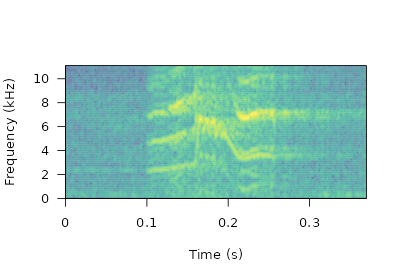
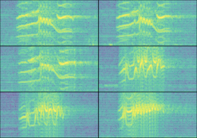
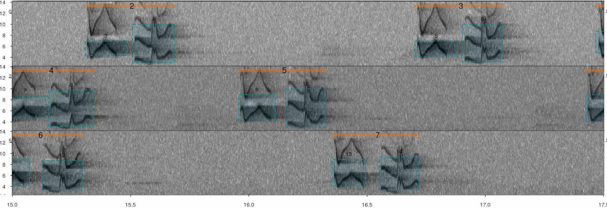
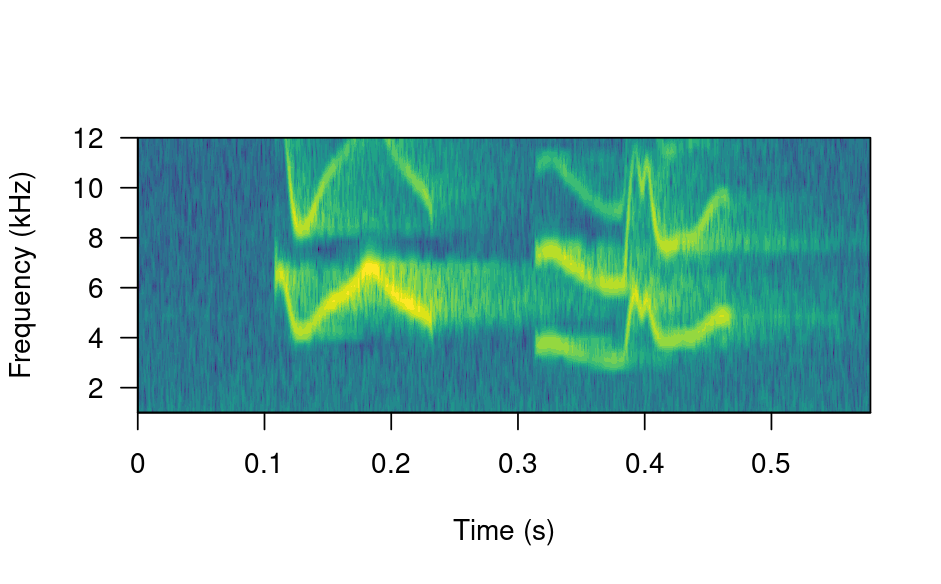
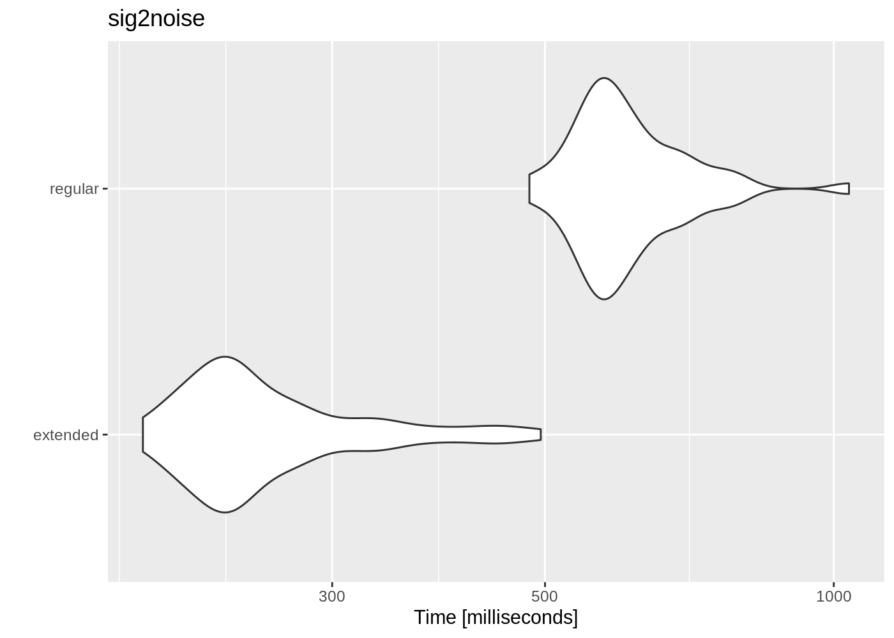
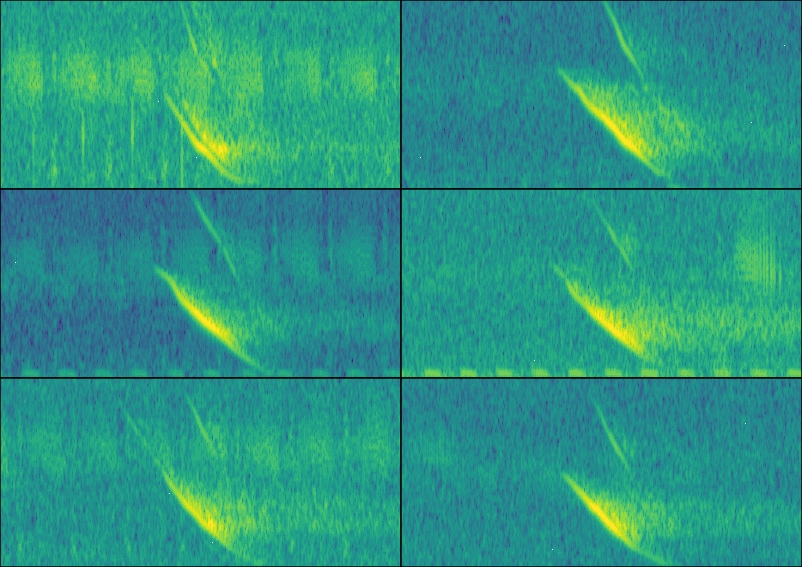

# Annotation data format

This vignette explains in detail the structure of the **R** data objects
containing sound file annotations that are required by the package
**warbleR**.


An annotation table (or selection table in Raven’s and warbleR’s
terminology) is a data set that contains information about the location
in time (and sometimes in frequency) of the sounds of interest in one or
more sound files. **warbleR** can take sound file annotations
represented in the following **R** objects:

- Data frames
- Selection tables
- Extended selection tables

The last 2 are annotation specific R classes included in **warbleR**.
Here we described the basic structure of these objects and how they can
be created.

## Data frames

Data frames with sound file annotations must contain the following
columns:

1.  **sound.files**: character or factor column with the name of the
    sound files including the file extension (e.g. “rec_1.wav”)
2.  **selec**: numeric, character or factor column with a unique
    identifier (at least within each sound file) for each annotation
    (e.g. 1, 2, 3 or “a”, “b”, “c”)
3.  **start**: numeric column with the start position in time of an
    annotated sound (in seconds)
4.  **end**: numeric column with the end position in time of an
    annotated sound (in seconds)

|   sound.files    | selec | start |  end  |
|:----------------:|:-----:|:-----:|:-----:|
| sound_file_1.wav |   1   | 3.02  | 5.58  |
| sound_file_1.wav |   2   | 7.92  | 9.00  |
| sound_file_2.wav |   1   | 4.21  | 5.34  |
| sound_file_2.wav |   2   | 8.85  | 11.57 |

Data frames containing annotations can also include the following
optional columns:

- 1.  **bottom.freq**: numeric column with the bottom frequency of the
      frequency range of the annotation (in kHz)
- 1.  **top.freq**: numeric column with the top frequency of the
      frequency range of the annotation (in kHz)
- 1.  **channel**: numeric column with the number of the channel in
      which the annotation is found in a multi-channel sound file
      (optional, by default is 1 if not supplied)

|   sound.files    | selec | start |  end  | bottom.freq | top.freq | channel |
|:----------------:|:-----:|:-----:|:-----:|:-----------:|:--------:|:-------:|
| sound_file_1.wav |   1   | 3.02  | 5.58  |    5.46     |  10.22   |    1    |
| sound_file_1.wav |   2   | 7.92  | 9.00  |    3.73     |   9.36   |    1    |
| sound_file_2.wav |   1   | 4.21  | 5.34  |    4.31     |   9.40   |    1    |
| sound_file_2.wav |   2   | 8.85  | 11.57 |    4.55     |   9.11   |    1    |

The sample data “lbh_selec_table” contains a data frame with annotations
with the format expected by **warbleR**:

``` r
library(warbleR)

data("lbh_selec_table")


knitr::kable(lbh_selec_table)
```

|  sound.files   | channel | selec | start |  end  | bottom.freq | top.freq |
|:--------------:|:-------:|:-----:|:-----:|:-----:|:-----------:|:--------:|
| Phae.long1.wav |    1    |   1   | 1.169 | 1.342 |    2.22     |   8.60   |
| Phae.long1.wav |    1    |   2   | 2.158 | 2.321 |    2.17     |   8.81   |
| Phae.long1.wav |    1    |   3   | 0.343 | 0.518 |    2.22     |   8.76   |
| Phae.long2.wav |    1    |   1   | 0.160 | 0.292 |    2.32     |   8.82   |
| Phae.long2.wav |    1    |   2   | 1.457 | 1.583 |    2.28     |   8.89   |
| Phae.long3.wav |    1    |   1   | 0.627 | 0.758 |    3.01     |   8.82   |
| Phae.long3.wav |    1    |   2   | 1.974 | 2.104 |    2.78     |   8.89   |
| Phae.long3.wav |    1    |   3   | 0.123 | 0.255 |    2.32     |   9.31   |
| Phae.long4.wav |    1    |   1   | 1.517 | 1.662 |    2.51     |   9.22   |
| Phae.long4.wav |    1    |   2   | 2.933 | 3.077 |    2.58     |  10.23   |
| Phae.long4.wav |    1    |   3   | 0.145 | 0.290 |    2.58     |   9.74   |

Typically, annotations are created in other sound analysis programs
(mainly, Raven, Avisoft, Syrinx and Audacity) and then imported into
*R*. We recommend annotating sound files in [Raven sound analysis
software](https://www.ravensoundsoftware.com/) ([Cornell Lab of
Ornithology](https://www.birds.cornell.edu/home)) and then importing
them into **R** with the package
[**Rraven**](https://marce10.github.io/Rraven/). This package
facilitates data exchange between R and [Raven sound analysis
software](https://www.ravensoundsoftware.com/) and allow users to import
annotation data into R using the **warbleR** annotation format (see
argument ‘warbler.format’ in the function `imp_raven()`).

Data frames containing annotations always refer to sound files.
Therefore, when using data frames users *must always indicate the
location of the sound files* to every **warbleR** function when
providing annotations in this format.

## warbleR annotation formats

### Selection tables

These objects are created with the
[`selection_table()`](https://marce10.github.io/warbleR/reference/selection_table.md)
function. The function takes data frames containing annotation data as
in the format described above. Therefore the same mandatory and optional
columns are used by selection tables. The function verifies if the
information is consistent (see the function
[`check_sels()`](https://marce10.github.io/warbleR/reference/check_sels.md)
for details) and saves the ‘diagnostic’ metadata as an attribute in the
output object. Selection tables are basically data frames in which the
information contained has been double checked to ensure it can be read
by other **warbleR** functions.

Selection tables are created by the function
[`selection_table()`](https://marce10.github.io/warbleR/reference/selection_table.md):

``` r
# write example sound files in temporary directory
writeWave(Phae.long1, file.path(tempdir(), "Phae.long1.wav"))
writeWave(Phae.long2, file.path(tempdir(), "Phae.long2.wav"))
writeWave(Phae.long3, file.path(tempdir(), "Phae.long3.wav"))
writeWave(Phae.long4, file.path(tempdir(), "Phae.long4.wav"))

st <-
  selection_table(X = lbh_selec_table, path = tempdir())

knitr::kable(st)
```

    
[30mall selections are OK 
    
[39m

| sound.files    | channel | selec | start |   end | bottom.freq | top.freq |
|:---------------|--------:|------:|------:|------:|------------:|---------:|
| Phae.long1.wav |       1 |     1 | 1.169 | 1.342 |        2.22 |     8.60 |
| Phae.long1.wav |       1 |     2 | 2.158 | 2.321 |        2.17 |     8.81 |
| Phae.long1.wav |       1 |     3 | 0.343 | 0.518 |        2.22 |     8.76 |
| Phae.long2.wav |       1 |     1 | 0.160 | 0.292 |        2.32 |     8.82 |
| Phae.long2.wav |       1 |     2 | 1.457 | 1.583 |        2.28 |     8.89 |
| Phae.long3.wav |       1 |     1 | 0.627 | 0.758 |        3.01 |     8.82 |
| Phae.long3.wav |       1 |     2 | 1.974 | 2.104 |        2.78 |     8.89 |
| Phae.long3.wav |       1 |     3 | 0.123 | 0.255 |        2.32 |     9.31 |
| Phae.long4.wav |       1 |     1 | 1.517 | 1.662 |        2.51 |     9.22 |
| Phae.long4.wav |       1 |     2 | 2.933 | 3.077 |        2.58 |    10.23 |
| Phae.long4.wav |       1 |     3 | 0.145 | 0.290 |        2.58 |     9.74 |

Selection table is an specific object class:

``` r
class(st)
```

    [1] "selection_table" "data.frame"     

They have their own printing method:

``` r
st
```

    Object of class 'selection_table'
    * The output of the following call:
    selection_table(X = lbh_selec_table, path = tempdir(), pb = FALSE)

    Contains: 
    *  A selection table data frame with 11 rows and 7 columns:
    sound.files       channel   selec   start     end   bottom.freq
    ---------------  --------  ------  ------  ------  ------------
    Phae.long1.wav          1       1   1.169   1.342          2.22
    Phae.long1.wav          1       2   2.158   2.321          2.17
    Phae.long1.wav          1       3   0.343   0.518          2.22
    Phae.long2.wav          1       1   0.160   0.292          2.32
    Phae.long2.wav          1       2   1.457   1.583          2.28
    Phae.long3.wav          1       1   0.627   0.758          3.01
    ... 1 more column(s) (top.freq)
     and 5 more row(s)

    * A data frame (check.results) with 11 rows generated by check_sels() (as an attribute)
    created by warbleR 1.1.37

Note that the path to the sound files must be provided. This is
necessary in order to verify that the data supplied conforms to the
characteristics of the audio files.

Selection table also refer to sound files. Therefore, users **must
always indicate the location of the sound files to every *warbleR*
function** when providing annotations in this format

### Extended selection tables

Extended selection tables are annotations that include both the acoustic
and annotation data. This is an specific object class,
*extended_selection_table*, that includes a list of ‘wave’ objects
corresponding to each of the selections in the data. Therefore, the
function **transforms the selection table into self-contained objects**
since the original sound files are no longer needed to perform most of
the acoustic analysis in **warbleR**. This can facilitate the storage
and exchange of (bio)acoustic data. This format can also speed up
analyses, since it is not necessary to read the sound files every time
the data is analyzed.

The
[`selection_table()`](https://marce10.github.io/warbleR/reference/selection_table.md)
function also creates extended selection tables. To do this, users must
set the argument `extended = TRUE` (otherwise, the class would be a
selection table). The following code converts the example
‘lbh_selec_table’ data into an extended selection table:

``` r
est <- selection_table(
  X = lbh_selec_table,
  pb = FALSE,
  extended = TRUE,
  path = tempdir()
)
```

    
[30mall selections are OK 
    
[39m

Extended selection table is an specific object class:

``` r
class(est)
```

    [1] "extended_selection_table" "data.frame"              

The class has its own printing method:

``` r
est
```

    Object of class 'extended_selection_table'
    * The output of the following call:
    selection_table(X = lbh_selec_table, path = tempdir(), extended = TRUE,  pb = FALSE)

    Contains: 
    *  A selection table data frame with 11 row(s) and 7 columns:
    sound.files         channel   selec   start     end   bottom.freq
    -----------------  --------  ------  ------  ------  ------------
    Phae.long1.wav_1          1       1     0.1   0.273          2.22
    Phae.long1.wav_2          1       1     0.1   0.263          2.17
    Phae.long1.wav_3          1       1     0.1   0.275          2.22
    Phae.long2.wav_1          1       1     0.1   0.233          2.32
    Phae.long2.wav_2          1       1     0.1   0.226          2.28
    Phae.long3.wav_1          1       1     0.1   0.231          3.01
    ... 1 more column(s) (top.freq)
     and 5 more row(s)

    * 11 wave object(s) (as attributes): 
    Phae.long1.wav_1, Phae.long1.wav_2, Phae.long1.wav_3, Phae.long2.wav_1, Phae.long2.wav_2, Phae.long3.wav_1
    ... and 5 more

    * A data frame (check.results) with 11 rows generated by check_sels() (as an attribute)

    The selection table was created by element (see description in '?selection_table')
    * 1 sampling rate(s) (in kHz): 22.5
    * 1 bit depth(s): 16
    * Created by warbleR 1.1.37

#### Handling extended selection tables

Several functions can be used to deal with objects of this class. First
can test if the object belongs to the *extended_selection_table*:

``` r
is_extended_selection_table(est)
```

    [1] TRUE

You can subset the selection in the same way that any other data frame
and it will still keep its attributes:

``` r
est2 <- est[1:2, ]

is_extended_selection_table(est2)
```

    [1] TRUE

As shown above, there is also a generic version of
[`print()`](https://rdrr.io/r/base/print.html) for this class of
objects:

``` r
## print (equivalent to `print(est)`)
est
```

    Object of class 'extended_selection_table'
    * The output of the following call:
    selection_table(X = lbh_selec_table, path = tempdir(), extended = TRUE,  pb = FALSE)

    Contains: 
    *  A selection table data frame with 11 row(s) and 7 columns:
    sound.files         channel   selec   start     end   bottom.freq
    -----------------  --------  ------  ------  ------  ------------
    Phae.long1.wav_1          1       1     0.1   0.273          2.22
    Phae.long1.wav_2          1       1     0.1   0.263          2.17
    Phae.long1.wav_3          1       1     0.1   0.275          2.22
    Phae.long2.wav_1          1       1     0.1   0.233          2.32
    Phae.long2.wav_2          1       1     0.1   0.226          2.28
    Phae.long3.wav_1          1       1     0.1   0.231          3.01
    ... 1 more column(s) (top.freq)
     and 5 more row(s)

    * 11 wave object(s) (as attributes): 
    Phae.long1.wav_1, Phae.long1.wav_2, Phae.long1.wav_3, Phae.long2.wav_1, Phae.long2.wav_2, Phae.long3.wav_1
    ... and 5 more

    * A data frame (check.results) with 11 rows generated by check_sels() (as an attribute)

    The selection table was created by element (see description in '?selection_table')
    * 1 sampling rate(s) (in kHz): 22.5
    * 1 bit depth(s): 16
    * Created by warbleR 1.1.37

You can also split them and/or combine them by rows. Here the original
*extended_selection_table* is divided using indexing into two objects
and combine the two back into a single object using
[`rbind()`](https://rdrr.io/r/base/cbind.html):

``` r
est3 <- est[1:5, ]

est4 <- est[6:11, ]

est5 <- rbind(est3, est4)

# print
est5
```

    Object of class 'extended_selection_table'
    * The output of the following call:
    rbind(deparse.level, ..1, ..2)

    Contains: 
    *  A selection table data frame with 11 row(s) and 7 columns:
    sound.files         channel   selec   start     end   bottom.freq
    -----------------  --------  ------  ------  ------  ------------
    Phae.long1.wav_1          1       1     0.1   0.273          2.22
    Phae.long1.wav_2          1       1     0.1   0.263          2.17
    Phae.long1.wav_3          1       1     0.1   0.275          2.22
    Phae.long2.wav_1          1       1     0.1   0.233          2.32
    Phae.long2.wav_2          1       1     0.1   0.226          2.28
    Phae.long3.wav_1          1       1     0.1   0.231          3.01
    ... 1 more column(s) (top.freq)
     and 5 more row(s)

    * 11 wave object(s) (as attributes): 
    Phae.long1.wav_1, Phae.long1.wav_2, Phae.long1.wav_3, Phae.long2.wav_1, Phae.long2.wav_2, Phae.long3.wav_1
    ... and 5 more

    * A data frame (check.results) with 11 rows generated by check_sels() (as an attribute)

    The selection table was created by element (see description in '?selection_table')
    * 1 sampling rate(s) (in kHz): 22.5
    * 1 bit depth(s): 16
    * Created by warbleR 1.1.37

The resulting extended selection table contains the same data as the
original extended selection table:

``` r
# same annotations
all.equal(est, est5, check.attributes = FALSE)
```

    [1] TRUE

``` r
# same acoustic data
all.equal(attr(est, "wave.objects"), attr(est5, "wave.objects"))
```

    [1] TRUE

The ‘wave’ objects can be read individually using
[`read_sound_file()`](https://marce10.github.io/warbleR/reference/read_sound_file.md),
a wrapper for the
[`readWave()`](https://rdrr.io/pkg/tuneR/man/readWave.html) function
from **tuneR**, which can handle extended selection tables:

``` r
wv1 <- read_sound_file(X = est, index = 3, from = 0, to = 0.37)
```

These are regular ‘wave’ objects:

``` r
class(wv1)
```

    [1] "Wave"
    attr(,"package")
    [1] "tuneR"

``` r
wv1
```

    Wave Object
        Number of Samples:      8325
        Duration (seconds):     0.37
        Samplingrate (Hertz):   22500
        Channels (Mono/Stereo): Mono
        PCM (integer format):   TRUE
        Bit (8/16/24/32/64):    16 

``` r
# print spectrogram
seewave::spectro(
  wv1,
  wl = 150,
  grid = FALSE,
  scale = FALSE,
  ovlp = 90,
  palette = viridis::viridis,
  collevels = seq(-100, 0 , 5)
)
```



``` r
par(mfrow = c(3, 2), mar = rep(0, 4))

for (i in 1:6) {
  wv <- read_sound_file(
    X = est,
    index = i,
    from = 0.05,
    to = 0.32
  )
  
  seewave::spectro(
    wv,
    wl = 150,
    grid = FALSE,
    scale = FALSE,
    axisX = FALSE,
    axisY = FALSE,
    ovlp = 90,
    palette = viridis::viridis,
    collevels = seq(-100, 0 , 5)
  )
}
```



The
[`read_sound_file()`](https://marce10.github.io/warbleR/reference/read_sound_file.md)
function requires a selection table, as well as the row index (i.e. the
row number) to be able to read the ‘wave’ objects. It can also read a
regular ‘wave’ file if the path is provided.

Note that other functions that modify data frames are likely to delete
the attributes in which the ‘wave’ objects and metadata are stored. For
example, the merge and the extended selection box will remove its
attributes:

``` r
# create new data frame
Y <-
  data.frame(
    sound.files = est$sound.files,
    site = "La Selva",
    lek = c(rep("SUR", 5), rep("CCL", 6))
  )

# combine
mrg_est <- merge(est, Y, by = "sound.files")

# check class
is_extended_selection_table(mrg_est)
```

    [1] FALSE

In this case, we can use the
[`fix_extended_selection_table()`](https://marce10.github.io/warbleR/reference/fix_extended_selection_table.md)
function to transfer the attributes of the original extended selection
table:

``` r
# fix est
mrg_est <- fix_extended_selection_table(X = mrg_est, Y = est)

# check class
is_extended_selection_table(mrg_est)
```

    [1] TRUE

This works as long as some of the original sound files are retained and
no other selections are added.

Finally, these objects can be used as input for most **warbleR**
functions, without the need of refering to any sound file. For instance
we can easily measure acoustic parameters on data in
*extended_selection_table* format using the function
[`spectro_analysis()`](https://marce10.github.io/warbleR/reference/spectro_analysis.md):

``` r
#  parametros espectrales
sp <- spectro_analysis(est)

# check first 10 columns
sp[, 1:10]
```

| sound.files      | selec | duration | meanfreq |   sd | freq.median | freq.Q25 | freq.Q75 | freq.IQR | time.median |
|:-----------------|------:|---------:|---------:|-----:|------------:|---------:|---------:|---------:|------------:|
| Phae.long1.wav_1 |     1 |    0.173 |     5.98 | 1.40 |        6.33 |     5.30 |     6.87 |     1.57 |       0.080 |
| Phae.long1.wav_2 |     1 |    0.163 |     6.00 | 1.42 |        6.21 |     5.33 |     6.88 |     1.55 |       0.082 |
| Phae.long1.wav_3 |     1 |    0.175 |     6.02 | 1.51 |        6.42 |     5.15 |     6.98 |     1.83 |       0.094 |
| Phae.long2.wav_1 |     1 |    0.133 |     6.40 | 1.34 |        6.60 |     5.61 |     7.38 |     1.77 |       0.074 |
| Phae.long2.wav_2 |     1 |    0.126 |     6.31 | 1.37 |        6.60 |     5.61 |     7.21 |     1.60 |       0.084 |
| Phae.long3.wav_1 |     1 |    0.131 |     6.61 | 1.09 |        6.67 |     6.06 |     7.34 |     1.27 |       0.058 |
| Phae.long3.wav_2 |     1 |    0.130 |     6.64 | 1.12 |        6.67 |     6.11 |     7.43 |     1.32 |       0.072 |
| Phae.long3.wav_3 |     1 |    0.131 |     6.58 | 1.25 |        6.65 |     6.03 |     7.39 |     1.36 |       0.058 |
| Phae.long4.wav_1 |     1 |    0.145 |     6.22 | 1.48 |        6.23 |     5.46 |     7.30 |     1.85 |       0.087 |
| Phae.long4.wav_2 |     1 |    0.144 |     6.46 | 1.59 |        6.34 |     5.63 |     7.57 |     1.94 |       0.087 |
| Phae.long4.wav_3 |     1 |    0.145 |     6.12 | 1.54 |        6.08 |     5.18 |     7.24 |     2.06 |       0.087 |

#### ‘By element’ vs ‘by song’ extended selection tables

As mention above extended selection tables by default contain one wave
object for each annotation (i.e. row):

``` r
length(attr(est, "wave.objects")) == length(unique(paste(est$sound.files)))
```

    [1] TRUE

This default behavior generates a ‘by element’ extended selection table,
as each resulting wave object contains a single element (usually defined
as continuous traces of power spectral entropy in the spectrograms).
Acoustic signals can have structure above the basic signal units
(elements), like in long repertoire songs or multi-syllable calls, in
which elements are always broadcast as a sequences, often with
consistent order and timing. It is then desirable to keep information
about the relative position of elements in these sequences. However,‘by
element’ extended selection tables discards some element sequence
information. This can be overwritten using the argument `by.song`, which
allows to keep in a single wave object all the elements belonging to the
same ‘song’. In this case song refers to any grouping of sounds above
the ‘element’ level.

The song of the Scale-throated Hermit (*Phaethornis eurynome*) will be
used to show how this can be done. This song consists of a sequence of
two elements, which are separated by short gaps:



*Annotated spectrogram of Scale-throated Hermit songs. Vertical orange
lines highlight songs while skyblue boxes show the frequency-time
position of individual elements. The sound file can be found at
<https://xeno-canto.org/15607>.*

An example sound file with this species’ song can be downloaded as
follows (the sound file can also be downloaded manually from [this
link](https://xeno-canto.org/15607/download)):

``` r
# load data
data("sth_annotations")

# download sound file from Xeno-Canto using catalog id
out <-
  query_xc(qword = "nr:15607",
           download = TRUE,
           path = tempdir())

# check file is found in temporary directory
list.files(path = tempdir(), "mp3")
```

    character(0)

**warbleR** comes with an example data set containing annotations on
this sound file, which can be loaded like this:

``` r
# load  Scale-throated Hermit example annotations
data("sth_annotations")
```

Note that these annotations contain an additional column called ‘song’,
with the song ID labels for elements (rows) belonging to the same song:

``` r
# print into the console
head(sth_annotations)
```

| sound.files                    | selec | channel | start |   end | bottom.freq | top.freq | song | element |
|:-------------------------------|------:|--------:|------:|------:|------------:|---------:|-----:|:--------|
| Phaethornis-eurynome-15607.mp3 |     1 |       1 | 0.774 | 0.952 |        4.08 |     8.49 |    1 | a       |
| Phaethornis-eurynome-15607.mp3 |     2 |       1 | 0.976 | 1.152 |        2.98 |     9.15 |    1 | b       |
| Phaethornis-eurynome-15607.mp3 |     3 |       1 | 2.808 | 2.984 |        4.30 |     6.95 |    2 | a       |
| Phaethornis-eurynome-15607.mp3 |     4 |       1 | 3.009 | 3.185 |        2.98 |    10.00 |    2 | b       |
| Phaethornis-eurynome-15607.mp3 |     5 |       1 | 4.201 | 4.382 |        4.08 |     6.95 |    3 | a       |
| Phaethornis-eurynome-15607.mp3 |     6 |       1 | 4.401 | 4.572 |        3.20 |    10.00 |    3 | b       |

These data (annotations + sound file) can be used to create a ‘by song’
extended selection table. To do this the name of the column containing
the ‘song’ level labels must be supplied to the argument ‘by.song’:

``` r
# create by song extended selection table
bs_est <-
  selection_table(X = sth_annotations,
                  extended = TRUE,
                  by.song = "song", 
                  path = tempdir())
```

In a ‘by song’ extended selection table there are as many wave objects
as songs in our annotation data:

``` r
length(attr(bs_est, "wave.objects")) == length(unique(paste(bs_est$sound.files, bs_est$song)))
```

    [1] TRUE

We can extract an entire wave object to check that two elements are
actually included:

``` r
# extract wave object
wave_song1 <-
  read_sound_file(
    X = bs_est,
    index = 1,
    from = 0,
    to = Inf
  )

# plot spectro
seewave::spectro(
  wave_song1,
  wl = 150,
  grid = FALSE,
  scale = FALSE,
  ovlp = 90,
  palette = viridis::viridis,
  collevels = seq(-100, 0 , 5),
  flim = c(1, 12)
)
```



Note that ‘by song’ extended selection tables can be converted into ‘by
element’ tables using the function
[`by_element_est()`](https://marce10.github.io/warbleR/reference/by_element_est.md).

#### Performance

The use of *extended_selection_table* objects can improve performance
(in our case, measured as time). Here we use **microbenchmark** to
compare the performance of
[`sig2noise()`](https://marce10.github.io/warbleR/reference/sig2noise.md)
and **ggplot2** to plot the results. First, a selection table with 1000
selections is created simply by repeating the sample data frame several
times and then is converted to an extended selection table:

``` r
# create long selection table
lng.selec.table <- do.call(rbind, replicate(10, lbh_selec_table,
                                            simplify = FALSE))

# relabels selec
lng.selec.table$selec <- 1:nrow(lng.selec.table)

# create extended selection table
lng_est <- selection_table(X = lng.selec.table,
                           pb = FALSE,
                           extended = TRUE)


# load packages
library(microbenchmark)
library(ggplot2)

# check performance
mbmrk.snr <- microbenchmark(
  extended = sig2noise(lng_est,
                       mar = 0.05),
  regular = sig2noise(lng.selec.table,
                      mar = 0.05),
  times = 50
)

autoplot(mbmrk.snr) + ggtitle("sig2noise")
```



autodetec image example

The function runs much faster in the extended selection tables.
Performance gain is likely to improve when longer recordings and data
sets are used (that is, to compensate for computing overhead).

#### Sharing acoustic data

This new object class allows to share complete data sets, including
acoustic data. To do this we can make use of the RDS file format to save
extended selection tables. These files can be easily shared with others,
allowing to share a entire acoustic data set in a single file, something
that can be tricky when dealing with acoustic data. For example, the
following code downloads an extended selection table of inquiry calls
from Spix’s disc-winged bats used in [Araya-Salas *et al*
(2020)](https://marce10.github.io/publication/araya-salas-2020/) (it can
take a few minutes! Can also be manually downloaded from
[here](https://figshare.com/ndownloader/files/21167052)):

``` r
URL <- "https://figshare.com/ndownloader/files/21167052"

options(timeout = max(300, getOption("timeout")))

download.file(
  url = URL,
  destfile = file.path(tempdir(), "est_inquiry.RDS"),
  method = "auto"
)

est <- readRDS(file.path(tempdir(), "est_inquiry.RDS"))

nrow(est)
```

    [1] 336

This data is ready to be used. For instance, here I create a multipanel
graph with the spectrograms of the first 6 selections:

``` r
par(mfrow = c(3, 2), mar = rep(0, 4))

for (i in 1:6) {
  wv <- read_sound_file(
    X = est,
    index = i,
    from = 0.05,
    to = 0.17
  )
  
  spectro(
    wv,
    grid = FALSE,
    scale = FALSE,
    axisX = FALSE,
    axisY = FALSE,
    ovlp = 90,
    flim = c(10, 50),
    palette = viridis::viridis,
    collevels = seq(-100, 0 , 5)  
    )
}
```



We can also measured pairwise cross correlation (for simplicity only on
the first 4 rows):

``` r
xcorr_inquiry <- cross_correlation(est[1:4, ])

xcorr_inquiry
```

|                                       | T2018-01-04_11-37-50_0000010.wav_1-1 | T2018-01-04_11-37-50_0000010.wav_10-1 | T2018-01-04_11-37-50_0000010.wav_11-1 | T2018-01-04_11-37-50_0000010.wav_12-1 |
|:--------------------------------------|-------------------------------------:|--------------------------------------:|--------------------------------------:|--------------------------------------:|
| T2018-01-04_11-37-50_0000010.wav_1-1  |                                1.000 |                                 0.522 |                                 0.535 |                                 0.594 |
| T2018-01-04_11-37-50_0000010.wav_10-1 |                                0.522 |                                 1.000 |                                 0.869 |                                 0.660 |
| T2018-01-04_11-37-50_0000010.wav_11-1 |                                0.535 |                                 0.869 |                                 1.000 |                                 0.833 |
| T2018-01-04_11-37-50_0000010.wav_12-1 |                                0.594 |                                 0.660 |                                 0.833 |                                 1.000 |

### **Citation**

Please cite `warbleR` when you use the package:

Araya-Salas, M. and Smith-Vidaurre, G. (2017), warbleR: an R package to
streamline analysis of animal acoustic signals. Methods Ecol Evol. 8,
184-191.

### **Reporting bugs**

Please report any bugs
[here](https://github.com/maRce10/warbleR/issues).  

------------------------------------------------------------------------

### References

- Araya-Salas (2017), *Rraven: connecting R and Raven bioacoustic
  software*. R package version 1.0.2.
- Araya-Salas, M., Hernández-Pinsón, H. A., Rojas, N., & Chaverri, G.
  (2020). *Ontogeny of an interactive call-and-response system in Spix’s
  disc-winged bats*. Animal Behaviour, 166, 233-245.
