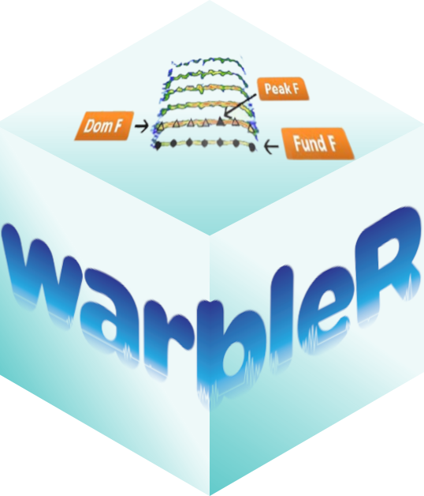

# warbleR: Streamline Bioacoustic Analysis



**warbleR** is an R package for analyzing the structure of animal
acoustic signals at scale. Bring your own recordings (or open-access
ones from repositories like [Xeno-canto](https://xeno-canto.org/),
easily obtained with [suwo](https://docs.ropensci.org/suwo/)), annotate
them in a *selection table*, and run the whole pipeline — from file
wrangling and spectrograms to acoustic measurements and similarity
analyses — in batch, on as many signals as you have.

Built on top of [seewave](https://cran.r-project.org/package=seewave)
and [tuneR](https://cran.r-project.org/package=tuneR), warbleR adds the
workflow layer those packages leave to the user:

- 🗂️ **Selection-table-driven workflows** — every function loops over
  the signals listed in an annotation table, so one call handles one
  sound or ten thousand
- 📦 **Extended selection tables** — a single R object that bundles
  annotations *and* the audio clips, making analyses portable and easy
  to share
- ⚡ **Parallel processing** — most functions take a `parallel` argument
  to spread the work across cores
- 🔍 **Built-in quality checks** — spectrogram images and diagnostic
  tools let you verify each step before moving on

## What can you do with it?

| Task | Key functions |
|:---|:---|
| Inspect, convert and fix sound files | [`info_sound_files()`](https://marce10.github.io/warbleR/reference/info_sound_files.md), [`check_sound_files()`](https://marce10.github.io/warbleR/reference/check_sound_files.md), [`fix_wavs()`](https://marce10.github.io/warbleR/reference/fix_wavs.md), [`mp32wav()`](https://marce10.github.io/warbleR/reference/mp32wav.md), [`wav_2_flac()`](https://marce10.github.io/warbleR/reference/wav_2_flac.md), [`split_sound_files()`](https://marce10.github.io/warbleR/reference/split_sound_files.md), [`remove_channels()`](https://marce10.github.io/warbleR/reference/remove_channels.md) |
| Build and validate annotation tables | [`selection_table()`](https://marce10.github.io/warbleR/reference/selection_table.md), [`check_sels()`](https://marce10.github.io/warbleR/reference/check_sels.md), [`tailor_sels()`](https://marce10.github.io/warbleR/reference/tailor_sels.md), [`cut_sels()`](https://marce10.github.io/warbleR/reference/cut_sels.md), [`overlapping_sels()`](https://marce10.github.io/warbleR/reference/overlapping_sels.md), [`consolidate()`](https://marce10.github.io/warbleR/reference/consolidate.md) |
| Create spectrograms | [`spectrograms()`](https://marce10.github.io/warbleR/reference/spectrograms.md), [`full_spectrograms()`](https://marce10.github.io/warbleR/reference/full_spectrograms.md), [`color_spectro()`](https://marce10.github.io/warbleR/reference/color_spectro.md), [`snr_spectrograms()`](https://marce10.github.io/warbleR/reference/snr_spectrograms.md), [`catalog()`](https://marce10.github.io/warbleR/reference/catalog.md), [`phylo_spectro()`](https://marce10.github.io/warbleR/reference/phylo_spectro.md) |
| Measure acoustic structure | [`spectro_analysis()`](https://marce10.github.io/warbleR/reference/spectro_analysis.md), [`mfcc_stats()`](https://marce10.github.io/warbleR/reference/mfcc_stats.md), [`song_analysis()`](https://marce10.github.io/warbleR/reference/song_analysis.md), [`freq_range()`](https://marce10.github.io/warbleR/reference/freq_range.md), [`sig2noise()`](https://marce10.github.io/warbleR/reference/sig2noise.md), [`sound_pressure_level()`](https://marce10.github.io/warbleR/reference/sound_pressure_level.md), [`gaps()`](https://marce10.github.io/warbleR/reference/gaps.md), [`wpd_features()`](https://marce10.github.io/warbleR/reference/wpd_features.md) |
| Track frequency contours | [`freq_ts()`](https://marce10.github.io/warbleR/reference/freq_ts.md), [`track_freq_contour()`](https://marce10.github.io/warbleR/reference/track_freq_contour.md), [`track_harmonic()`](https://marce10.github.io/warbleR/reference/track_harmonic.md), [`inflections()`](https://marce10.github.io/warbleR/reference/inflections.md) |
| Compare signals | [`cross_correlation()`](https://marce10.github.io/warbleR/reference/cross_correlation.md), [`freq_DTW()`](https://marce10.github.io/warbleR/reference/freq_DTW.md), [`multi_DTW()`](https://marce10.github.io/warbleR/reference/multi_DTW.md), [`waveform_similarity()`](https://marce10.github.io/warbleR/reference/waveform_similarity.md), [`compare_methods()`](https://marce10.github.io/warbleR/reference/compare_methods.md) |
| Analyze duet / chorus coordination | [`test_coordination()`](https://marce10.github.io/warbleR/reference/test_coordination.md), [`plot_coordination()`](https://marce10.github.io/warbleR/reference/plot_coordination.md) |
| Simulate signals | [`simulate_songs()`](https://marce10.github.io/warbleR/reference/simulate_songs.md) |

See the [function
reference](https://marce10.github.io/warbleR/reference/) for the full
list.

## Installation

From CRAN:

``` r

install.packages("warbleR")
```

Development version from GitHub (requires
[remotes](https://cran.r-project.org/package=remotes)):

``` r

remotes::install_github("maRce10/warbleR")
```

## Quick example

The example recordings and annotations come from the
[NatureSounds](https://cran.r-project.org/package=NatureSounds) package
(installed with warbleR):

``` r

library(warbleR)

# load example long-billed hermit songs and their annotations
data(list = c("Phae.long1", "Phae.long2", "Phae.long3", "Phae.long4", "lbh_selec_table"))

# save the sound files to a temporary folder
for (i in paste0("Phae.long", 1:4)) {
  tuneR::writeWave(get(i), file.path(tempdir(), paste0(i, ".wav")))
}

# check that annotations and sound files match
check_sels(lbh_selec_table, path = tempdir())

# measure spectral and temporal parameters for every annotated signal
params <- spectro_analysis(lbh_selec_table, path = tempdir())

# pairwise acoustic similarity via spectrographic cross-correlation
xc <- cross_correlation(lbh_selec_table, path = tempdir())
```

## Learn more

- 📘 [Intro to
  warbleR](https://marce10.github.io/warbleR/articles/a_warbleR.html) —
  an overview of the package
- 📝 [Annotation data
  format](https://marce10.github.io/warbleR/articles/b_annotation_data_format.html)
  — how input annotations (selection tables) should look
- 🔁 [All vignettes](https://marce10.github.io/warbleR/articles/) —
  worked examples of complete analysis workflows
- 📄 [Original paper](https://doi.org/10.1111/2041-210X.12624) in
  *Methods in Ecology and Evolution* (the package has grown a lot since,
  so check the vignettes for current usage)

## Related packages

| Package | What it does |
|:---|:---|
| [seewave](https://cran.r-project.org/package=seewave) & [tuneR](https://cran.r-project.org/package=tuneR) | Core sound analysis and manipulation of wave objects in R |
| [ohun](https://docs.ropensci.org/ohun/) | Automated detection of sound events, with tools to diagnose and optimize detection routines |
| [suwo](https://docs.ropensci.org/suwo/) | Search, download and map nature media (Xeno-canto, Macaulay Library, iNaturalist, GBIF, WikiAves) — replaces warbleR’s [`query_xc()`](https://marce10.github.io/warbleR/reference/query_xc.md) and [`map_xc()`](https://marce10.github.io/warbleR/reference/map_xc.md) |
| [baRulho](https://docs.ropensci.org/baRulho/) | Quantifying habitat-induced degradation of acoustic signals, with inputs/outputs compatible with warbleR |
| [Rraven](https://cran.r-project.org/package=Rraven) | Data exchange between R and [Raven](https://www.ravensoundsoftware.com/) (Cornell Lab of Ornithology), handy for using Raven as the annotation tool |
| [dynaSpec](https://cran.r-project.org/package=dynaSpec) | Dynamic spectrograms (spectrogram videos) |
| [NatureSounds](https://cran.r-project.org/package=NatureSounds) | Example recordings and annotations of animal sounds |

## Getting help & contributing

Found a bug or have a feature request? Please open an
[issue](https://github.com/maRce10/warbleR/issues). Contributions are
welcome — see the [contributing
guidelines](https://github.com/maRce10/warbleR/blob/master/CONTRIBUTING.md).

## Citation

If you use warbleR, please cite:

> Araya-Salas, M. & Smith-Vidaurre, G. (2017). warbleR: an R package to
> streamline analysis of animal acoustic signals. *Methods in Ecology
> and Evolution*, 8, 184–191. <https://doi.org/10.1111/2041-210X.12624>

Please also cite [tuneR](https://cran.r-project.org/package=tuneR) and
[seewave](https://cran.r-project.org/package=seewave) if you use any
function that creates spectrograms or measures acoustic parameters. You
can get all citations from R with `citation("warbleR")`.
