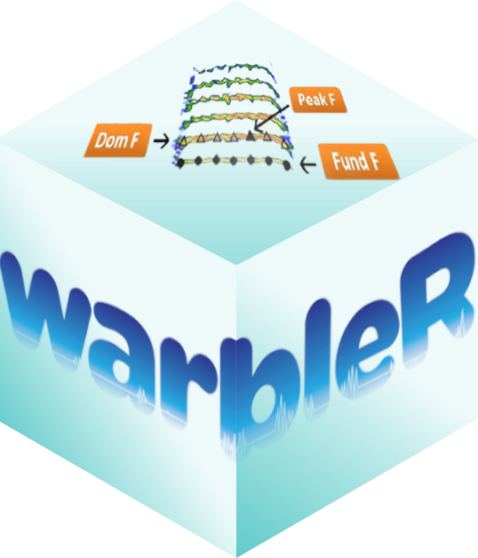

<!-- <script> -->
<!--    $(document).ready(function() { -->
<!--      $head = $('#header'); -->
<!--      $head.prepend('') -->
<!--    }); -->
<!-- </script> -->

<!-- &nbsp;  -->
```{css, echo = FALSE}

div#header h1.title, div#header h3.subtitle, div#header h4.author, div#header h4.date {
  text-align: center
}

```




The [warbleR](https://cran.r-project.org/package=warbleR) package is intended to facilitate the analysis of the structure of the animal acoustic signals in R. Users can enter their own data into a workflow that facilitates spectrographic visualization and measurement of acoustic parameters **warbleR** makes use of the fundamental sound analysis tools of the **seewave** package, and offers new tools for acoustic structure analysis. These tools are available for batch analysis of acoustic signals.

&nbsp;

<font size = "3">The main features of the package are:

 - The use of loops to apply tasks through acoustic signals referenced in a selection table
 - The production of image files with spectrograms that let users organize data and verify acoustic analyzes </font>

&nbsp;

<center></center>

&nbsp;


The package offers functions for:

- Browse and download recordings of [Xeno-Canto](https://www.xeno-canto.org/)
- Explore, organize and manipulate multiple sound files
- Create spectrograms of complete recordings or individual signals
- Run different measures of acoustic signal structure
- Evaluate the performance of measurement methods
- Catalog signals
- Characterize different structural levels in acoustic signals
- Statistical analysis of duet coordination
- Consolidate databases and annotation tables


Most of the functions allow the parallelization of tasks, which distributes the tasks among several cores to improve computational efficiency. Tools to evaluate the performance of the analysis at each step are also available. All these tools are provided in a standardized workflow for the analysis of the signal structure, making them accessible to a wide range of users, including those without much knowledge of R. **warbleR** is a young package (officially published in 2017) currently in a maturation stage.

&nbsp;

## Input acoustic data in warbleR

Most **warbleR** functions take as input annotation tables. An annotation table (or selection table in Raven's and warbleR's terminology) is a data set that contains information about the location in time (and sometimes in frequency) of the sounds of interest in one or more sound files. **warbleR** can take sound file annotations represented in the following **R** objects: 

 - Data frames
 - Selection tables
 - Extended selection tables


The data "lbh_selec_table" that comes with the package provides a good example will on the annotation data format used in **warbleR**:
```{r extn_sel_2, echo = FALSE, message = FALSE}

# load packages
library(warbleR)
library(knitr)

cf <- read.csv("function_descrip_table.csv", stringsAsFactors = FALSE)


data(list = c("Phae.long1", "Phae.long2", "Phae.long3", "Phae.long4"))
writeWave(Phae.long1, file.path(tempdir(), "Phae.long1.wav"))
writeWave(Phae.long2, file.path(tempdir(), "Phae.long2.wav"))
writeWave(Phae.long3, file.path(tempdir(), "Phae.long3.wav"))
writeWave(Phae.long4, file.path(tempdir(), "Phae.long4.wav"))


warbleR_options(wav.path = tempdir())

options(knitr.table.format = "html")
knitr::opts_chunk$set(
  comment = "",
  fig.width = 5, 
  fig.height = 3.5,
  dpi = 40,
  out.width = "80%"
)
opts_knit$set(root.dir = tempdir())
options(width = 100, max.print = 100)
```

```{r extn_sel_4.1, eval=FALSE}

data("lbh_selec_table")

lbh_selec_table
```

```{r extn_sel_4.2, echo=FALSE, eval = TRUE}

library(kableExtra)
kbl <- kable(lbh_selec_table, align = "c", row.names = F, format = "html")

kbl <- kable_styling(kbl, bootstrap_options = "striped", font_size = 14)

kbl <- scroll_box(kbl,
  width = "740px",
  box_css = "border: 1px solid #ddd; padding: 1px; ", extra_css = NULL
)

kbl
```
&nbsp;
 
<!-- light brown box -->
<div class="alert alert-warning">

Take a look at the vignette ['Annotation data format'](https://marce10.github.io/warbleR/articles/annotation_data_format.html) for more details on annotation data formats.

</div>

## **warbleR** functions and the workflow of analysis in bioacoustics

Bioacoustic analyzes generally follow a specific processing sequence and analysis. This sequence can be represented schematically like this:

```{r, eval = FALSE, echo = FALSE}

library(warbleR)

wf <- ls("package:warbleR")

wf <- wf[-c(2, 7, 8, 10, 12, 16, 17, 19, 20, 23, 24, 28, 31, 32, 33, 38, 42, 43, 44, 47, 50, 53, 59, 64, 66, 68, 68, 72, 74, 80, 81, 85, 90, 93, 94, 96)]

df <- data.frame(funciones = wf, `Obtener-preparar grabaciones` = "", `Anotar` = "", `Medir` = "", `Revision` = "", `Inspeccion visual` = "", `Analisis estadistico` = "", `Otros` = "")

df2 <- edit(df)


df2$`organizar.anotaciones` <- ""

names(df2) <- names(df2)[c(1:3, 9, 4:8)]

df3 <- edit(df2)

df4 <- df3

df4[is.na(df4)] <- ""

df4 <- df4[df4$Obtener.preparar.grabaciones != "borrar", ]

names(df4) <- c("Funcion", "Obtener-preparar grabaciones", "Anotar", "Organizar anotaciones", "Medir estructura", "Verificar", "Inspeccion visual", "Analisis estadistico", "Otros")

rownames(df4) <- 1:nrow(df4)

df5 <- df4[order(df4$`Obtener-preparar grabaciones`, df4$Anotar, df4$`Organizar anotaciones`, df4$`Medir estructura`, df4$Verificar, df4$`Inspeccion visual`, df4$`Analisis estadistico`, df4$Otros, decreasing = TRUE), ]

df4 <- df4[c(5, 8, 18, 29, 34, 35, 37, 38, 39, 55, 56, 26, 1, 19, 40, 46, 4, 11, 16, 17, 24, 25, 32, 41, 45, 7, 12, 13, 14, 15, 23, 27, 30, 42, 47, 48, 57, 2, 3, 28, 44, 50, 51, 52, 58, 9, 10, 21, 22, 59, 6, 20, 31, 33, 36, 43, 49, 53, 54), ]

# write.csv(df4, "cuadro de funciones warbleR.csv", row.names = FALSE)
```

 

&nbsp; 

We can group **warbleR** functions according to the bioacoustic analysis stages.

&nbsp;

### Get and prepare recordings

The `query_xc()` function allows you to search and download sounds from the free access database [Xeno-Canto](https://www.xeno-canto.org/). You can also convert .mp3 files to .wav, change the sampling rate of the files and correct corrupt files, among other functions.

```{r, echo = FALSE, eval = TRUE}

library(kableExtra)

names(cf) <- gsub("\\.", " ", names(cf))

cf2 <- cf[cf$`Obtener preparar grabaciones` == "x", c("Function", "Description", "Works on", "Output")]

cf2$Function <- cell_spec(x = cf2$Function, link = paste0("https://marce10.github.io/warbleR/reference/", cf2$Function, ".html"))

kbl <- kable(cf2, align = "c", row.names = F, format = "html", escape = F)

kbl <- column_spec(kbl, 1, bold = TRUE)

kbl <- column_spec(kbl, 2:4, italic = TRUE)

kbl <- kable_styling(kbl, bootstrap_options = "striped", font_size = 14)

kbl
```

&nbsp; 

### Annotating sound

It is recommended to make annotations in other programs and then import them into R (for example in Raven and import them with the **Rraven** package). However, **warbleR** offers some functions to facilitate manual or automatic annotation of sound files, as well as the subsequent manipulation:

```{r, echo = FALSE, eval = TRUE}

cf2 <- cf[cf$Anotar == "x", c("Function", "Description", "Works on", "Output")]

cf2$Function <- cell_spec(x = cf2$Function, link = paste0("https://marce10.github.io/warbleR/reference/", cf2$Function, ".html"))

kbl <- kable(cf2, align = "c", row.names = F, format = "html", escape = F)

kbl <- column_spec(kbl, 1, bold = TRUE)

kbl <- column_spec(kbl, 2:4, italic = TRUE)

kbl <- kable_styling(kbl, bootstrap_options = "striped", font_size = 14)

kbl
```

&nbsp; 

### Organize annotations

The annotations (or selection tables) can be manipulated and refined with a variety of functions. Selection tables can also be converted into the compact format *extended selection tables*:

```{r, echo = FALSE, eval = TRUE}

cf2 <- cf[cf$`Organizar anotaciones` == "x", c("Function", "Description", "Works on", "Output")]

cf2$Function <- cell_spec(x = cf2$Function, link = paste0("https://marce10.github.io/warbleR/reference/", cf2$Function, ".html"))

kbl <- kable(cf2, align = "c", row.names = F, format = "html", escape = F)

kbl <- column_spec(kbl, 1, bold = TRUE)

kbl <- column_spec(kbl, 2:4, italic = TRUE)

kbl <- kable_styling(kbl, bootstrap_options = "striped", font_size = 14)

kbl
```

&nbsp; 

### Measure acoustic signal structure

Most **warbleR** functions are dedicated to quantifying the structure of acoustic signals listed in selection tables using batch processing. For this, 4 main measurement methods are offered:

1. Spectrographic parameters
1. Cross correlation
1. Dynamic time warping (DTW)
1. Statistical descriptors of cepstral coefficients

Most functions gravitate around these methods, or variations of these methods:

```{r, echo = FALSE, eval = TRUE}

cf2 <- cf[cf$`Medir estructura` == "x", c("Function", "Description", "Works on", "Output")]

cf2$Function <- cell_spec(x = cf2$Function, link = paste0("https://marce10.github.io/warbleR/reference/", cf2$Function, ".html"))

kbl <- kable(cf2, align = "c", row.names = F, format = "html", escape = F)

kbl <- column_spec(kbl, 1, bold = TRUE)

kbl <- column_spec(kbl, 2:4, italic = TRUE)

kbl <- kable_styling(kbl, bootstrap_options = "striped", font_size = 14)

kbl
```

&nbsp; 

### Verify annotations

Functions are provided to detect inconsistencies in the selection tables or modify selection tables. The package also offers several functions to generate spectrograms showing the annotations, which can be organized by annotation categories. This allows you to verify if the annotations match the previously defined categories, which is particularly useful if the annotations were automatically generated.

```{r, echo = FALSE, eval = TRUE}

cf2 <- cf[cf$Verificar == "x", c("Function", "Description", "Works on", "Output")]

cf2$Function <- cell_spec(x = cf2$Function, link = paste0("https://marce10.github.io/warbleR/reference/", cf2$Function, ".html"))

kbl <- kable(cf2, align = "c", row.names = F, format = "html", escape = F)

kbl <- column_spec(kbl, 1, bold = TRUE)

kbl <- column_spec(kbl, 2:4, italic = TRUE)

kbl <- kable_styling(kbl, bootstrap_options = "striped", font_size = 14)

kbl
```

&nbsp; 

### Visually inspection of annotations and measurements

```{r, echo = FALSE, eval = TRUE}

cf2 <- cf[cf$`Inspeccion visual` == "x", c("Function", "Description", "Works on", "Output")]

cf2$Function <- cell_spec(x = cf2$Function, link = paste0("https://marce10.github.io/warbleR/reference/", cf2$Function, ".html"))

kbl <- kable(cf2, align = "c", row.names = F, format = "html", escape = F)

kbl <- column_spec(kbl, 1, bold = TRUE)

kbl <- column_spec(kbl, 2:4, italic = TRUE)

kbl <- kable_styling(kbl, bootstrap_options = "striped", font_size = 14)

kbl
```

&nbsp; 

### Additional functions

Finally, **warbleR** offers functions to simplify the use of extended selection tables, organize large numbers of images with spectrograms and generate elaborated signal visualizations:

```{r, echo = FALSE, eval = TRUE}

cf2 <- cf[cf$`Analisis estadistico` == "x" | cf$Otros == "x", c("Function", "Description", "Works on", "Output")]

cf2$Function <- cell_spec(x = cf2$Function, link = paste0("https://marce10.github.io/warbleR/reference/", cf2$Function, ".html"))

kbl <- kable(cf2, align = "c", row.names = F, format = "html", escape = F)

kbl <- column_spec(kbl, 1, bold = TRUE)

kbl <- column_spec(kbl, 2:4, italic = TRUE)

kbl <- kable_styling(kbl, bootstrap_options = "striped", font_size = 14)

kbl
```

&nbsp;

---


## References

1. Araya-Salas M, G Smith-Vidaurre & M Webster. 2017. Assessing the effect of sound file compression and background noise on measures of acoustic signal structure. Bioacoustics 4622, 1-17
1. Araya-Salas M, Smith-Vidaurre G (2017) warbleR: An R package to streamline analysis of animal acoustic signals. Methods Ecol Evol 8:184-191.

&nbsp; 

---

<font size="4">Session information</font>

```{r session info, echo=F}

sessionInfo()
```
