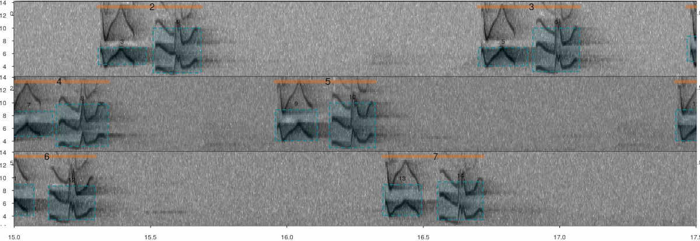

<!-- skyblue box -->
<div class="alert alert-info">

This vignette explains in detail the structure of the **R** data objects containing sound file annotations that are required by the package **warbleR**.

</div>


```{r annotations_2, echo = FALSE, message = FALSE}


rm(list = ls())

# unload all non-based packages
out <-
  sapply(paste('package:', names(sessionInfo()$otherPkgs), sep = ""), function(x)
    try(detach(x, unload = FALSE, character.only = TRUE), silent = T)
  )

#load packages
library(warbleR)
library(knitr)
library(kableExtra)


# cf <- read.csv("./data/cuadro de funciones warbleR.csv", stringsAsFactors = FALSE)

# warbleR_options(wav.path = "./examples")

options(knitr.table.format = "html")
opts_chunk$set(comment = "")
options(width = 100, max.print = 100)

# avoid weird printing of selection tables
Sys.setenv(NO_COLOR = 1)

print_st_no_color <- function(x, ...) if (is(x, "selection_table")) warbleR:::print.selection_table(x, no.color = TRUE, ...) else
  warbleR:::print.extended_selection_table(x, no.color = TRUE, ...)


```


An annotation table (or selection table in Raven's and warbleR's terminology) is a data set that contains information about the location in time (and sometimes in frequency) of the sounds of interest in one or more sound files. **warbleR** can take sound file annotations represented in the following **R** objects: 

 - Data frames
 - Selection tables
 - Extended selection tables
 
The last 2 are annotation specific R classes included in **warbleR**. Here we described the basic structure of these objects and how they can be created.


# Data frames

Data frames with sound file annotations must contain the following columns: 

 1) **sound.files**: character or factor column with the name of the sound files including the file extension (e.g. "rec_1.wav")
 1) **selec**: numeric, character or factor column with a unique identifier (at least within each sound file) for each annotation (e.g. 1, 2, 3 or "a", "b", "c")
 1) **start**: numeric column with the start position in time of an annotated sound (in seconds)
 1) **end**: numeric column with the end position in time of an annotated sound (in seconds)

```{r, echo = FALSE}

options(digits = 3)

set.seed(123)

start <- runif(n = 4, min = 0.2, max = 10)

cd.anot <-
  data.frame(
    sound.files = rep(c("sound_file_1.wav", "sound_file_2.wav"), each = 2),
    selec = rep(1:2, 2),
    start,
    end =  start + abs(rnorm(n = 4, mean = 1))
  )


kbl <-
  knitr::kable(cd.anot,
               align = "c",
               row.names = F,
               format = "html")

kbl <-
  kableExtra::kable_styling(kbl, bootstrap_options = "striped", font_size = 14)

kbl

```

Data frames containing annotations can also include the following optional columns: 

 - 1) **bottom.freq**: numeric column with the bottom frequency of the frequency range of the annotation (in kHz)
 - 1) **top.freq**: numeric column with the top frequency of the frequency range of the annotation (in kHz)
 - 1) **channel**: numeric column with the number of the channel in which the annotation is found in a multi-channel sound file (optional, by default is 1 if not supplied)

```{r, echo = FALSE}

cd.anot$bottom.freq <- rnorm(n = 4, mean = 5)
cd.anot$top.freq <- rnorm(n = 4, mean = 9)

cd.anot$channel <- rep(1, 4)

# cd.anot <- cd.anot[, c(1, 7, 2:6)]

kbl <-
  knitr::kable(cd.anot,
               align = "c",
               row.names = F,
               format = "html")


kbl <-
  kableExtra::kable_styling(kbl, bootstrap_options = "striped", font_size = 14)

kbl

```

The sample data "lbh_selec_table" contains a data frame with annotations with the format expected by **warbleR**:

```{r annotations_4.1, eval=FALSE}

library(warbleR)

data("lbh_selec_table")


knitr::kable(lbh_selec_table)
```

```{r annotations_4.2, echo=FALSE}

kbl <-
  knitr::kable(
    lbh_selec_table,
    align = "c",
    row.names = F,
    format = "html"
  )

kbl <-
  kableExtra::kable_styling(kbl, bootstrap_options = "striped", font_size = 14)

kbl
```

Typically, annotations are created in other sound analysis programs (mainly, Raven, Avisoft, Syrinx and Audacity) and then imported into *R*. We recommend annotating sound files in [Raven sound analysis software](http://www.birds.cornell.edu/brp/raven/RavenOverview.html) ([Cornell Lab of Ornithology](http://www.birds.cornell.edu)) and then importing them into **R** with the package [**Rraven**](https://marce10.github.io/Rraven/). This package facilitates data exchange between R and [Raven sound analysis software](http://www.birds.cornell.edu/brp/raven/RavenOverview.html) and allow users to import annotation data into R using the **warbleR** annotation format (see argument 'warbler.format' in the function `imp_raven()`).

<!-- light brown box -->
<div class="alert alert-warning">

Data frames containing annotations always refer to sound files. Therefore, when using data frames users *must always indicate the location of the sound files* to every **warbleR** function when providing annotations in this format.

</div>


# warbleR annotation formats

## Selection tables

These objects are created with the `selection_table()` function. The function takes data frames containing annotation data as in the format described above. Therefore the same mandatory and optional columns are used by selection tables. The function verifies if the information is consistent (see the function `check_sels()` for details) and saves the 'diagnostic' metadata as an attribute in the output object. Selection tables are basically data frames in which the information contained has been double checked to ensure it can be read by other **warbleR** functions.

Selection tables are created by the function `selection_table()`:

```{r annotations_4.32, eval = FALSE}

# write example sound files in temporary directory
writeWave(Phae.long1, file.path(tempdir(), "Phae.long1.wav"))
writeWave(Phae.long2, file.path(tempdir(), "Phae.long2.wav"))
writeWave(Phae.long3, file.path(tempdir(), "Phae.long3.wav"))
writeWave(Phae.long4, file.path(tempdir(), "Phae.long4.wav"))

st <-
  selection_table(X = lbh_selec_table, path = tempdir())

knitr::kable(st)
```

```{r, eval = TRUE, echo = FALSE}


writeWave(Phae.long1, file.path(tempdir(), "Phae.long1.wav"))
writeWave(Phae.long2, file.path(tempdir(), "Phae.long2.wav"))
writeWave(Phae.long3, file.path(tempdir(), "Phae.long3.wav"))
writeWave(Phae.long4, file.path(tempdir(), "Phae.long4.wav"))

# global parameters
st <-
  selection_table(X = lbh_selec_table, pb = FALSE, path = tempdir())

kbl <- knitr::kable(st)

kbl <-
  kableExtra::kable_styling(kbl, bootstrap_options = "striped", font_size = 14)

kbl

```

Selection table is an especific object class: 
```{r}

class(st)

```

They have their own printing method:
```{r, eval = FALSE}

st

```

```{r, eval = TRUE, echo = FALSE, collapse = TRUE}

print_st_no_color(st)

```


Note that the path to the sound files must be provided. This is necessary in order to verify that the data provided conforms to the characteristics of the audio files.

<!-- light brown box -->
<div class="alert alert-warning">

Selection table also refer to sound files. Therefore, users **must always indicate the location of the sound files to every *warbleR* function** when providing annotations in this format

</div>


## Extended selection tables

Extended selection tables are annotations that include both the acoustic and annotation data. This an specific object class, *extended_selection_table*, that include a list of 'wave' objects corresponding to each of the selections in the data. Therefore, the function **transforms the selection table into self-contained objects** since the original sound files are no longer needed to perform most of the acoustic analysis in **warbleR**. This can facilitate the storage and exchange of (bio)acoustic data. This format can also speed up analyses, since it is not necessary to read the sound files every time the data is analyzed.

The `selection_table()` function also creates extended selection tables. To do this, users must set the argument `extended = TRUE` (otherwise, the class would be a selection table). The following code converts the example 'lbh_selec_table' data into an extended selection table:

```{r annotations_4.3, eval = FALSE}

est <- selection_table(
  X = lbh_selec_table,
  pb = FALSE,
  extended = TRUE,
  path = tempdir()
)

```

```{r annotations_4.33, eval = TRUE, echo = FALSE}

est <- selection_table(
  X = lbh_selec_table,
  pb = FALSE,
  extended = TRUE,
  path = tempdir()
)

```


Extended selection table is an specific object class: 
```{r}

class(est)

```

The class has its own printing method:
```{r, eval = FALSE}

est

```


```{r, eval = TRUE, echo = FALSE, collapse = TRUE}

print_st_no_color(est)

```


### Handling extended selection tables

Several functions can be used to deal with objects of this class. First can test if the object belongs to the *extended_selection_table*:

```{r annotations_5}

is_extended_selection_table(est)
```


You can subset the selection in the same way that any other data frame and it will still keep its attributes:

```{r annotations_6}

est2 <- est[1:2, ]

is_extended_selection_table(est2)
```

As shown above, there is also a generic version of `print()` for this class of objects:

```{r annotations_7, eval = FALSE}

## print
print(est)

```


```{r annotations_7.05, eval = TRUE, echo = FALSE, collapse = TRUE}

print_st_no_color(est)

```

... which is equivalent to:

```{r annotations_7.1, eval=FALSE}

est
```

```{r, eval = TRUE, echo = FALSE, collapse = TRUE}

print_st_no_color(est)

```

You can also split them and/or combine them by rows. Here the original *extended_selection_table* is divided into 2 and bound again using `rbind()`:

```{r annotations_8, eval = FALSE}

est3 <- est[1:5, ]

est4 <- est[6:11, ]

est5 <- rbind(est3, est4)

# print
est5
```


```{r annotations_8.1, echo=FALSE, collapse = TRUE}

est3 <- est[1:5, ]

est4 <- est[6:11, ]

est5 <- rbind(est3, est4)

# print
print_st_no_color(est5)
```

```{r annotations_8.2}

# same annotations
all.equal(est, est5, check.attributes = FALSE)

# same acoustic data
all.equal(attr(est, "wave.objects"), attr(est5, "wave.objects"))

```


The 'wave' objects can be read individually using `read_sound_file()`, a wrapper for the `readWave()` function from **tuneR**, which can handle extended selection tables:

```{r annotations_8.21}

wv1 <- read_sound_file(X = est, index = 3, from = 0, to = 0.37)
```


These are regular 'wave' objects:

```{r annotations_8.22, out.width= 750}

class(wv1)

wv1

# print spectrogram
seewave::spectro(
  wv1,
  wl = 150,
  grid = FALSE,
  scale = FALSE,
  ovlp = 90,
  palette = viridis::viridis,
  collevels = seq(-100, 0 , 5)
)
```

 

```{r annotations_8.23, out.width= 750}
par(mfrow = c(3, 2), mar = rep(0, 4))

for (i in 1:6) {
  wv <- read_sound_file(
    X = est,
    index = i,
    from = 0.05,
    to = 0.32
  )
  
  seewave::spectro(
    wv,
    wl = 150,
    grid = FALSE,
    scale = FALSE,
    axisX = FALSE,
    axisY = FALSE,
    ovlp = 90,
    palette = viridis::viridis,
    collevels = seq(-100, 0 , 5)
  )
}
```


The `read_sound_file()` function requires a selection table, as well as the row index (i.e. the row number) to be able to read the 'wave' objects. It can also read a regular 'wave' file if the path is provided.

Note that other functions that modify data frames are likely to delete the attributes in which the 'wave' objects and metadata are stored. For example, the merge and the extended selection box will remove its attributes:

```{r annotations_8.24}

# create new data frame
Y <-
  data.frame(
    sound.files = est$sound.files,
    site = "La Selva",
    lek = c(rep("SUR", 5), rep("CCL", 6))
  )

# combine
mrg_est <- merge(est, Y, by = "sound.files")

# check class
is_extended_selection_table(mrg_est)
```


In this case, we can use the `fix_extended_selection_table()` function to transfer the attributes of the original extended selection table:

```{r annotations_8.25}

# fix est
mrg_est <- fix_extended_selection_table(X = mrg_est, Y = est)

# check class
is_extended_selection_table(mrg_est)
```

This works as long as some of the original sound files are retained and no other selections are added.

Finally, these objects can be used as input for most **warbleR** functions, without the need of refering to any sound file. For instance we can easily measure acoustic parameters on data in *extended_selection_table* format using the function `spectro_analysis()`:

```{r annotations_12.1, eval=FALSE}

#  parametros espectrales
sp <- spectro_analysis(est)

# check first 10 columns
sp[, 1:10]
```


```{r, eval = TRUE, echo = FALSE}

sp <- spectro_analysis(est)

kbl <- knitr::kable(sp[, 1:10])

kbl <-
  kableExtra::kable_styling(kbl, bootstrap_options = "striped", font_size = 14)

kbl
```


### 'By element' vs 'by song' extended selection tables

As mention above extended selection tables by default contain one wave object for each annotation (i.e. row):

```{r}

length(attr(est, "wave.objects")) == length(unique(paste(est$sound.files)))

```

This default behavior generates a 'by element' extended selection table, as each resulting wave object contains a single element (usually defined as continuous traces of power spectral entropy in the spectrograms). Acoustic signals can have structure above this basic signal units (elements), like in long repertoire songs or multi-syllable calls, in which elements are always broadcast as a sequences, often with consistent order and timing. It is then desirable to keep information about the relative position of elements in these sequences. However,'by element' extended selection tables discards some element sequence information. This can be overwritten using the argument `by.song`, which allows to keep in a single wave object all the elements belonging to the same 'song'. In this case song refers to any grouping of sounds above the 'element' level.   

The song of the Scale-throated Hermit (*Phaethornis eurynome*) will be used to show how this can be done. This song consists of a sequence of two elements, which are separated by short gaps:

```{r songs 3, echo = FALSE, fig.align= "right", out.width="100%", fig.cap="Annotated spectrogram of Scale-throated Hermit songs. Vertical orange lines highlight songs while skyblue boxes show the frequency-time position of individual elements. The sound file can be found at https://xeno-canto.org/15607."}



```

An example sound file with this species' song can be downloaded as follows (the sound file can also be downloaded manually from [this link](https://xeno-canto.org/15607/download)):
```{r, warning=FALSE, message=FALSE}

# load data
data("sth_annotations")

# download sound file from Xeno-Canto using catalog id
out <-
  query_xc(qword = "nr:15607",
           download = TRUE,
           path = tempdir())

# check file is found in temporary directory
list.files(path = tempdir(), "mp3")
```

**warbleR** comes with an example data set containing annotations on this sound file, which can be loaded like this:

```{r}
# load  Scale-throated Hermit example annotations
data("sth_annotations")

```

Note that these annotations contain an additional column called 'song', with the song ID labels for elements (rows) belonging to the same song:

```{r, eval = FALSE}
# print into the console
knitr::kable(head(sth_annotations))

```

```{r, echo=FALSE}

kbl <- knitr::kable(head(sth_annotations))

kbl <-  kableExtra::kable_styling(kbl, bootstrap_options = "striped", font_size = 14)

kbl

```

These data (annotations + sound file) can be used to create a 'by song' extended selection table. To do this the name of the column containing the 'song' level labels must be supplied to the argument 'by.song':
```{r}

# create by song extended selection table
bs_est <-
  selection_table(X = sth_annotations,
                  extended = TRUE,
                  by.song = "song", 
                  path = tempdir())

```

In a 'by song' extended selection table there are as many wave objects as songs in our annotation data: 
```{r}

length(attr(bs_est, "wave.objects")) == length(unique(paste(bs_est$sound.files, bs_est$song)))

```
 
We can extract an entire wave object to check that two elements are actually included:

```{r}
# extract wave object
wave_song1 <-
  read_sound_file(
    X = bs_est,
    index = 1,
    from = 0,
    to = Inf
  )

# plot spectro
seewave::spectro(
  wave_song1,
  wl = 150,
  grid = FALSE,
  scale = FALSE,
  ovlp = 90,
  palette = viridis::viridis,
  collevels = seq(-100, 0 , 5),
  flim = c(1, 12)
)

```

Note that 'by song' extended selection tables can be converted into 'by element' tables using the function `by_element_est()`. 

### Performance

The use of *extended_selection_table* objects can improve performance (in our case, measured as time). Here we use **microbenchmark** to compare the performance of `sig2noise()` and **ggplot2** to plot the results. First, a selection table with 1000 selections is created simply by repeating the sample data frame several times and then is converted to an extended selection table:

```{r annotations_13, eval = FALSE}

# create long selection table
lng.selec.table <- do.call(rbind, replicate(10, lbh_selec_table,
                                            simplify = FALSE))

# relabels selec
lng.selec.table$selec <- 1:nrow(lng.selec.table)

# create extended selection table
lng_est <- selection_table(X = lng.selec.table,
                           pb = FALSE,
                           extended = TRUE)


# load packages
library(microbenchmark)
library(ggplot2)

# check performance
mbmrk.snr <- microbenchmark(
  extended = sig2noise(lng_est,
                       mar = 0.05),
  regular = sig2noise(lng.selec.table,
                      mar = 0.05),
  times = 50
)

autoplot(mbmrk.snr) + ggtitle("sig2noise")
```


<center> </center>


The function runs much faster in the extended selection tables. Performance gain is likely to improve when longer recordings and data sets are used (that is, to compensate for computing overhead).

### Sharing acoustic data

This new object class allows to share complete data sets, including acoustic data. To do this we can make use of the RDS file format to save extended selection tables. These files can be easily shared with others, allowing to share a entire acoustic data set in a single file, something that can be tricky when dealing with acoustic data. For example, the following code downloads an extended selection table of inquiry calls from Spix's disc-winged bats used in [Araya-Salas *et al* (2020)](https://marce10.github.io/publication/araya-salas-2020/) (it can take a few minutes! Can also be manually downloaded from [here](https://figshare.com/ndownloader/files/21167052)):

```{r downloading rds, eval = TRUE}

URL <- "https://figshare.com/ndownloader/files/21167052"

download.file(
  url = URL,
  destfile = file.path(tempdir(), "est_inquiry.RDS"),
  method = "wget"
)

est <- readRDS(file.path(tempdir(), "est_inquiry.RDS"))

nrow(est)

```

This data is ready to be used. For instance, here I create a multipanel graph with the spectrograms of the first 6 selections:

```{r, eval = TRUE, out.width= 750}

par(mfrow = c(3, 2), mar = rep(0, 4))

for (i in 1:6) {
  wv <- read_wave(
    X = est,
    index = i,
    from = 0.05,
    to = 0.17
  )
  
  spectro(
    wv,
    grid = FALSE,
    scale = FALSE,
    axisX = FALSE,
    axisY = FALSE,
    ovlp = 90,
    flim = c(10, 50),
    palette = viridis::viridis,
    collevels = seq(-100, 0 , 5)  
    )
}

```

We can also measured pairwise cross correlation (for simplicity only on the first 4 rows):

```{r, eval = FALSE}

xcorr_inquiry <- cross_correlation(est[1:4, ])

xcorr_inquiry
```


```{r, echo=FALSE}

xcorr_inquiry <- cross_correlation(est[1:4, ])

kbl <- knitr::kable(xcorr_inquiry, row.names = TRUE)

kbl <-  kableExtra::kable_styling(kbl, bootstrap_options = "striped", font_size = 14)

kbl

```

------------------------------------------------------------------------

## References

 - Araya-Salas (2017), *Rraven: connecting R and Raven bioacoustic software*. R package version 1.0.2.
 - Araya-Salas, M., Hernández-Pinsón, H. A., Rojas, N., & Chaverri, G. (2020). *Ontogeny of an interactive call-and-response system in Spix's disc-winged bats*. Animal Behaviour, 166, 233-245.

------------------------------------------------------------------------


<font size="4">Session information</font>

```{r session info, echo=F}

sessionInfo()

```
