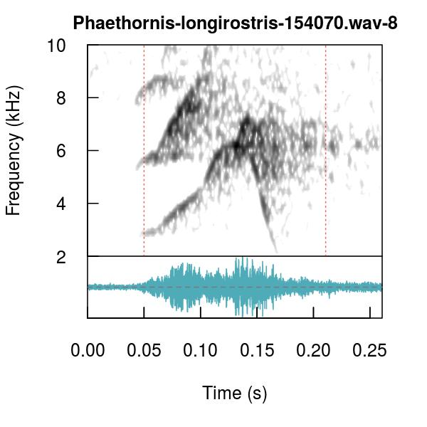
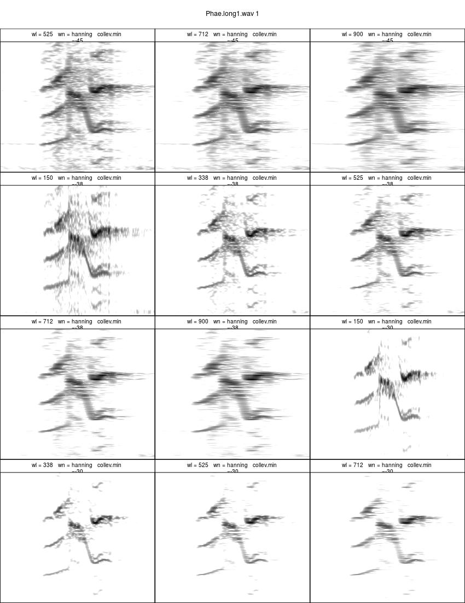
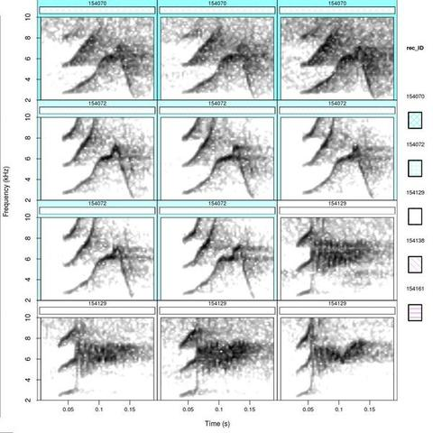
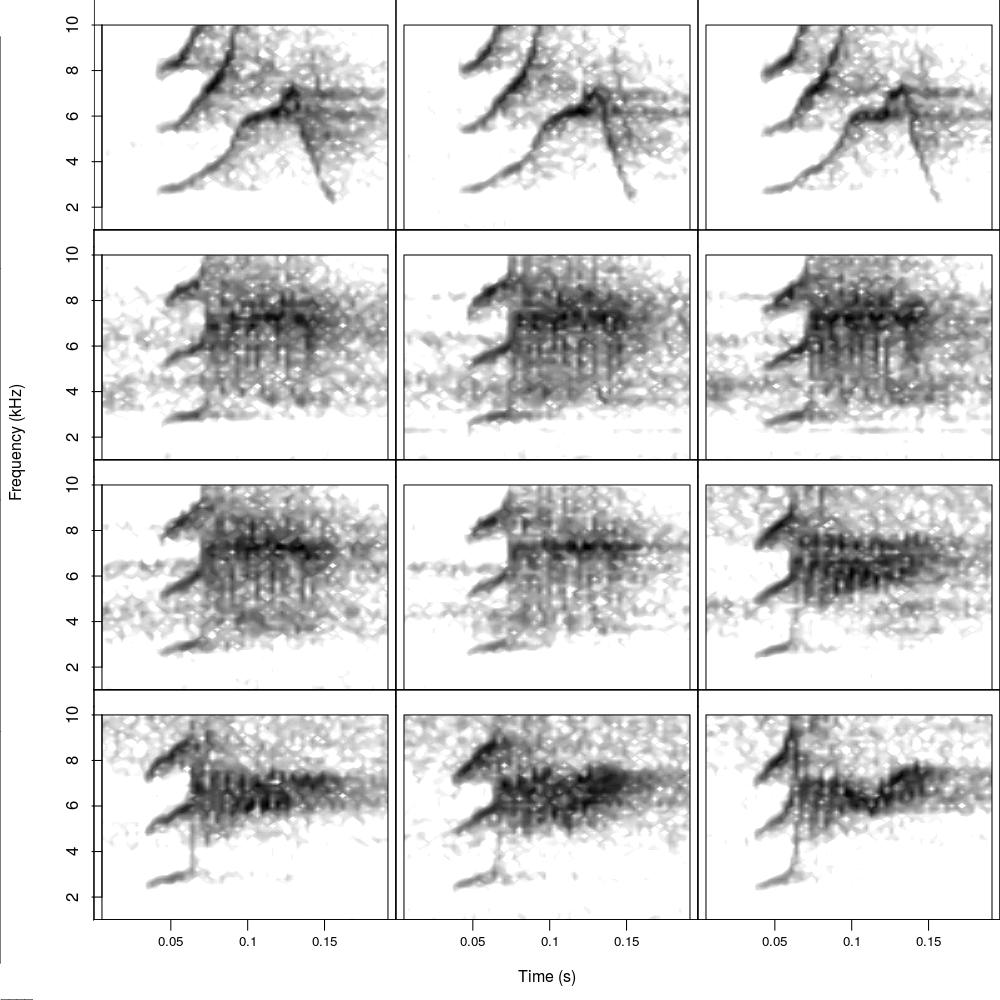

<!-- <center> <h1><b>Visual inspection and classification of signals</h1></b> -->
<!-- <center> <i><font size="4">Marcelo Araya-Salas and Grace Smith Vidaurre</font></i> </center> -->
<!-- <center> `r Sys.Date()` </center> -->

```{css, echo = FALSE}
div#header h1.title, div#header h3.subtitle, div#header h4.author, div#header h4.date {
  text-align: center
}
```

## Bioacoustics in R with `warbleR`


Bioacoustics research encompasses a wide range of questions, study systems and methods, including the software used for analyses. The `warbleR` and `Rraven` packages leverage the flexibility of the `R` environment to offer a broad and accessible bioinformatics tool set. These packages fundamentally rely upon two types of data to begin bioacoustic analyses in R:

  1. **Sound files:** Recordings in _wav_ or _mp3_ format, either from your own research or open-access databases like _xeno-canto_

  2. **Selection tables:** Selection tables contain the temporal coordinates (start and end points) of selected acoustic signals within recordings

### Package repositories

These packages are both available on _CRAN_: [`warbleR`](https://cran.r-project.org/package=warbleR/), [`Rraven`](https://cran.r-project.org/package=Rraven), as well as on _GitHub_: [`warbleR`](https://github.com/maRce10/warbleR), [`Rraven`](https://github.com/maRce10/Rraven). The GitHub repository will always contain the latest functions and updates. You can also check out an article in _Methods in Ecology and Evolution_ documenting the `warbleR` package <a href='#References'><sup>[1]</sup></a>.

We welcome all users to provide feedback, contribute updates or new functions and report bugs to warbleR's GitHub repository.

Please note that `warbleR` and `Rraven` use functions from the [`seewave`](https://cran.r-project.org/package=seewave), [`monitoR`](https://cran.r-project.org/package=monitoR), [`tuneR`](https://cran.r-project.org/package=tuneR) and [`dtw`](https://cran.r-project.org/package=dtw) packages internally. `warbleR` and `Rraven` have been designed to make bioacoustics analyses more accessible to `R` users, and such analyses would not be possible without the tools provided by the packages above. These packages should be given credit when using `warbleR` and `Rraven` by including citations in publications as appropriate (e.g. `citation("seewave")`).

### Parallel processing in `warbleR`

Parallel processing, or using multiple cores on your machine, can greatly speed up analyses. All iterative `warbleR` functions now have parallel processing for Linux, Mac and Windows operating systems. These functions also contain progress bars to visualize progress during normal or parallel processing. See <a href='#References'><sup>[1]</sup></a> for more details about improved running time using parallel processing.

## **Vignette introduction**

 Here we work on a case study of microgeographic vocal variation in long-billed hermit hummingbirds, _Phaethornis longirostris_ <a href='#References'><sup>[2]</sup></a> by:

  1. Performing quality control processing on selected signals, including visual inspection and tailoring temporal coordinates
  
  2. Making lexicons for visual classification of signals 

This vignette can be run without an advanced understanding of `R`, as long as you know how to run code in your console. However, knowing more about basic `R` coding would be very helpful to modify the code for your research questions.

For more details about function arguments, input or output, read the documentation for the function in question (e.g. `?catalog`). 
&nbsp; 

```{r, echo = FALSE, message = FALSE}

# remove all objects
rm(list = ls())

# unload all non-based packages
out <- sapply(paste("package:", names(sessionInfo()$otherPkgs), sep = ""), function(x) try(detach(x, unload = FALSE, character.only = TRUE), silent = TRUE))

# load packages
X <- c("warbleR", "knitr")
invisible(lapply(X, library, character.only = TRUE))
# library(kableExtra)

options(knitr.table.format = "html")
# opts_chunk$set(comment = "")
knitr::opts_chunk$set(
  comment = "",
  fig.width = 5, 
  fig.height = 3.5,
  dpi = 40,
  out.width = "80%"
)
# opts_knit$set(root.dir = tempdir())
options(width = 150, max.print = 100)

# from https://stackoverflow.com/questions/28961431/computationally-heavy-r-vignettes, so that vignettes will be built upon installation, but not executed during R CMD check (which is contributing to the /doc being too large)
is_check <- ("CheckExEnv" %in% search()) || any(c(
  "_R_CHECK_TIMINGS_",
  "_R_CHECK_LICENSE_"
) %in% names(Sys.getenv()))
knitr::opts_chunk$set(eval = !is_check, comment = "")

# for vignette checking and image file output
# setwd("~/Desktop/R/warbleR_example2/")

# website to fix gifs
# https://ezgif.com/optimize
```


## **Prepare for analyses**

```{r, eval=FALSE}

library(warbleR)

# set your working directory appropriately
# setwd("/path/to/working directory")

# run this if you have restarted RStudio between vignettes without saving your workspace (assuming that you are in your /home/username directory)
setwd(file.path(getwd(), "warbleR_example"))

# Check your location
getwd()
```

## **Obtain example acoustic data from xeno-canto**

The open-access [xeno-canto](https://www.xeno-canto.org/) database is an excellent source of sound files across avian species. You can query this database by a species or genus of interest. The function `query_xc` has two types of output:

  1. **Metadata of recordings:** geographic coordinates, recording quality, recordist, type of signal, etc.
  
  2. **Sound files:** Sound files in _mp3_ format are returned if the argument `download` is set to `TRUE`.  
  
We recommend downloading metadata first from _xeno-canto_, as this data can be filtered in R to more efficiently download recordings (e.g. only those relevant to your question).

Here, we will query the _xeno-canto_ database to download more _Phaethornis longirostris_ sound files for our question of how male songs vary at a microgeographic scale.

&nbsp; 

```{r, eval=FALSE}

# Query xeno-canto for all Phaethornis recordings (e.g., by genus)
Phae <- query_xc(qword = "Phaethornis", download = FALSE)

# Check out the structure of resulting the data frame
str(Phae)
```

```{r, eval = TRUE, echo = FALSE, message = FALSE}
vgn.path <- getwd()
# Phae <- query_xc(qword = "Phaethornis", download = FALSE)

# write.csv(Phae, file = "~/Dropbox/warbleR/vignettes/Phae.XC.csv", row.names = FALSE)

Phae <- read.csv(file.path(vgn.path, "Phae.XC.csv"), stringsAsFactors = FALSE)

# Check out the structure of resulting the data frame
str(Phae)
```

```{r, eval=FALSE}

# Query xeno-canto for all Phaethornis longirostris recordings
Phae.lon <- query_xc(qword = "Phaethornis longirostris", download = FALSE)

# Check out the structure of resulting the data frame
str(Phae.lon)
```

```{r, eval = TRUE, echo = FALSE, message = FALSE}

# Phae.lon <- query_xc(qword = "Phaethornis longirostris", download = FALSE)

# write.csv(Phae.lon, file = "~/Dropbox/warbleR/vignettes/Phae.lon.XC.csv", row.names = FALSE)

Phae.lon <- read.csv(file.path(vgn.path, "Phae.lon.XC.csv"), stringsAsFactors = FALSE)

# Check out the structure of resulting the data frame
str(Phae.lon)
```
&nbsp; 

You can then use the function `map_xc` to visualize the geographic spread of the queried recordings. `map_xc` will create an image file of a map per species in your current directory if `img = TRUE`. If `img = FALSE`, maps will be displayed in the graphics device. 

```{r, eval=FALSE}

# Image type default is jpeg, but tiff files have better resolution

# When the data frame contains multiple species, this will yield one map per species
map_xc(X = Phae, img = TRUE, it = "tiff") # all species in the genus
map_xc(X = Phae.lon, img = FALSE) # a single species
```

```{r, eval=TRUE, echo=FALSE, message=FALSE}

map_xc(X = Phae.lon, img = FALSE)
```


### Filter [xeno-canto](https://www.xeno-canto.org/) recordings by quality, signal type and locality

In most cases, you will need to filter the _xeno-canto_ metadata by type of signal you want to analyze. When you subset the metadata, you can input the filtered metadata back into `query_xc` to download only the selected recordings. There are many ways to filter data in R, and the example below can be modified to fit your own data. 

Here, before downloading the sound files themselves from _xeno-canto_, we want to ensure that we select high quality sound files that contain songs (rather than other acoustic signal types) and were also recorded at La Selva Biological Station in Costa Rica. 

&nbsp; 
```{r, eval=TRUE, echo=TRUE}

# How many recordings are available for Phaethornis longirostris?
nrow(Phae.lon)

# How many signal types exist in the xeno-canto metadata?
unique(Phae.lon$Vocalization_type)

# How many recordings per signal type?
table(Phae.lon$Vocalization_type)
```

&nbsp; 
```{r, eval=TRUE, echo=TRUE}

# Filter the metadata to select the signals we want to retain

# First by quality
Phae.lon <- Phae.lon[Phae.lon$Quality == "A", ]
nrow(Phae.lon)

# Then by signal type
Phae.lon.song <- Phae.lon[grep("song", Phae.lon$Vocalization_type, ignore.case = TRUE), ]
nrow(Phae.lon.song)

# Finally by locality
Phae.lon.LS <- Phae.lon.song[grep("La Selva Biological Station, Sarapiqui, Heredia", Phae.lon.song$Locality, ignore.case = FALSE), ]

# Check resulting data frame, 6 recordings remain
str(Phae.lon.LS)
```

&nbsp; 

We can check if the location coordinates make sense (all recordings should be from a single place in Costa Rica) by making a map of these recordings using `map_xc`.

```{r, eval=TRUE, echo=TRUE}

# map in the RStudio graphics device (img = FALSE)
map_xc(Phae.lon.LS, img = FALSE)
```

```{r, eval=FALSE, echo=FALSE}

# Not working as of 01 Aug 2017
# This copies the selected sound files to a dropbox folder so they can be shared
# do not show this code
fn <- with(Phae.lon.LS, paste(paste(Genus, Specific_epithet, Recording_ID, sep = "-"), ".wav", sep = " "))
file.copy(from = file.path("/home/m/Documents/Biblioteca de cantos/Trochilidae/XC/wavs", fn), to = file.path("/home/m/Dropbox/Projects/warbleR package/vignette files", fn), overwrite = TRUE)

wlist <- lapply(fn, function(x) downsample(readWave(file.path("/home/m/Dropbox/Projects/warbleR package/vignette files", x)), samp.rate = 22500))

names(wlist) <- fn

saveRDS(wlist, file = "/home/m/Dropbox/Sharing/warbleR/recs.RDS")
```

&nbsp; 

Once you're sure you want the recordings, use `query_xc` to download the files. Also, save the metadata as a _.csv_ file.

```{r, eval=FALSE}

# Download sound files
query_xc(X = Phae.lon.LS)

# Save the metadata object as a .csv file
write.csv(Phae.lon.LS, "Phae_lon.LS.csv", row.names = FALSE)
```

&nbsp; 

### Convert [xeno-canto](https://www.xeno-canto.org/) _mp3_ recordings to _wav_ format

[xeno-canto](https://www.xeno-canto.org/) maintains recordings in _mp3_ format due to file size restrictions. However, we require _wav_ format for all downstream analyses. Compression from _wav_ to _mp3_ and back involves information losses, but recordings that have undergone this transformation have been successfully used in research <a href='#References'> <sup>[3]</sup></a>.

To convert _mp3_ to _wav_, we can use the warbleR function `mp32wav`, which relies on a underlying function from the [`tuneR`](https://cran.r-project.org/package=tuneR) package. This function does not always work (and it remains unclear as to why!). This bug should be fixed in future versions of `tuneR`. If RStudio aborts when running `mp32wav`, use an _mp3_ to _wav_ converter online, or download the open source software `Audacity` (available for Mac, Linux and Windows users). 

After _mp3_ files have been converted, we need to check that the _wav_ files are not corrupted and can be read into RStudio (some _wav_ files can't be read due to format or permission issues).

```{r, eval=FALSE}

# Always check you're in the right directory beforehand
# getwd()

# here we are downsampling the original sampling rate of 44.1 kHz to speed up downstream analyses in the vignette series
mp32wav(samp.rate = 22.05)

# Use checkwavs to see if wav files can be read
check_sound_files()
```

```{r, eval=FALSE, echo=FALSE}

# Not working 01 Aug 2017

### If you were unable to convert _mp3_ to _wav_ format:
# + download the file in [this link](https://www.dropbox.com/s/htpbxbdw8s4i23k/recs.RDS?dl=0) and put it in your working directory
# + then run the following code:


# recs <- readRDS(file = "recs.RDS")
#
# for(i in 1:length(recs))
#   writeWave(recs[[i]], filename = names(recs)[i])
```

&nbsp; 


### Find overlapping selections

Overlapping selections can sometimes arise after selecting signals using other functions or software. The function below helps you detect overlapping signals in your selection table, and has arguments that you can play around with for overlap detection, renaming or deleting overlapping selections.
```{r, echo=TRUE, eval=FALSE}

# To run this example:
# Open Phae_hisnr.csv and modify the start coordinate of the first selection and the end coordinate of the second selection so that the signals overlap

Phae.hisnr <- read.csv("Phae_hisnr.csv", header = TRUE)
str(Phae.hisnr)
head(Phae.hisnr, n = 15)

# yields a data frame with an additional column (ovlp.sels) that indicates which selections overlap
Phae.hisnr <- overlapping_sels(X = Phae.hisnr, max.ovlp = 0)

# run the function again but this time retain only the signals that don't overlap
Phae.hisnr <- overlapping_sels(X = Phae.hisnr, max.ovlp = 0, drop = TRUE)
```

### Make spectrograms of selections

`spectrograms` generates spectrograms of individual selected signals. These image files can be used to filter out selections that were poorly made or represent signals that are not relevant to your analysis. This quality control step is important for visualizing your selected signals after any selection method, even if you imported your selections from _Raven_ or _Syrinx_.

```{r, eval=FALSE}

spectrograms(Phae.hisnr, wl = 300, flim = c(2, 10), it = "jpeg", res = 150, osci = TRUE, ovlp = 90)
```

Inspect spectrograms and throw away image files that are poor quality to prepare for later steps. Make sure you are working in a directory that only has image files associated with this vignette. Delete the image files corresponding to recording _154070_ selection _8_ and _154070_ selection _12_, as the start coordinates for these selections are not accurate.

### Remove selections with missing image files

```{r, eval=FALSE}

# remove selections after deleting corresponding image files
Phae.hisnr2 <- filter_sels(Phae.hisnr, it = "jpeg", incl.wav = TRUE)
nrow(Phae.hisnr2)
```

After removing the poorest quality selections or signals, there are some other quality control steps that may be helpful.

### Check selections

Can selections be read by downstream functions? The function `checksels` also yields a data frame with columns for duration, minimum samples, sampling rate, channels and bits. 
```{r, echo=TRUE, eval=FALSE}

# if selections can be read, "OK" will be printed to check.res column
checksels(Phae.hisnr2, check.header = FALSE)
```

If selections cannot be read, it is possible the sound files are corrupt. If so, use the `fixwavs` function to repair _wav_ files. 

```{r, eval=FALSE, echo=FALSE}

# ### Cut selections into individual sound files
#
# Listening to signals complements visual inspection and classification. The function `cut_sels` can be very useful for aural comparison of selected signals. Selected signals can be played as individual sounds rather than having to open up entire sound files. As a word of caution, generating cuts of sound files will also propagate any naming errors present in your original files.
#
# `cut_sels` can also be used to your advantage if your original recordings are long (over 10-15 minutes). Some _warbleR_ functions, so it's helpful to use shorter duration sound files. You can make selections of shorter pieces of long original recordings, either in _Raven_ or _Syrinx_, and use `cut_sels` to generate shorter segments for smoother signal detection in `warbleR`.

cut_sels(X = Phae.hisnr2, mar = 0.01, labels = c("sound.files", "selec"))

# bug in the above cut_sels code

# Error in apply(X[, sapply(X, is.factor)], 2, as.character) :
#   dim(X) must have a positive length

# cut_sels(selec.table) # this works!
```

### Tailor temporal coordinates of selections

Sometimes the start and end times of selected signals need fine-tuned adjustments. This is particularly true when signals are found within bouts of closely delivered sounds that may be hard to pull apart, such as duets, or if multiple researchers use different rules-of-thumb to select signals. `tailor_sels` provides an interactive interface for tailoring the temporal coordinates of selections.

If you check out the image files generated by running `spectrograms` above, you'll see that some of the selections made during the automatic detection process with `auto_detec` do not have accurate start and/or end coordinates. 

For instance:

The end of this signal is not well selected.
<!-- <center> </center> -->
&nbsp; 

The temporal coordinates for the tailored signals will be saved in a _ .csv_ file called `seltailor_output.csv`. You can rename this file and read it back into `R` to continue downstream analyses. 

```{r, eval=FALSE}

tailor_sels(Phae.hisnr2, wl = 300, flim = c(2, 10), wn = "hanning", mar = 0.1, osci = TRUE, title = c("sound.files", "selec"), auto.next = TRUE)

# Read in tailor_sels output after renaming the csv file
Phae.hisnrt <- read.csv("Phae_hisnrt.csv", header = TRUE)
str(Phae.hisnrt)
```

```{r, eval=TRUE, echo=FALSE}

Phae.hisnrt <- read.csv("Phae_hisnrt.csv", header = TRUE)
str(Phae.hisnrt)
```


## **Quality control filtering of selections**

### Find overlapping selections

Overlapping selections can sometimes arise after selecting signals using other functions or software. The function below helps you detect overlapping signals in your selection table, and has arguments that you can play around with for overlap detection, renaming or deleting overlapping selections.
```{r, echo=TRUE, eval=FALSE}

# To run this example:
# Open Phae_hisnr.csv and modify the start coordinate of the first selection and the end coordinate of the second selection so that the signals overlap

Phae.hisnr <- read.csv("Phae_hisnr.csv", header = TRUE)
str(Phae.hisnr)
head(Phae.hisnr, n = 15)

# yields a data frame with an additional column (ovlp.sels) that indicates which selections overlap
Phae.hisnr <- overlapping_sels(X = Phae.hisnr, max.ovlp = 0)

# run the function again but this time retain only the signals that don't overlap
Phae.hisnr <- overlapping_sels(X = Phae.hisnr, max.ovlp = 0, drop = TRUE)
```

### Make spectrograms of selections

`spectrograms` generates spectrograms of individual selected signals. These image files can be used to filter out selections that were poorly made or represent signals that are not relevant to your analysis. This quality control step is important for visualizing your selected signals after any selection method, even if you imported your selections from _Raven_ or _Syrinx_.

```{r, eval=FALSE}

spectrograms(Phae.hisnr, wl = 300, flim = c(2, 10), it = "jpeg", res = 150, osci = TRUE, ovlp = 90)
```

Inspect spectrograms and throw away image files that are poor quality to prepare for later steps. Make sure you are working in a directory that only has image files associated with this vignette. Delete the image files corresponding to recording _154070_ selection _8_ and _154070_ selection _12_, as the start coordinates for these selections are not accurate.

### Remove selections with missing image files

```{r, eval=FALSE}

# remove selections after deleting corresponding image files
Phae.hisnr2 <- filter_sels(Phae.hisnr, it = "jpeg", incl.wav = TRUE)
nrow(Phae.hisnr2)
```

After removing the poorest quality selections or signals, there are some other quality control steps that may be helpful.

### Check selections

Can selections be read by downstream functions? The function `checksels` also yields a data frame with columns for duration, minimum samples, sampling rate, channels and bits. 
```{r, echo=TRUE, eval=FALSE}

# if selections can be read, "OK" will be printed to check.res column
checksels(Phae.hisnr2, check.header = FALSE)
```

If selections cannot be read, it is possible the sound files are corrupt. If so, use the `fixwavs` function to repair _wav_ files. 

```{r, eval=FALSE, echo=FALSE}

# ### Cut selections into individual sound files
#
# Listening to signals complements visual inspection and classification. The function `cut_sels` can be very useful for aural comparison of selected signals. Selected signals can be played as individual sounds rather than having to open up entire sound files. As a word of caution, generating cuts of sound files will also propagate any naming errors present in your original files.
#
# `cut_sels` can also be used to your advantage if your original recordings are long (over 10-15 minutes). Some _warbleR_ functions, so it's helpful to use shorter duration sound files. You can make selections of shorter pieces of long original recordings, either in _Raven_ or _Syrinx_, and use `cut_sels` to generate shorter segments for smoother signal detection in `warbleR`.

cut_sels(X = Phae.hisnr2, mar = 0.01, labels = c("sound.files", "selec"))

# bug in the above cut_sels code

# Error in apply(X[, sapply(X, is.factor)], 2, as.character) :
#   dim(X) must have a positive length

# cut_sels(selec.table) # this works!
```

### Tailor temporal coordinates of selections

Sometimes the start and end times of selected signals need fine-tuned adjustments. This is particularly true when signals are found within bouts of closely delivered sounds that may be hard to pull apart, such as duets, or if multiple researchers use different rules-of-thumb to select signals. `tailor_sels` provides an interactive interface for tailoring the temporal coordinates of selections.

If you check out the image files generated by running `spectrograms` above, you'll see that some of the selections made during the automatic detection process with `auto_detec` do not have accurate start and/or end coordinates. 

For instance:

The end of this signal is not well selected.
<!-- <center> </center> -->
&nbsp; 

The temporal coordinates for the tailored signals will be saved in a _ .csv_ file called `seltailor_output.csv`. You can rename this file and read it back into `R` to continue downstream analyses. 

```{r, eval=FALSE}

tailor_sels(Phae.hisnr2, wl = 300, flim = c(2, 10), wn = "hanning", mar = 0.1, osci = TRUE, title = c("sound.files", "selec"), auto.next = TRUE)

# Read in tailor_sels output after renaming the csv file
Phae.hisnrt <- read.csv("Phae_hisnrt.csv", header = TRUE)
str(Phae.hisnrt)
```

```{r, eval=TRUE, echo=FALSE}

Phae.hisnrt <- read.csv("Phae_hisnrt.csv", header = TRUE)
str(Phae.hisnrt)
```

## **Visual classification of selected signals**

Visual classification of signals is fundamental to vocal repertoire analysis, and can also be useful for other questions. If your research focuses on assessing variation between individuals or groups, several `warbleR` functions can provide you with important information about how to steer your analysis. If there is discrete variation in vocalization structure across groups (e.g. treatments or geographic regions), visual classification of vocalizations will be useful.

### Print long spectrograms with `full_spectrograms`

The function `full_spectrograms` can be used as a tool for visually classifying signals. Long spectrograms can be printed to classify signals by hand, or comments accompanying the selections can be printed over selected signals. 

Here, we print the start and end of selections with a red dotted line, and the selection number printed over the signal. If a selection data frame contains a comments column, these will be printed with the selection number.
```{r, eval=FALSE, echo=TRUE}

# highlight selected signals
full_spectrograms(Phae.hisnrt, wl = 300, flim = c(2, 10), ovlp = 10, sxrow = 6, rows = 15, it = "jpeg")

# concatenate full_spectrograms image files into a single PDF per recording
# full_spectrograms images must be jpegs
full_spectrograms2pdf(keep.img = FALSE, overwrite = TRUE)
```

```{r, eval=FALSE, echo=FALSE}

# Note for later...full_spectrograms2pdf works on auto_detec files in the working directory too...maybe including a suffix argument would help
```

Check out the image file in your working directory. These will look very similar to the `full_spectrograms` images produced in vignette 1, but with red dotted lines indicating where the selected signals start and end. 

### Highlight spectrogram regions with `color_spectro`

`color_spectro` allows you to highlight selections you've made within a short region of a spectrogram. In the example below we will use `color_spectro` to highlight neighboring songs. This function has a wide variety of uses, and could be especially useful for analysis of duets or coordinated singing bouts. This example is taken directly from the `color_spectro` documentation. If working with your own data frame of selections, make sure to calculate the frequency range for your selections beforehand using the function `frange`, which will come up in the next vignette.

```{r, eval=FALSE}

# we will use Phaethornis songs and selections from the warbleR package
data(list = c("Phae.long1", "lbh_selec_table"))
writeWave(Phae.long1, "Phae.long1.wav") # save sound files

# subset selection table
# already contains the frequency range for these signals
st <- lbh_selec_table[lbh_selec_table$sound.files == "Phae.long1.wav", ]

# read wave file as an R object
sgnl <- read_sound_file(as.character(st$sound.files[1]))

# create color column
st$colors <- c("red2", "blue", "green")

# highlight selections
color_spectro(wave = sgnl, wl = 300, ovlp = 90, flim = c(1, 8.6), collevels = seq(-90, 0, 5), dB = "B", X = st, col.clm = "colors", base.col = "skyblue", t.mar = 0.07, f.mar = 0.1)
```

```{r, eval = FALSE, echo = FALSE}

# was getting bugs using the xeno-canto recordings
# but code sort of works for the following code:
# problem is that code takes a while to run and then shows the whole long spectrogram
# suggestion for color spectro - an argument to zoom in on section of x-axis?

X <- Phae.hisnrt[Phae.hisnrt$sound.files == "Phaethornis-longirostris-154072.wav", ]
X$colors <- c("red2", "blue", "green", "yellow", "orange")

X2 <- frange(X)
# View(X2)

color_spectro(
  wave = read_sound_file("Phaethornis-longirostris-154072.wav"), wl = 300, ovlp = 90, flim = c(1, 8.6), collevels = seq(-90, 0, 5),
  dB = "B", X = X2, col.clm = "colors", base.col = "skyblue", t.mar = 0.07, f.mar = 0.1
)
```

### Optimize spectrogram display parameters

`spec_param` makes a catalog or mosaic of the same signal plotted with different combinations of spectrogram display arguments. The purpose of this function is to help you choose parameters that yield the best spectrograms (e.g. optimal visualization) for your signals (although low signal-to-noise ratio selections may be an exception).  

```{r, eval=FALSE, echo=FALSE}

# spec_param takes a single selection from the selection table as input
tweak_spectro(Phae.hisnrt[1, ], length.out = 5, ovlp = 90, wl = c(150, 900), wn = c("hanning", "bartlett"), collev.min = c(-60, -30), pal = "reverse.gray.colors.2", path = NULL, rm.axes = TRUE, cex = 0.45, flim = c(2, 10))
```

<!-- <center> </center> -->
&nbsp; 

### Make lexicons of signals

When we are interested in geographic variation of acoustic signals, we usually want to compare spectrograms from different individuals and sites. This can be challenging when working with large numbers of signals, individuals and/or sites. `catalog` aims to simplify this task.

This is how it works:

  * `catalog` plots a matrix of spectrograms from signals listed in a selection table
  * the catalog files are saved as image files in the working directory (or path provided)
  * Several image files are generated if the signals do not fit in a single file
  * Spectrograms can be labeled or color-tagged to facilitate exploring variation related to the parameter of interest (e.g. site or song type if already classified) 
  * A legend can be added to help match colors with tag levels
    * different color palettes can be used for each tag
  * The duration of the signals can be "fixed" such that all the spectrograms have the same duration 
    * facilitates comparisons 
  * You can control the number of rows and columns as well as the width and height of the output image

`catalog` allows you to group signals into biologically relevant groups by coloring the background of selected spectrograms accordingly. There is also an option to add hatching to tag labels, as well as filling the catalog with spectrograms by rows or columns of the selection table data frame, among other additional arguments.  

The `move_imgs` function can come in handy when creating multiple catalogs to avoid overwriting previous image files, or when working through rounds of other image files. In this case, the first catalog we create has signals labeled, tagged and grouped with respective color and hatching levels. The second catalog we create will not have any grouping of signals whatsoever, and could be used for a test of inter-observer reliability. `move_imgs` helps us move the first catalog into another directory to save it from being overwritten when creating the second catalog.

```{r, eval=FALSE}

# create a column of recording IDs for friendlier catalog labels
rec_ID <- sapply(1:nrow(Phae.hisnrt), function(x) {
  gsub(x = strsplit(as.character(Phae.hisnrt$sound.files[x]), split = "-")[[1]][3], pattern = ".wav$", replacement = "")
})
rec_ID

Phae.hisnrt$rec_ID <- rec_ID
str(Phae.hisnrt)

# set color palette
# alpha controls transparency for softer colors
cmc <- function(n) cm.colors(n, alpha = 0.8)

catalog(X = Phae.hisnrt, flim = c(2, 10), nrow = 4, ncol = 3, height = 10, width = 10, tag.pal = list(cmc), cex = 0.8, same.time.scale = TRUE, mar = 0.01, wl = 300, gr = FALSE, labels = "rec_ID", tags = "rec_ID", hatching = 1, group.tag = "rec_ID", spec.mar = 0.4, lab.mar = 0.8, max.group.cols = 5)

catalog2pdf(keep.img = FALSE, overwrite = TRUE)

# assuming we are working from the warbleR_example directory
# the ~/ format does not apply to Windows
# make sure you have already moved or deleted all other pdf files
move_images(from = ".", it = "pdf", create.folder = TRUE, folder.name = "Catalog_image_files")
```

```{r, eval = FALSE, echo = FALSE}

# suggestion for move_imgs
# add argument for regex so as not to delete/move all image files of a given type
# and be able to move just "Cat*.pdf"...etc
```

<center> </center>
&nbsp; 

You can also make lexicons for blind scoring, which could be useful for determining interobserver reliability. 

```{r, eval=FALSE}
# now create a catalog without labels, tags, groups or axes
Phae.hisnrt$no_label <- ""

# catalog(X = Phae.hisnrt, flim = c(1, 10), nrow = 4, ncol = 3, height = 10, width = 10, cex = 0.8, same.time.scale = TRUE, mar = 0.01, wl = 300, spec.mar = 0.4, rm.axes = TRUE, labels = "no_label", lab.mar = 0.8, max.group.cols = 5, img.suffix = "nolabel")

catalog(X = Phae.hisnrt, flim = c(1, 10), nrow = 4, ncol = 3, height = 10, width = 10, tag.pal = list(cmc), cex = 0.8, same.time.scale = TRUE, mar = 0.01, wl = 300, gr = FALSE, labels = "no_label", spec.mar = 0.4, lab.mar = 0.8, max.group.cols = 5, img.suffix = "nolabels")

catalog2pdf(keep.img = FALSE, overwrite = TRUE)
```

<!-- <center> </center> -->
<!-- &nbsp;  -->

## **Citation**

Please cite `warbleR` when you use the package: 

Araya-Salas, M. and Smith-Vidaurre, G. (2017), warbleR: an R package to streamline analysis of animal acoustic signals. Methods Ecol Evol. 8, 184-191.

## **Reporting bugs**
Please report any bugs [here](https://github.com/maRce10/warbleR/issues). 
&nbsp; 


