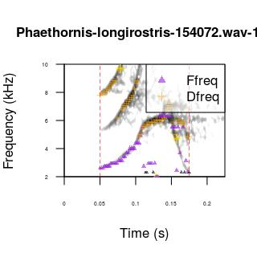

<!-- <center> <h1><b>Acoustic (dis)similarity and coordinated singing</h1></b> </center> -->
<!-- <center> <i><font size="4">Marcelo Araya-Salas and Grace Smith Vidaurre</font></i> </center> -->
<!-- <center> `r Sys.Date()` </center> -->

```{css, echo = FALSE}
div#header h1.title, div#header h3.subtitle, div#header h4.author, div#header h4.date {
  text-align: center
}
```

## Bioacoustics in R with `warbleR`


Bioacoustics research encompasses a wide range of questions, study systems and methods, including the software used for analyses. The `warbleR` and `Rraven` packages leverage the flexibility of the `R` environment to offer a broad and accessible bioinformatics tool set. These packages fundamentally rely upon two types of data to begin bioacoustic analyses in R:

  1. **Sound files:** Recordings in _wav_ or _mp3_ format, either from your own research or open-access databases like _xeno-canto_

  2. **Selection tables:** Selection tables contain the temporal coordinates (start and end points) of selected acoustic signals within recordings

### Package repositories

These packages are both available on _CRAN_: [`warbleR`](https://cran.r-project.org/package=warbleR), [`Rraven`](https://cran.r-project.org/package=Rraven), as well as on _GitHub_: [`warbleR`](https://github.com/maRce10/warbleR), [`Rraven`](https://github.com/maRce10/Rraven). The GitHub repository will always contain the latest functions and updates. You can also check out an article in _Methods in Ecology and Evolution_ documenting the `warbleR` package <a href='#References'><sup>[1]</sup></a>.

We welcome all users to provide feedback, contribute updates or new functions and report bugs to warbleR's GitHub repository.

Please note that `warbleR` and `Rraven` use functions from the [`seewave`](https://cran.r-project.org/package=seewave), [`monitoR`](https://cran.r-project.org/package=monitoR), [`tuneR`](https://cran.r-project.org/package=tuneR) and [`dtw`](https://cran.r-project.org/package=dtw) packages internally. `warbleR` and `Rraven` have been designed to make bioacoustics analyses more accessible to `R` users, and such analyses would not be possible without the tools provided by the packages above. These packages should be given credit when using `warbleR` and `Rraven` by including citations in publications as appropriate (e.g. `citation("seewave")`).

### Parallel processing in `warbleR`

Parallel processing, or using multiple cores on your machine, can greatly speed up analyses. All iterative `warbleR` functions now have parallel processing for Linux, Mac and Windows operating systems. These functions also contain progress bars to visualize progress during normal or parallel processing. See <a href='#References'><sup>[1]</sup></a> for more details about improved running time using parallel processing.

## **Vignette introduction**

In the previous vignette, we performed quality control processing of selected signals and made lexicons for visual classification. Here we continue with the case study of microgeographic vocal variation in long-billed hermit hummingbirds, _Phaethornis longirostris_ <a href='#References'><sup>[2]</sup></a> (and a short sidenote using _Tinamus major_ for an example of a tonal signal) by:

  1. Detecting signal frequency range
  
  2. Extracting spectral entropy and frequency contours as time series
  
  3. Comparing methods for quantitative analysis of signal structure
      - data set of 29 acoustic parameters
      - spectrographic cross-correlation
      - dynamic time warping on frequency contours
  
  4. Visually inspecting frequency contours
  
  5. Measuring acoustic parameters as a batch-process across signals
  
  6. Calculating pairwise acoustic (dis)similarity between signals
  
  7. Analysis of geographic variation in _Phaethornis longirostris_ songs
  
We also include some examples at the end of the vignette of how to perform coordinated singing analysis and simulate songs. 
  
This vignette can be run without an advanced understanding of `R`, as long as you know how to run code in your console. However, knowing more about basic `R` coding would be very helpful to modify the code for your research questions.

For more details about function arguments, input or output, read the documentation for the function in question (e.g. `?cross_correlation`). 
&nbsp; 

```{r, echo = FALSE, message = FALSE}

# remove all objects
rm(list = ls())

# unload all non-based packages
out <- sapply(paste("package:", names(sessionInfo()$otherPkgs), sep = ""), function(x) try(detach(x, unload = FALSE, character.only = TRUE), silent = TRUE))

# load packages
X <- c("warbleR", "knitr")
invisible(lapply(X, library, character.only = TRUE))
# library(kableExtra)

options(knitr.table.format = "html")
knitr::opts_chunk$set(
  comment = "",
  fig.width = 5, 
  fig.height = 3.5,
  dpi = 40,
  out.width = "80%"
)
# opts_knit$set(root.dir = tempdir())
options(width = 150, max.print = 100)

# from https://stackoverflow.com/questions/28961431/computationally-heavy-r-vignettes, so that vignettes will be built upon installation, but not executed during R CMD check (which is contributing to the /doc being too large)
is_check <- ("CheckExEnv" %in% search()) || any(c(
  "_R_CHECK_TIMINGS_",
  "_R_CHECK_LICENSE_"
) %in% names(Sys.getenv()))
knitr::opts_chunk$set(eval = !is_check, comment = "")

# for vignette checking and image file output
# setwd("~/Desktop/R/warbleR_example2/")

# website to fix gifs
# https://ezgif.com/optimize
```

## **Prepare for analyses**

```{r, eval=FALSE}

library(warbleR)

# set your working directory appropriately
# setwd("/path/to/working directory")

# run this if you have restarted RStudio between vignettes without saving your workspace
# assumes that you are in your /home/username directory
setwd(file.path(getwd(), "warbleR_example"))

# Check your location
getwd()
```

This vignette series will not always include all available `warbleR` functions, as existing functions are updated and new functions are added. To see all functions available in this package:

```{r, echo=TRUE, eval=FALSE}

# The package must be loaded in your working environment
ls("package:warbleR")
```

## **Extract acoustic parameters as time series**

### Detect frequency range

_Raven_ selection tables can return low and high frequencies in your selections (e.g. if `all.data` or `freq.cols` in `run_raven` or `imp.raven` is TRUE), but the accuracy of these frequency selections depends on how the signals themselves were selected. Below we demonstrate how to visualize and detect the frequency range in your selected signals using the functions `freq_range_detec` and `freq_range`, which have options for setting bandpass filters to exclude background noise or other non-target acoustic signals. 

`freq_range_detec` creates a plot that will print to your graphics device, and also outputs a data frame per recording with the frequency range. This data frame can be used in subsequent analyses if saved as an object. `freq_range_detec` works best with single signals. If used for a whole recording, `freq_range_detec` will pick up _all_ sounds in the recording. 

Finally, although we have been using _Phaethornis longirostris_ vocalizations throughout these vignettes, these signals are harmonically structured. The functions for detecting frequency ranges, `freq_range` and `freq_range_detec` work best on tonal signals, so for this example we will use Great Tinamou ( _Tinamus major_) songs. 

Download a tinamou recording from _xeno-canto_, make selections and visualize/detect frequency ranges.

```{r, eval=FALSE, echo=TRUE}

tin <- query_xc(qword = "Tinamus", download = FALSE)

# select a single recording
tin <- tin[tin$Recordist == "Marcelo Araya-Salas", ]

# download this recording
query_xc(X = tin, download = TRUE)

mp32wav()
```

```{r, eval=FALSE, echo=FALSE}

# Hiding the text that goes with the chunk below

# If you have _Raven_ installed on your local machine, you can use _Rraven_ to call this software and make selections. Make sure to include arguments from imp_raven to ensure that the selection table is imported with the correct columns for downstream functions. We will use the _Tinamus major_ signals for detecting frequency range below, so if you do not have _Raven_ installed on your machine, you can use the code below as a reference for your own signals.
```

```{r, eval=FALSE, echo=FALSE}

# commenting this out because this fails on my machine, although it worked when I first wrote this code...

# here you will replace the raven.path argument with the path specifying where Raven is located on your own machine
Tin.sels <- run_raven(raven.path = "/home/gsvidaurre/opt/Raven-1.5.0.0035/", sound.files = "Tinamus-major-154191.wav", import = TRUE, all.data = FALSE, name.from.file = TRUE, ext.case = "lower", freq.cols = FALSE)
str(Tin.sels)

# write the selection table as a physical file you you can read them back in at any time
# good way to save all your work
write.csv(Tin.sels, "Tinamus-major-154191_sels.csv", row.names = FALSE)

# generate individual cuts for freqeuency range measurements below
cut_sels(Tin.sels, mar = 0.05, labels = c("sound.files", "selec"))
```

```{r, eval=FALSE, echo=FALSE}

# Tin.sels <- read.csv("Tinamus-major-154191_sels.csv", header = TRUE)
```

```{r, eval=FALSE, echo=TRUE}

# here we will use a data set with sound files that have been already annotated
# read the selections back into the global environment
Tin.sels <- read.csv("manualoc_output.csv")
str(Tin.sels)

# cut the original wave file by selections for freq_range_detec below
writeWave(seewave::cutw(read_sound_file("Tinamus-major-154191.wav"), from = Tin.sels$start[1], to = Tin.sels$end[1], f = 44100, plot = FALSE, output = "Wave"), filename = "Tinamus-major-154191-1.wav")

writeWave(seewave::cutw(read_sound_file("Tinamus-major-154191.wav"), from = Tin.sels$start[2], to = Tin.sels$end[2], f = 44100, plot = FALSE, output = "Wave"), filename = "Tinamus-major-154191-2.wav")
```

```{r, eval=FALSE, echo=TRUE}

# note that changing the threshold argument in combination with the bandpass argument can improve the detection
freq_range_detec(read_sound_file("Tinamus-major-154191-1.wav"), flim = c(0, 2.5), bp = c(0, 3), threshold = 15, plot = TRUE)
```

```{r, eval=FALSE, echo=TRUE}

# here, giving a strict bandpass with very low threshold improves freq_range detection
# since the curving end of the tinamou signal is lower amplitude than the rest of the signal
c(read_sound_file("Tinamus-major-154191-1.wav"), flim = c(0, 2.5), bp = c(0, 3), threshold = 1, plot = TRUE)
```

The function `freq_range` allows you to simultaneously return the frequency ranges for all signals in a selection table, including the graphical output as `freq_range_detec`. Check out the resulting image file in your graphics device. In addition to image files, this function returns the original selection table, as a data frame with the newly calculated low and high frequency measurements. 

```{r, eval=FALSE, echo=TRUE}

# use arguments from freq_range_detec above
fr <- freq_range(Tin.sels, threshold = 1, res = 100, flim = c(0, 2.5), bp = c(0.5, 2.5))
str(fr)
```

### Extract spectral entropy as a time series 

Spectral entropy can be calculated as time series in selected signals and plotted onto image files. Previously, spectral entropy was only available as a sole measurement across a selection, as measured by `spectro_analysis`. Check out the resulting image files in your working directory. 

```{r, eval = FALSE, echo=FALSE}

Phae.hisnrt <- read.csv("Phae_hisnrt.csv", header = TRUE)
```

```{r, eval=FALSE, echo=TRUE}

Phae.hisnrt <- read.csv("Phae_hisnrt.csv", header = TRUE)
str(Phae.hisnrt)

se <- freq_ts(Phae.hisnrt, wl = 300, length.out = 10, threshold = 10, img = TRUE, img.suffix = "entropy_ts", type = "b", ovlp = 90, sp.en.range = c(-25, 10), flim = c(2, 10), picsize = 0.75, title = FALSE, type = "entropy")

str(se)
```

#### Visualizing frequency contours with `track_freq_contour`

The function `track_freq_contour` allows you to create spectrograms and visualize the accuracy of dominant frequency and fundamental frequency measurements. 

Use `track_freq_contour` on all the recordings for which you want to extract frequency contours as a time series, or later, calculate other frequency measurements. Scroll through all the spectrograms to get a feeling for how well the frequency measurements will be performed across your recordings.

Running `track_freq_contour` can allow you to decide which frequency parameters to use in subsequent analyses, namely `spectro_analysis` and dynamic time warping methods. Also, ff the frequency measurements look acceptable with the bandpass setting used in `track_freq_contour`, use that same bandpass while running `spectro_analysis`.

```{r, eval=FALSE, echo=TRUE}

# Note that the dominant frequency measurements are almost always more accurate
track_freq_contour(Phae.hisnrt, wl = 300, flim = c(2, 10), bp = c(1, 12), it = "jpeg")

# We can change the lower end of bandpass to make the frequency measurements more precise
track_freq_contour(Phae.hisnrt, wl = 300, flim = c(2, 10), bp = c(2, 12), col = c("purple", "orange"), pch = c(17, 3), res = 100, it = "jpeg", picsize = 0.8)
```

<!-- <center> </center> -->
&nbsp; 

Note that the fundamental frequency measurements are not always very accurate, so we will remove fundamental frequency measurements later on.

### Extract fundamental or dominant frequency contours as a time series 

These functions return a data frame that contains estimated frequency contours as a time series across each signal in the input data frame. You can also specify if you want to create image files with the estimated frequency contours plotted over spectrograms. You can change argument settings to better visualize the signals or change the estimation of the frequency contour. For instance, the argument `threshold` (as in `auto_detec`) controls the amplitude threshold for estimating frequency values at each time point. Note that the fundamental frequency contour estimation can often have errors, and tends to perform best with more tonal signals. The frequency contours are those that can be visualized using `track_freq_contour`.

```{r, echo=FALSE, eval=FALSE}

# decided to remove track_harmonics, not working well for either Phaethornis or Tinamou signals

# the text for above this chunk
# `track_harmonics` is a modified function from `seewave` that allows you to track the dominant frequency for harmonic calls, even when the amplitude fluctuates among harmonics.

# with a Phaethornis harmonic signal
nm <- paste(paste(as.character(Phae.hisnrt$sound.files[1]), as.character(Phae.hisnrt$selec[1]), sep = "-"), ".wav", sep = "")

writeWave(seewave::cutw(read_sound_file(as.character(Phae.hisnrt$sound.files[1])), from = Phae.hisnrt$start[1], to = Phae.hisnrt$end[1], f = 44100, plot = FALSE, output = "Wave"), filename = nm)

trck_hrm <- track_harmonic(read_sound_file(nm), f = 44100, ovlp = 70, fftw = FALSE, threshold = 15, bandpass = NULL, clip = 0.1, plot = TRUE, xlab = "Time (s)", ylab = "Frequency (kHz)", adjust.wl = FALSE, dfrq = FALSE)

# plot spectrogram
spectro(read_sound_file(nm), grid = FALSE, scale = FALSE, f = 22050, ovlp = 90, palette = reverse.gray.colors.2, collevels = seq(-40, 0, 1), wl = 300, osc = FALSE, flim = c(2, 10), main = "warbleR's 'track_harmonic'")

# plot detected frequency contour
points(x = trck_hrm[, 1] + 0.1, y = trck_hrm[, 2], cex = 1, col = "red", pch = 20)
```

```{r, echo=FALSE, eval=FALSE}

# with a Tinamou tonal signal
trck_hrm <- track_harmonic(read_sound_file("Tinamus-major-154191-1.wav"), f = 44100, ovlp = 70, fftw = FALSE, threshold = 15, bandpass = NULL, plot = TRUE, xlab = "Time (s)", ylab = "Frequency (kHz)", adjust.wl = FALSE, dfrq = FALSE)

# plot spectrogram
spectro(read_sound_file("Tinamus-major-154191-2.wav"), grid = FALSE, scale = FALSE, f = 44100, ovlp = 90, palette = reverse.gray.colors.2, collevels = seq(-40, 0, 1), wl = 300, osc = FALSE, flim = c(0, 4), main = "warbleR's 'track_harmonic'")

# plot detected frequency contour
points(x = trck_hrm[, 1] + 0.1, y = trck_hrm[, 2], cex = 1, col = "red", pch = 20)
```

```{r, echo=TRUE, eval=FALSE}

# Fundamental frequency contour
ff_df <- freq_ts(Phae.hisnrt, wl = 300, length.out = 20, threshold = 15, img = TRUE, img.suffix = "ff", type = "p", ovlp = 70, clip.edges = FALSE, leglab = "freq_ts", ff.method = "tuneR")

str(ff_df)
```

```{r, echo=TRUE, eval=FALSE}

# Dominant frequency contour

# Uses seewave function dfreq by default
df_df <- freq_ts(Phae.hisnrt, wl = 300, length.out = 20, threshold = 15, img = TRUE, img.suffix = "ff", type = "p", ovlp = 70, clip.edges = FALSE, leglab = "freq_ts", fsmooth = 0.2)

str(df_df)
```

### Manually tailor frequency contours with tailor_sels

The functions above to track/extract dominant and fundamental frequency contours perform best with more tonal signals. The frequency measurements for signals with harmonic structure tend to jump around, and might not always match your own visual tracking of frequency contours. If this is the case, you can use the function `tailor_sels` to fix frequency contours where individual frequency measurements are clearly far off from the frequency contour detected by the human eye. The `tailor_sels` function is the same used in vignette 2 in this series, but by changing a few arguments, you can use `tailor_sels` to fix frequency contours.

Note that manually fixing frequency contours might not make sense, depending on your question and/or the contour in question. For instance, a dominant frequency contour for a harmonic signal that jumps around and does not form a smooth contour may in fact be the truth, rather than mis-estimation of the contour. On the other hand, fundamental frequencies can be more easily traced by the human eye across a signal, so using `tailor_sels` to fix a frequency contour that jumps around the signal makes more sense. 

When the new graphics window for `tailor_sels` appears, it will show spectrograms as we saw in vignette 2, but with frequency contours plotted as points over each spectrogram. To fix the frequency contour, click near the malaligned points to place them over the frequency contour that you detect by eye. `tailor_sels` makes a new `.csv` file in your working directory that merges your original data frame (below, `Phae.hisnrt`) with the modified frequency time series (below, `ff_df` with any modified frequency values). To check that your manual tracing improved frequency contours, you can use `track_freq_contour` to make spectrograms with your new frequency contours plotted as custom contours.

```{r, eval=FALSE, echo=TRUE}

# Use the original data frame of songs for the main tailor_sels dataset
# the data frame with the fundamental frequency contours is provided for manual tracing
tailor_sels(Phae.hisnrt,
  wl = 300, flim = c(2, 10), wn = "hanning", mar = 0.1,
  osci = TRUE, title = c("sound.files", "selec"), auto.contour = TRUE, ts.df = ff_df, col = "red", alpha = 0.6
)

# rename your tailor_sels output csv as desired, then read it back into R
mff <- read.csv("seltailor_output_mff.csv")
str(mff)

track_freq_contour(Phae.hisnrt, wl = 300, flim = c(2, 10), bp = c(1, 12), it = "jpeg", custom.contour = mff)
```

### Count inflections across frequency contours

This function calculates the modulation index for any frequency contour or time series. The function `spectro_analysis` (see below) also calculates a modulation index for signals, but as a single value across the length of the signal.

```{r, eval=FALSE, echo=TRUE}

df_inf <- inflections(X = df_df, pb = TRUE)
str(df_inf)
```

##**Quantitative measurements of acoustic (dis)similarity**

### Compare methods for quantitative analysis of signal structure

Bioacoustic research relies on quantifying the structure of acoustic signals and comparing that structure across behavioral/ecological contexts, groups or species. However, measuring signal structure in a way that fully accounts for the variation in the signals could be a tricky task. Some of the differences that are apparent by visual inspection of spectrograms might not be picked up by some analyses. Hence, choosing the most appropriate analytical approach is a critical step.

The `warbleR` function `compare_methods` attempts to facilitate method selection. This function produces graphs (as image files in the working directory) with spectrograms from 4 signals that allow visual inspection of the performance of acoustic analysis methods at comparing those signals. The signals are randomly picked up from the provided data frame (`X` argument), and the function compares 2 `warbleR`methods at a time. The methods available are: 
  * cross-correlation by warbleR function `cross_correlation`
  * dynamic time warping on dominant or fundamental frequency contours with `freq_DTW`
  * spectral parameters with `spectro_analysis`
  
In the vignette "Visual inspection and signal classification", we tailored selections of _Phaethornis longirostris_ songs that were originally downloaded from _xeno-canto_, detected by `auto_detec`and filtered by signal-to-noise ratio (SNR). Here we will pick up the workflow with these filtered and tailored selections, using the data frame `Phae.hisnrt`.
```{r, eval=FALSE, echo=TRUE}

Phae.hisnrt <- read.csv("Phae_hisnrt.csv", header = TRUE)

compare_methods(
  X = Phae.hisnrt, flim = c(0, 10), bp = c(0, 10),
  wl = 300, n = 10, methods = c("XCORR", "dfDTW")
)
```


`compare_methods` will produce 10 image files in the working directory (since we specified `n = 10`) that look like this:

<!-- <center> </center> -->
&nbsp; 

In this graphic, the acoustic pairwise distance between signals is shown next to the arrows linking them. The font color of a distance value corresponds to the font color of the method that generated it, as shown in the scatterplots (in this case black font represents XCORR distances). Distances are standardized, with 0 being the distance of a signal to itself and 1 the farthest pairwise distance in the pool of signals. Principal Component Analysis (`princomp` function) is applied to calculate distances when using spectral parameters (SP). In this case, the first 2 PC's are used. Classical Multidimensional Scaling (also known as Principal Coordinates Analysis, `cmdscale` function) is used for all other methods. The image file name contains the methods being compared and the row number of the selections. This function internally uses a modified version of the `spectro` function from the `seewave` package to create spectrograms. Note that the spectrograms are all plotted with the same frequency and time scales.

Also note that the graphs contain 2 scatterplots (1 per method) of the acoustic space of all signals in the input data frame `X`. The position of the 4 signals in the spectrograms is highlighted in the acoustic space scatterplot. These graphics allow you to directly assess if the distances between signals in the acoustic space accurately represent the spectrographic similarity (e.g. how similar their acoustic structure looks in the spectrograms).

You can run `compare_methods` for any combination of the quantitative methods for assessing acoustic (dis)similarity mentioned above. Importantly, to include the SP method (spectral parameters measured by the function `spectro_analysis`), you need a large enough dataset, as the PCA that summarizes the spectral parameters needs more units (rows) that variables (columns).

### Measure acoustic parameters with spectro_analysis

We can now perform acoustic measurements with the function `spectro_analysis`. This function relies on the temporal coordinates in selection tables to measure 29 parameters across selections. `spectro_analysis` is a batch process that is faster than calculating measurements manually, e.g. one selection and recording at a time. `spectro_analysis` uses and customizes several functions available in the [`seewave package`](https://cran.r-project.org/package=seewave). 

Use the bandpass filter to your advantage here, to filter out low or high background noise before performing measurements. Also note that changing the amplitude threshold will change the amplitude at which noises (including non-target signals) are detected for measurements.

```{r, eval=TRUE, echo=FALSE}

params <- read.csv("acoustic_parameters.csv")
```

```{r, eval=FALSE, echo=TRUE}

params <- spectro_analysis(Phae.hisnrt, bp = c(2, 10), threshold = 15)
write.csv(params, "acoustic_parameters.csv", row.names = FALSE)
```

Remove parameters derived from fundamental frequency (based on `track_freq_contour` results).
```{r, eval=FALSE, echo=TRUE}

params <- params[, grep("fun|peakf", colnames(params), invert = TRUE)]
```

### Calculate acoustic parameters by song type

In addition to calculating acoustic parameters per individual signals using `spectro_analysis`, you can also calculate these acoustic parameters by song type (average, minimum and maximum values per song type group). 

```{r, eval=FALSE, echo=TRUE}

data(list = c("Phae.long1", "Phae.long2", "Phae.long3", "Phae.long4", "lbh_selec_table"))
writeWave(Phae.long1, "Phae.long1.wav")
writeWave(Phae.long2, "Phae.long2.wav")
writeWave(Phae.long3, "Phae.long3.wav")
writeWave(Phae.long4, "Phae.long4.wav")

# Add a 'song' column
lbh_selec_table$song <- rep(1:4, each = 3)[1:11]

# Measure acoustic parameters
sp <- spectro_analysis(lbh_selec_table, bp = c(1, 11), 300, fast = TRUE)

# Add song data
sp <- merge(sp, lbh_selec_table, by = c("sound.files", "selec"))

# Caculate song-level parameters for all numeric parameters
sng <- song_analysis(X = sp, song_colm = "song", parallel = 1, pb = TRUE)
str(sng)
```

### Dynamic time warping of frequency contours

The dynamic time warping methods in `warbleR` all rely on functions from the `dtw` package, and are available for both dominant and fundamental frequencies. `df_DTW` and `ff_DTW` calculate the dominant and fundamental frequency contours, respectively, of each signal and compares using dynamic time warping. You can interpolate measurements across the frequency time series using the `length.out` argument. 

These functions return a matrix of pairwise acoustic dissimilarity (e.g. acoustic "distance") measurements that can be used in analyses of acoustic similarity, as well as image files with the frequency contours plotted over the spectrograms. If you require only the time series without the dynamic time warping analysis for either the dominant or fundamental frequency, check out the functions `freq_ts`and `freq_ts`.

Note that as the `freq_range` and `freq_range_detec` functions, the dynamic time warping functions tend to work best on more tonal signals. Check out the resulting image files in your working directory. 
```{r, eval=FALSE, echo=TRUE}

# Harmonic Phaethornis signals
dm <- freq_DTW(Phae.hisnrt, length.out = 30, flim = c(2, 10), bp = c(2, 9), wl = 300, img = TRUE)

str(dm)
```

```{r, eval=FALSE, echo=TRUE}

# Tonal Tinamou signals
Tin.sels <- read.csv("Tinamus-major-154191_sels.csv", header = TRUE)

dm <- freq_DTW(Tin.sels, length.out = 30, flim = c(0, 2.5), bp = c(0.5, 2.5), wl = 512, img = TRUE)
str(dm)
```


### Spectrographic cross-correlation

Cross-correlation calculates the pairwise similarity of multiple signals by spectrogram cross-correlation. `cross_correlation` calculates a correlation of the amplitude values at each step by sliding one spectrogram over the other. This function is a modified version of the `corMatch` and `makeTemplate` functions from the package `monitoR`. `cross_correlation` runs over multiple signals and returns a list of output, including:

  * a correlation statistic for each "sliding" step
  * the maximum (peak) correlation for each pairwise comparison 

`cross_correlation` requires margins half the duration of the signal on either side of the signal (e.g. before and after the start and end coordinates). Signals that are very close to either the start or end of a recording may throw errors. Additionally, when sound files have been modified by bandpass filters, some pairwise cross-correlations may not work and the correlation matrix may contain `NA` values. `cross_correlation` now contains an argument to remove columns of the matrix that contain `NA` values, which will reduce the data in the matrix but also allow the matrix to be used in subsequent analyses.

Here our output is a matrix of peak correlation per pairwise comparison, with the recording-selection names as the matrix dimension names.

```{r, eval=FALSE, echo=TRUE}

xc <- cross_correlation(Phae.hisnrt, wl = 300, na.rm = FALSE)
str(xc)
```


## Analysis of geographic variation using `spectro_analysis` measurements

We can evaluate whether or not the observed variation in song structure is reflected by the meters we just measured. For this we will conduct a Principal Component Analysis on scaled (z-transformed) meters and look at the grouping of songs (data points) in the scatter plot.

```{r, eval=TRUE, dpi=220}

# Run the PCA with only numeric variables of params
pca <- prcomp(x = params[, sapply(params, is.numeric)], scale. = TRUE)

# Check loadings
summary(pca)

# Extract PCA scores
pcascor <- as.data.frame(pca[[5]])

# Plot the 2 first PCs
plot(pcascor[, 1], pcascor[, 2],
  col = as.numeric(as.factor(params$sound.files)), pch = 20,
  cex = 1, xlab = "PC1", ylab = "PC2"
)

# Add recordings/individuals labels
x <- tapply(pcascor[, 1], params$sound.files, mean)
y <- tapply(pcascor[, 2], params$sound.files, mean)

labs <- gsub(".wav", "", unique(sapply(as.character(params$sound.files), function(x) {
  strsplit(x, split = "-", fixed = TRUE)[[1]][3]
}, USE.NAMES = FALSE)))

text(x, y, labs, cex = 0.75)
```

Songs are grouped by sound file. As each sound file represents a single individual, this suggests that songs have individual signatures. Let's look at the song type level. First, we need to classify the songs by song type. We can check the spectrograms we previously created to do this.

<!-- <center> </center> -->
&nbsp; 

Songs from sound files 154070 and 154072 seem to belong to the same song type. Sound files 154129 and 154161 represent a different song type. Finally, the songs from each of the other 2 sound files have a unique structure, so each one represents a different song type. We can add this information to the plot by using symbols to represent song types.

```{r, eval=TRUE, dpi=220}

# Create a song type variable

# First, extract recording ID
songtype <- gsub(".wav", "", sapply(as.character(params$sound.files), function(x) {
  strsplit(x, split = "-", fixed = TRUE)[[1]][3]
}, USE.NAMES = FALSE))

# Now change IDs for letters representing song types
songtype <- gsub("154070|154072", "A", songtype)
songtype <- gsub("154129|154161", "B", songtype)
songtype <- gsub("154138", "C", songtype)

# Add song type as a variable representing symbol type
plot(pcascor[, 1], pcascor[, 2],
  col = as.numeric(as.factor(params$sound.files)),
  pch = as.numeric(as.factor(songtype)),
  cex = 1, xlab = "PC1", ylab = "PC2"
)

# Add song type labels
x <- tapply(pcascor[, 1], songtype, mean)
y <- tapply(pcascor[, 2], songtype, mean)

text(x, y, unique(songtype), cex = 1)
```

Songs of the same song type are more similar (they cluster together). This PCA confirms that the visually obvious differences in the song structures are well described by the meters measured in [`warbleR`](https://cran.r-project.org/package=warbleR). Likewise, it also confirms that we can detect biologically relevant differences from sound files that have undergone _mp3_ compression and conversion back to _wav_ format (see also <a href='#References'> <sup>[2]</sup></a>). Importantly, if this analysis were for publication we would have to run other filtering steps on the acoustic parameters generated by `spectro_analysis`, including removing any collinear variables. 

## Coordinated singing analysis 

`warbleR` contains functions to visualize and test whether or not singing bouts between individuals can be considered coordinated singing. The function `plot_coordination` plots signals as polygons to better visualize overlap between these signals.

The function `test_coordination` uses a Monte Carlo randomization test to determine whether or not the probability of finding overlapping songs in a singing event is less than or more than what you would expect by chance. `test_coordination` can be run simultaneously for many singing events, if all are contained in a single data frame (see `test_coordination` documentation for more information).

```{r, eval = FALSE, echo = TRUE}

data(sim_coor_sing)
str(sim_coor_sing)
```

The `sim_coor_sing` dataset contains three types of singing bouts:
```{r, eval = FALSE, echo = TRUE}

# save plots in a list
g <- plot_coordination(sim_coor_sing, it = "jpeg", img = FALSE, res = 300)

# print list of plots to graphics device
g
```

We can test for overlapping or alternating coordinated singing using the `less.than.chance` argument in `test_coordination`. Here we will test for alternating coordinated singing, since `less.than.chance` is set to `TRUE`.
```{r, eval = FALSE, echo = TRUE}

cs <- test_coordination(sim_coor_sing, iterations = 1000, less.than.chance = TRUE, cutoff = 10)
str(cs)
```

## Simulating songs

You can simulate songs using `warbleR`. Depending on your question, you can simulate songs with different numbers of subunits, subunit durations, numbers of harmonics, amplitudes, gaps between subunits, amplitude fading of subunits, among other options. Songs are simulated under Brownian motion frequency drift.

```{r, eval = FALSE, echo = TRUE}

# simulate a song with 3 tonal elements
ss <- simulate_songs(n = 3, harms = 1)

# plot the simulated song
# seewave::spectro(ss)

# simulate a song with 3 harmonic elements of differing amplitude
ss <- simulate_songs(n = 3, harms = 3)

# plot the simulated song
seewave::spectro(ss)
```

&nbsp; 

## **Citation**

Please cite `warbleR` when you use the package: 

Araya-Salas, M. and Smith-Vidaurre, G. (2017), warbleR: an R package to streamline analysis of animal acoustic signals. Methods Ecol Evol. 8, 184-191.

## **Reporting bugs**
Please report any bugs [here](https://github.com/maRce10/warbleR/issues). 
&nbsp; 

