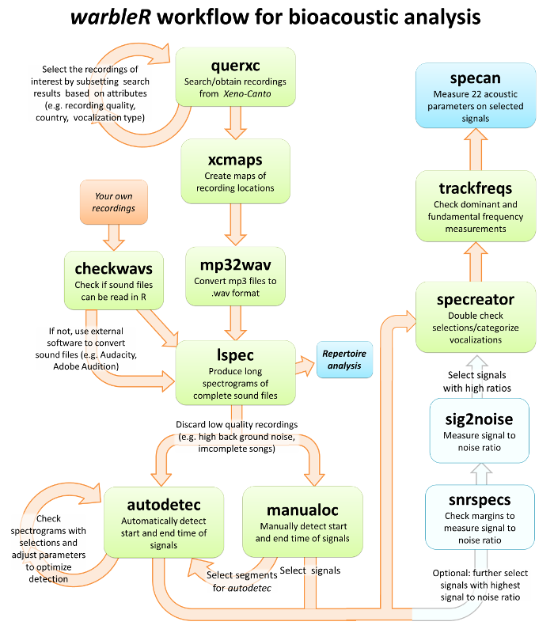
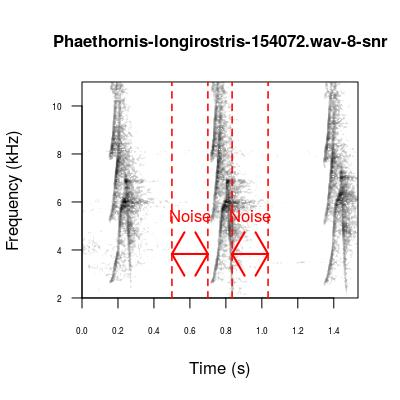
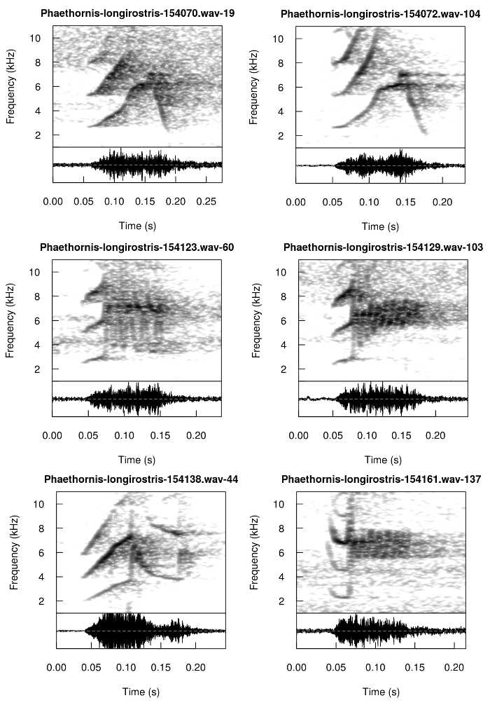

<br>

<center></center>

<center> <h1><b>Streamlining acoustic analysis</h1></b> </center>
<center> <i><font size="4"><a href="http://marceloarayasalas.weebly.com/">Marcelo Araya-Salas</a> and <a href="gsmithvi.github.io">Grace Smith Vidaurre</a></font></i> </center>
<center> `r Sys.Date()` </center>
<br>


Here we present a case study of how [`warbleR`](https://cran.r-project.org/package=warbleR) functions can be used for bioacoustics, as well as some tips on managing bioacoustic data in R. For more details about function arguments, input or output, please read the documentation for the function in question (e.g. `?querxc`). 

Please note that most tools in [`warbleR`](https://cran.r-project.org/package=warbleR) use functions from the [`seewave package`](https://cran.r-project.org/package=seewave) internally. [`warbleR`](https://cran.r-project.org/package=warbleR) has been designed to make the analyses more accessible to average R-users. However, acoustic analysis in R would not be possible without the tools provided by [`seewave`](https://cran.r-project.org/package=seewave). Hence, both packages should be given credit when using [`warbleR`](https://cran.r-project.org/package=warbleR) and both should be appropriately cited in publications (try `citation("warbleR")` and `citation("seewave")`). 

This vignette can be run without an advanced understanding of R, as long as you know how to run code in you R console. However, knowing more about data and file manipulation would be very helpful in order to modify the code to fit your own needs.

<center> </center> 

<br>
To start, we will use [`warbleR`](https://cran.r-project.org/package=warbleR) to download recordings from [Xeno-Canto](http://www.xeno-canto.org/). 
<br>


## **Prepare for data collection**

-----

First, we need to install and load [`warbleR`](https://cran.r-project.org/package=warbleR). Notice that you need an R version ≥ 2.10 and seewave package version ≥ 2.0.1. Also, users using UNIX machines (Mac OSX or Linux), will need to install `fftw3`, `pkg-config` and `libsndfile` on their machines prior to installing `warbleR`. These external packages will need to be installed through a UNIX terminal.

```{r, eval=FALSE}

install.packages("warbleR")
library(warbleR)

```

<br>

And set up a working directory

```{r, eval=FALSE}

# Create a new directory
dir.create(file.path(getwd(),"warbleR_example"))
setwd(file.path(getwd(),"warbleR_example"))

# Check the location of the directory
getwd()

```

```{r, eval=TRUE, echo=FALSE, message=FALSE}

# this sets my working directory
library(warbleR)
library(knitr)

```

<br>

### Obtain metadata and recordings from [Xeno-Canto](http://www.xeno-canto.org/)

Next, we can query the [Xeno-Canto](http://www.xeno-canto.org/) database for a species or genus of interest. The function `querxc` has two types of output:

  1. **Metadata of recordings:** geographic coordinates, recording quality, recorder, type of signal, etc.
  
  2. **Sound files:** Sound files (_mp3_ format) are returned if the argument `download` is set to `TRUE` (default is `FALSE`).  

<br>
**You can query [Xeno-Canto](http://www.xeno-canto.org/) by genus:**

```{r, eval=TRUE}

# Query Xeno-Canto for all recordings of the hummingbird genus Phaethornis
Phae <- querxc(qword = "Phaethornis", download = FALSE) 

# Find out what kind of metadata we have
names(Phae) 

```

```{r, eval=FALSE}

View(Phae)

```

<br>
**Or you can query by species:**

```{r, eval=FALSE}

# Query Xeno-Canto for all recordings of the species Phaethornis longirostris
Phae.lon <- querxc(qword = "Phaethornis longirostris", download = FALSE) 
View(Phae.lon)

```

```{r, eval=TRUE, echo=FALSE, message=FALSE}

Phae.lon <- querxc(qword = "Phaethornis longirostris", download = FALSE) 

```

<br>
If you're interested in the geographic spread of the recording locations, you can use the function `xcmaps` to visualize locations. `xcmaps` will create an image file of a map per species in your current directory if `img = TRUE`. If `img = FALSE`, maps will be displayed in the graphic device. 

```{r, eval=FALSE}

# Image type default is jpeg, but tiff files have better resolution
xcmaps(X = Phae, img = TRUE, it = "tiff") 
xcmaps(X = Phae.lon, img = FALSE) 

```

```{r, eval=TRUE, echo=FALSE, message=FALSE}

xcmaps(X = Phae.lon, img = FALSE) 

```


### Filter [Xeno-Canto](http://www.xeno-canto.org/) recordings by signal type

In most cases, you will need to filter the type of signal you want to analyze. You can filter the recordings prior to download by subsetting the metadata. Then, you can input the filtered metadata back into `querxc` to download only the selected recordings. There are many ways to filter data in R, and the example below can be modified to fit your own data. 

Some of the metadata is not quite consistent across recordings, such as signal type or recording quality. These are characteristics of the recordings that you will need to explore visually with downstream functions before proceeding with data collection and analysis. However, if you are dealing with many recordings, we advise removing the lowest quality recordings (D quality level) or selecting specific vocalization types.

For example, we are interested in assessing the microgeographic variation of long-billed hermit (_Phaethornis longirostris_) songs. Variation at small geographic scales has been already described in this species <a href='#References'><sup>[1]</sup></a>. We should proceed by looking for a site with the highest number of songs. Our goal is to search for visible differences in song structure within a site, and then determine whether underlying differences in acoustic parameters are representative of spectrographic distinctiveness. 

<br>
```{r, eval=TRUE}

# Find out number of available recordings
nrow(Phae.lon) 

# Find out how many types of signal descriptions exist in the Xeno-Canto metadata
levels(Phae.lon$Vocalization_type)

# How many recordings per signal type?
table(Phae.lon$Vocalization_type)

```

<br>
```{r, eval=TRUE}

# There are many levels to the Vocalization_type variable. 
# Some are biologically relevant signals, but most just 
# reflect variation in data entry.

# Luckily, it's very easy to filter the signals we want 
Phae.lon.song <- Phae.lon[grep("song", Phae.lon$Vocalization_type, 
                                ignore.case = TRUE), ]

# Check resulting data frame
str(Phae.lon.song) 

```

<br>
```{r, eval=FALSE}

# Now, how many recordings per locatity?
table(Phae.lon.song$Locality)

```

```{r, eval=FALSE}

# In case you want more than one signal type you can try something like this:
Phae.lon.sc <- Phae.lon[grep("song|call", Phae.lon$Vocalization_type,ignore.case = TRUE), ]
str(Phae.lon.sc)

```


<br>

Let's focus on the high quality song recordings from La Selva Biological Station:

```{r, eval=TRUE}

#first filter by location
Phae.lon.LS <- Phae.lon.song[grep("La Selva Biological Station, Sarapiqui, Heredia", Phae.lon.song$Locality,
                              ignore.case = FALSE),]

# And only those of the highest quality
Phae.lon.LS <- Phae.lon.LS[Phae.lon.LS$Quality == "A", ]
```

We can check if the location coordinates make sense (all recordings should be from a single place in Costa Rica) by making a map of these recordings using `xcmaps` 

```{r, eval=TRUE}
# map in the graphic device (img = FALSE)
xcmaps(Phae.lon.LS, img = FALSE)

```

```{r, eval=FALSE, echo=FALSE}

# This copies the selected sound files to a dropbox folder so they can be shared
# do not show this code
fn <- with(Phae.lon.LS,paste(paste(Genus, Specific_epithet, Recording_ID, sep = "-"), ".wav", sep = " "))
file.copy(from = file.path("/home/m/Documents/Biblioteca de cantos/Trochilidae/XC/wavs",fn), to = file.path("/home/m/Dropbox/Projects/warbleR package/vignette files", fn), overwrite = TRUE)

wlist <- lapply(fn,function(x) downsample(readWave(file.path("/home/m/Dropbox/Projects/warbleR package/vignette files", x)), samp.rate = 22050))

names(wlist) <- fn

saveRDS(wlist, file = "/home/m/Dropbox/Sharing/warbleR/recs.RDS")

```

<br>

Once you're sure you want the recordings, use `querxc` to download the files. It is also a good idea to save the metadata as .csv files at this point. This data will likely be useful at a later point, especially if you're aiming for a publication.  

```{r, eval=FALSE}

# Download sound files
querxc(X = Phae.lon.LS) 

# Save each data frame object as a .csv file 
write.csv(Phae.lon.LS, "Phae_lon.LS.csv", row.names = FALSE)

```

<br>

### Convert [Xeno-Canto](http://www.xeno-canto.org/) _mp3_ recordings to _wav_ format

[Xeno-Canto](http://www.xeno-canto.org/) maintains recordings in _mp3_ format, as this compressed format yields smaller files. However, we require _wav_ format for all downstream analyses. Compression from _wav_ to _mp3_ and back involves information losses, but recordings that have undergone this transformation have been successfully used in research <a href='#References'> <sup>[2]</sup></a>.

To convert _mp3_ to _wav_, we can use the warbleR function `mp32wav`, which relies on a underlying function from the [`tuneR package`](https://cran.r-project.org/package=tuneR). However, this function does not always work (and it remains unclear as to why!). This bug should be fixed in future versions of tuneR. If RStudio aborts when running `mp32wav`, use an _mp3_ to _wav_ converter online, or download the open source software `Audacity` (available for Mac, Linux and Windows users). We have made the selected _wav_ files available for download (see next section).

After _mp3_ files have been converted, we need to check that the _wav_ files are not corrupted and can be read into RStudio (some _wav_ files can't be read due to format or permission issues).

```{r, eval=FALSE}
# Neither of these functions requires arguments
# Always check you're in the right directory beforehand
# getwd()
mp32wav() 

# You can use checkwavs to see if wav files can be read
checkwavs() 

# Let's create a list of all the recordings in the directory
wavs <- list.files(pattern="wav$")

# We will use this list to downsample the wav files so the following analyses go a bit faster
lapply(wavs, function(x) writeWave(downsample(readWave(x), samp.rate = 22050),
                                  filename = x))
```

```{r, eval=FALSE, echo=FALSE}

### If you were unable to convert _mp3_ to _wav_ format:
  + download the file in [this link](https://www.dropbox.com/s/htpbxbdw8s4i23k/recs.RDS?dl=0) and put it in your working directory
  + then run the following code:


recs <- readRDS(file = "recs.RDS")

for(i in 1:length(recs))
  writeWave(recs[[i]], filename = names(recs)[i])

*Note: In case you have your own recordings in _wav_ format and have skipped previous sections, you must specify the location of your sound files prior to running downstream functions.* 

```

<br>

### Filter recordings by visual inspection 


###

The function `lspec` produces image files with spectrograms of whole sound files split into multiple rows. It is a useful tool for:

  * **vocal repertoire analyses**
  * **filtering by visual inspection** 

This is the first time we can visualize the recordings since the [Xeno-Canto](http://www.xeno-canto.org/) download, and we can make the most of it. 

If your research focuses on assessing variation between individuals or groups, `lspec` can provide you with important information about how to steer your analysis. If there is an obvious variation in vocalization structure across groups (e.g. treatments or geographic regions), you can focus your analysis on a visual classification of vocalizations. You can use `lspec` to your advantage here, printing spectrograms on paper and classifying signal types by hand. 

Whether or not you decide to proceed with visual classification,   `lspec` allows you to visually inspect the quality of the recording (e.g. amount of background noise) or the type, number, and completeness of the vocalizations of interest. You can discard the image files and recordings that you no longer want to analyze, as this will become very useful for downstream functions. 

We should first adjust the function arguments to fit our recording characteristics. We can work on a subset of the recordings by specifying their names with the `flist` argument.

```{r, eval=FALSE}

# Let's first create a subset for playing with arguments 
# This subset is based on the list of wav files we created above
sub <- wavs[c(1,3)]

# ovlp = 10 speeds up process a bit 
# tiff image files are better quality and are faster to produce
lspec(flist = sub, ovlp = 10, it = "tiff")

# We can zoom in on the frequency axis by changing flim, 
# the number of seconds per row, and number of rows
lspec(flist = sub, flim = c(1.5, 11), sxrow = 6, rows = 15, ovlp = 10, it = "tiff")

```

Once satisfied with the argument settings we can run all files

```{r, eval=FALSE}

lspec(flim = c(1.5, 11), ovlp = 10, sxrow = 6, rows = 15, it = "tiff")

```

The image files (in the working directory) should look like this:


Note that the sound file name and page number are placed in the top right corner. Also, the dimensions of the image fit perfectly on letter paper size for printing.

Now we should inspect the spectrograms. Throwing away image files that are poor quality at first glance (e.g. lots of background noise), will help us in later steps. For instance, the spectrogram for the recording with ID _154143_ does not look good, so we will manually delete those image files (yes, go and delete those image files!). Then, we can select only the sound files that have an image file in the folder. This looks strange for just one recording, but it is really useful when working with many recordings.

```{r, eval=FALSE}

# List the image files in the directory
# Change the pattern to "jpeg" if you used that image type
imgs <- list.files(pattern = ".tiff") 

# If the maps we created previously are still there, you can remove them from this list easily
imgs <- imgs[grep("Map", imgs, invert = TRUE)]

# Extract the recording IDs of the files for which image files remain 
kept <- unique(sapply(imgs, function(x){
  strsplit(x, split = "-", fixed = TRUE)[[1]][3]
  }, USE.NAMES = FALSE))

# Now we can get rid of sound files that do not have image files 
snds <- list.files(pattern = ".wav", ignore.case = TRUE) 
file.remove(snds[grep(paste(kept, collapse = "|"), snds, invert = TRUE)])

```

## **Data Collection**

We can move on to data collection with the filtered recordings, using the functions `autodetec` and `manualoc`

### Automatically detect signals with `autodetec`

Both these functions work faster with shorter recordings, but there are ways to deal with larger recordings (an hour long or more). As its name suggests, `autodetec` automatically detects the start and end of vocalizations in sound files based on amplitude, duration, and frequency range attributes.

Here are some points that will help us tailor `autodetec` for our use:

  1. **`autodetec` has 2 types of output:** 
    + data frame with recording name, selection, start and end times. These are temporal coordinates that will be passed on to downstream functions to measure acoustic parameters. Save this output as an object or it will not be saved in the environment, but rather printed in the console. 
    + a spectrogram per recording, with red dotted lines marking the start and end of each detected signal, saved in your working directory. In the case of long recordings, as in our example, it's preferable to create long spectrograms (`ls = TRUE`). For shorter recordings (a few seconds), spectrograms of the individual selections may work better (`ls = FALSE`).
 <br>
 
  2. **Some important detection parameters to fiddle with:** 
    + `threshold` controls detection by relative amplitude (%) 
    + `bp` serves as a frequency bandpass filter 
    + `ssmooth` controls combination of window length and overlap to smooth signals that have many peaks and would otherwise be detected as multiple signals
    + `mindur` & `maxdur` determine the minimum and maximum duration of the signals to be detected
    + `set` controls if settings of the autodetection process are included in the image file name. If TRUE, threshold (th), envelope (envt), bandpass (bp), power (pw), smooth (smo), maxdur (mxdu), and mindur (midu) are included. This could be very helpful for comparing the performance of different detection setttings

To set these parameters, we need to have some idea of the frequency range and duration of the signals we want to detect. Sectrograms produced above can help us to figure this out. _Phaenthornis longirostris_ songs have frequencies between 2 and 10 kHz and durations between 0.05 and 0.5 s. 

If you need to detect all or most of the signals within the recording, play around with different argument values to increase detection accuracy. It may be necessary to do several rounds of optimization with different subsets of your recordings. If just a few signals are needed per recording, a low-accuracy detection could yield enough selections. For instance, if the species you study produces stereotyped signals, like _Phaethornis longirostris_.

Finally, although `autodetec` performs automatic signal detection, it doesn't remove all manual labor from your data collection. Take the time to visually inspect your selections. 


```{r, eval=FALSE}

# Select a subset of the recordings
wavs <- list.files(pattern = ".wav", ignore.case = TRUE)

# Set a seed so we all have the same results
set.seed(1)
sub <- wavs[sample(1:length(wavs), 3)]

# Run autodetec() on subset of recordings
autodetec(flist = sub, bp = c(1, 10), threshold = 10, mindur = 0.05, maxdur = 0.5, envt="abs",
          ssmooth = 300, ls = TRUE, res = 100, 
          flim = c(1, 12), wl = 300, set =TRUE, sxrow = 6, rows = 15, 
          redo = FALSE, it = "tiff")

```

The image files (in the working directory) should look like this (shown below is recording ID 154161):


Notice some song were correclty detected but other undersired sounds were also detected. In most cases they have a shorter duration than our target signals.

We won't save the `autodetec` ouput in an object until we're satisfied with the detection. To improve our detection we should play around with the arguments values. Below are some detection parameters that work well for these _Phaethornis longirotris _
recordings:

```{r, eval=FALSE}

autodetec(flist = sub, bp = c(2, 9), threshold = 20, mindur = 0.09, maxdur = 0.22, 
                     envt = "abs", ssmooth = 900, ls = TRUE, res = 100, 
                     flim= c(1, 12), wl = 300, set =TRUE, sxrow = 6, rows = 15, 
                     redo = TRUE, it = "tiff", img = TRUE, smadj = "end")
```

This seems to provide a good detection for most recordings (recording ID 154161):


Once we're satisfied with the detection, we can run the `autodetec` on all the recordings, removing the argument `flist`(so it runs over all files in the working directory). We also need to save the temporal output at this point.

```{r, eval=FALSE}

Phae.ad <- autodetec(bp = c(2, 9), threshold = 20, mindur = 0.09, maxdur = 0.22, 
                     envt = "abs", ssmooth = 900, ls = TRUE, res = 100, 
                     flim= c(1, 12), wl = 300, set =TRUE, sxrow = 6, rows = 15, 
                     redo = TRUE, it = "tiff", img = TRUE, smadj = "end")

str(Phae.ad)
```

Let's look at the number of selections per sound file 

```{r, eval=FALSE}

table(Phae.ad$sound.files)

```


```{r, eval=TRUE, echo=FALSE}

Phae.snr <- Phae.ad <- read.csv("Phae.snr.csv")


# Look at the number of selections per sound file 
table(Phae.ad$sound.files)

```

<br>

### Select signals based on signal-to-noise ratio (SNR)

<br>

#### Use `snrspecs` to prepare signal to noise measurements

Filtering your selected signals by signal to noise ratio (SNR) is often a good idea. Signals that have a ratio close to 1 (or lower) have very poor quality. A SNR of 1 means the signal and background noise have the same amplitude. 

A SNR filter can be applied at any point in your worklow, after using `autodetec` or `manualoc`. However, if you just need a sample of the signals in each recording, it would make sense to use the SNR functions to perform another quality filter prior to making acoustic measurements. Like the other functions downstream of `autodetec` or `manualoc`, the signal to noise functions require the start and end time of the signals. 

`snrspecs` is another function in the family of spectrogram creators. It has very similar arguments to `specreator`, but it also has additional arguments for picking a margin over which to measure noise. These margins are very important for calculating SNR, especially when you're measuring signals with short silence in between. You want to be sure to pick a noise margin that doesn't overlap neighboring signals. 

```{r, eval=FALSE}

# A margin that's too large causes other signals to be included in the noise measurement
# Re-initialize X as needed, for either autodetec or manualoc output

# Let's try it on 10% of the selections so it goes a faster
# Set a seed first, so we all have the same results
set.seed(5)

X <- Phae.ad[sample(1:nrow(Phae.ad),(nrow(Phae.ad)*0.1)), ]

snrspecs(X = X, flim = c(2, 110), snrmar = 0.5, mar = 0.7, it = "tiff")

```

The image files should look like this:


This margin is far too large! It's overlapping the whole previous signal. Let's try with smaller margins.

```{r, eval=FALSE}

# This smaller margin is better
snrspecs(X = X, flim = c(2, 11), snrmar = 0.2, mar = 0.7, it = "tiff")

```



These smaller margins seem to work well. Now we can run the function over all the selections and inspect all spectrograms to be sure that the margin(s) still hold. 

```{r, eval=FALSE}

snrspecs(X = Phae.ad, flim = c(2, 11), snrmar = 0.2, mar = 0.7, it = "tiff")

```

<br>

#### Calculate signal to noise ratio for recordings

Once you've picked a margin for all recordings, you can move forward with the SNR calculation. This calculation can allow you to remove poor quality recordings with a SNR close to 1. Since you've already performed several visual filters in the workflow, this step is not always necessary, but it can provide you with quantitative information about recording quality.  

We will measure SNR on every other selection to speed up the process
```{r, eval=FALSE}

Phae.snr <- sig2noise(X = Phae.ad[seq(1, nrow(Phae.ad), 2), ], mar = 0.04)

```

As we just need a few songs to characterize each sound file and individual, we can choose selections with the highest SNR per sound file. In this example, we will choose 5 selections with the highest SNRs.  

```{r, eval=TRUE}

Phae.hisnr <- Phae.snr[ave(-Phae.snr$SNR, Phae.snr$sound.files, FUN = rank) <= 5, ]

# Double check the number of selection per sound files 
table(Phae.hisnr$sound.files)

```

At this point would be a good idea to save the selections as a file

```{r, eval=FALSE}

write.csv(Phae.hisnr, "Phae_lon_autodetec_selecs.csv", row.names = FALSE)

```

<br>

### Manually select signals with `manualoc`

In some cases manual selection may be preferable, especially if you have shorter recordings or if the automatic detection is not as accurate as you'd like. 

`manualoc` is a function that provides a graphical interface in which you can select the start and end of the signals. Users can zoom-in a specific sound file segment by clicking at the start and end (left side and right side) of the segment. To select the start and end of a vocalization unit the users need to click at the end and then at the start (right side and left side) of the unit. In addition, 6 "buttons" are provided at the upper right side of the spectrogram that allow to display a full view of the spectrogram ("Full view"), go back to the previous view ("Previous view"), stop the analysis ("Stop"), go to the next sound file ("Next rec"), play the current view using external software ("Play", see "player" argument), or delete the last manual selection in the current sound file ("Del-sel").

It can often run slowly, depending on the size of the sound files. However, `manualoc` can be most helpful when you only need a few signals from short recordings. 

We recommend reading the documentation for `manualoc` prior to running this example. Once you've done so, here are some points to keep in mind:
  
  1. **The sole output for this function is a .csv file**:
    + contains the time coordinates, selection information and any comments made 
    + similar to the `autodetec` output, these coordinates will be used in downstream functions 
  
  2. **Be very precise with your clicks**
    + stray clicks will cause `manualoc` to fail
    + don't double-click, instead click once and wait for blue bubble to pop up before clicking again
    + suspect a stray click when `manualoc` starts responding to single clicks
    + if so, stop `manualoc` with `Stop` button
    + `manualoc` retains all previous selections in the .csv file and will start up where 
    you left off
  
  3. **Selections can be deleted directly in the `manualoc` interface** 
    + use `Del-sel` button
  
  4. **Selections can also be deleted in the `manualoc_output.csv`** 
    + stop `manualoc`, open the .csv 
    + delete the rows corresponding to the unwanted selection(s) prior to starting `manualoc` again 

  6. **Run `manualoc` within the expected frequency range for your species** 
    + use argument `flim` to facilitate signal selection
    
  7. **Run `manualoc` with oscillograms enabled to improve signal selection**
    + when `osci = TRUE`, the oscillogram or waveform serve as a visual aid 
    + use changes in amplitude to select start and end of the signal
    + oscillogram will print to screen when the resolution of the projected spectrogram    
    improves (depends on the `seltime` argument)
    + `seltime ` determines the time interval in seconds at which the spectrograms are produced with higher resolution and oscillograms 

Some other uses for `manualoc`:

  1. **`manualoc` can be used in combination with `autodetec` if you have large recordings:**
    + you can select specific time points to break up the recording and speed up `autodetec`
    + then you can feed these time coordinates to `autodetec` using the data frame argument `X`
    + this can help customize `autodetec` if you have recordings with different noise 
    or playback treatments 
    
  2. **`manualoc` can also be used for visual classification:** 
    + run `manualoc` with `selcomm = TRUE`
    + tag individual selections with song or element types using `selcomm`
    + use `specreator` to create spectrograms with `selcomm` text and check visual classifications

Note that you can stop the function at any point by clicking twice on the `stop` button.

```{r, eval=FALSE}

# Run manualoc() with frequency range set for Phaethornis longirostris
# Recording comments are enabled to mark recording quality
# Selection comments enabled to include visual classifications
manualoc(flim = c(1, 11), reccomm = TRUE, selcomm = TRUE, osci = TRUE)

# Read manualoc() output back into RStudio as an object
# This data frame object can be used as input for the functions that follow
manualoc_out <- read.csv("manualoc_output.csv", header = TRUE)

```

The graphic device should display something like this


<br>

### Visualize `autodetec` or `manualoc` selections with `specreator`

`specreator` serves as yet another option for visual inspection, although at the level of individual selections made through `autodetec` and `manualoc`.

Like the other members of the spectrogram-creating family, `specreator` contains many options related to graphical parameters. With some fiddling around, it's possible to make images of publication quality. However, some of these graphical parameters do not play well together (especially `osci`, `gr`, `sc`), see the documentation for suggestions. 


```{r, eval=FALSE}

# Create a subset of 5 recordings analyzed by autodetec() or manualoc()
# Speeds up process of playing around with arguments 
# Run either line below to reinitialize X with either autodetec 
# or manualoc subset as desired

set.seed(50)
X <- Phae.hisnr[sample(1:nrow(Phae.hisnr), 5), ]

# Plot selection lines from manualoc() or autodetec()
specreator(X, osci = FALSE, line = TRUE, wl = 300, flim = c(1, 11), it = "tiff")

# Change frequency limits of y-axis
specreator(X, flim = c(1, 11), osci = TRUE, line = TRUE, wl = 300, it = "tiff")

# Change width of spectrogram to be proportional to signal duration
specreator(X, flim = c(1, 11), osci = TRUE, line = TRUE, propwidth = TRUE, wl = 300, it = "tiff")

# Change spectrogram size 
# Changing inner.mar and outer.mar arguments improves picsize results
specreator(X, flim = c(1, 11), osci = TRUE, line = TRUE, picsize = 1.5, wl = 300, 
           ovlp = 90, inner.mar = c(4, 4.5, 2, 1), outer.mar = c(4, 2, 2, 1), it = "tiff")

# Run function for all recordings, with final argument settings
specreator(Phae.hisnr, flim = c(1, 11), osci = TRUE, line = TRUE, wl = 300,
           ovlp = 90, it = "tiff", res = 300)
```


## **Measure acoustic parameters**

-----

### Visualize frequency measurements with `trackfreqs`

Prior to calculating acoustic measurements, it's good practice to visualize the accuracy of some important measurements, namely frequency measurements. The function `trackfreqs` is the last in the family of spectrogram-creators. It allows you to create spectrograms with dominant frequency and fundamental frequency measurements plotted on top of each selected signal. 

In general, the fundamental frequency measurements are not as reliable as the dominant frequency measurements. Use `trackfreqs` on all the recordings for which you want to measure acoustic parameters. Scroll through all the spectrograms to get a feeling for how well the frequency measurements will be performed across your recordings.

Like it's sister functions, `trackfreqs` has many graphical arguments. It has additional graphical arguments to change colors of the plotting symbols, and size and position of legend labels. These arguments will largely depend on the nature of your selections. 

```{r, eval=FALSE}

# Note that the dominant frequency measurements are almost always more accurate
trackfreqs(Phae.hisnr, flim = c(1, 11), bp = c(1, 12), it = "tiff")

# We can change the lower end of bandpass to make the frequency measurements more precise
trackfreqs(Phae.hisnr, flim = c(1, 11), bp = c(2, 12), col = c("purple", "orange"),
           pch = c(17, 3), res = 300, it = "tiff")

# If the frequency measurements look acceptable with this bandpass setting,
# that's the setting we should use when running specan() 

```


As fundamental frequency does not seem to be adequately tracked, we will remove it from the acoustic parameters measured in the next step.

<br>

### Batch-process acoustic measurements with `specan`

We're close to finshing the warbleR workflow. We can now perform acoustic measurements with the function `specan`. This function calculates 22 acoustic parameters across all the specified recordings. It's a batch process that is much faster than calculating measurements one recording at a time. `specan` uses and customizes several functions available in the [`seewave package`](https://cran.r-project.org/package=seewave). 

`specan` uses the time coordinates in the autodetec or manualoc output. It will measure acoustic parameters within the start and end times of the selections.


```{r, eval=FALSE}

# Use the bandpass filter to your advantage, to filter out low or high background
# noise before performing measurements
# The amplitude threshold will change the amplitude at which noises are
# detected for measurements 
params <- specan(Phae.hisnr, bp = c(1, 11), threshold = 15)

View(params)

str(params)

# As always, it's a good idea to write .csv files to your working directory
```

```{r, eval=TRUE, echo=FALSE}
params <- read.csv("acoustic_parameters.csv")

str(params)

```


Now let's remove parameters derived from fundamental frequency (based on `trackfreqs`  results)
```{r, eval=TRUE}

params <- params[, grep("fun|peakf", colnames(params), invert = TRUE)]

```

<br>

## **Analysis of geographic variation using `specan` measurements**

-----

Now we can evaluate whether the observed variation in song structure is actually reflected by the acoustic parameters we just measured. For this we will conduct a Principal Component Analysis on scaled (z-transformed) acoustic parameters and look at the grouping of songs (data points) in the scatter plot.

```{r, eval=TRUE, dpi=220}

# Run the PCA with only numeric variables of params
pca <- prcomp(x = params[, sapply(params, is.numeric)], scale. = TRUE)

# Check loadings
summary(pca)

# Extract PCA scores
pcascor <- as.data.frame(pca[[5]])

# Plot the 2 first PCs
plot(pcascor[, 1], pcascor[, 2], col = as.numeric(params$sound.files), pch = 20, 
     cex = 1, xlab = "PC1", ylab = "PC2")

# Add recordings/individuals labels 
x <- tapply(pcascor[, 1], params$sound.files, mean)
y <- tapply(pcascor[, 2], params$sound.files, mean)

labs <- gsub(".wav", "", unique(sapply(as.character(params$sound.files), function(x){
  strsplit(x, split = "-", fixed = TRUE)[[1]][3]
  }, USE.NAMES = FALSE)))

text(x, y, labs, cex=0.5)

```

It seems like the songs are grouped by sound file. As each sound files represent a single individual, this suggests that songs have individual signatures. Let's look at the song type level. First, we need to classify the songs by song type. We can check the spectrograms we previously created to do this.



Songs from sound files 154070 and 154072 seem to belong to the same song type. Sound files 154129 and 154161 represent a different song type. Finally, the songs from each of the other 2 sound files have a unique structure, so each one represents a different song type. We can add this information to the plot by using symbols to represent song types.

```{r, eval=TRUE, dpi=220}

# Create a song type variable

# First, extract recording ID
songtype <- gsub(".wav", "", sapply(as.character(params$sound.files), function(x){
  strsplit(x, split = "-", fixed = TRUE)[[1]][3]
  }, USE.NAMES = FALSE))

# Now change IDs for letters representing song types
songtype <- gsub("154070|154072", "A", songtype)
songtype <- gsub("154129|154161", "B", songtype)
songtype <- gsub("154123", "C", songtype)
songtype <- gsub("154138", "D", songtype)

# Add song type as a variable representing symbol type
plot(pcascor[, 1], pcascor[, 2], col = as.numeric(params$sound.files), 
pch = as.numeric(as.factor(songtype)), 
     cex = 1, xlab = "PC1", ylab = "PC2")

# Add song type labels 
x <- tapply(pcascor[, 1], songtype, mean)
y <- tapply(pcascor[, 2], songtype, mean)

text(x, y, unique(songtype), cex = 1)

```

Songs of the same song type are more similar (they cluster together). This PCA confirms that the visually obvious differences in the song structures are well described by the acoustic parameters measured in [`warbleR`](https://cran.r-project.org/package=warbleR). Likewise, it also confirms that we can detect biologically relevant differences from sound files that have undergone _mp3_ compression and conversion back to _wav_ format (see also <a href='#References'> <sup>[2]</sup></a>). 


<br>

<font size="5"><a name="References">References</a></font> 

1. Araya-Salas, M. and T. Wright. 2013. Open-ended song learning in a hummingbird. _Biology Letters_. 9 (5). doi: 10.1098/rsbl.2013.0625 [PDF](http://marceloarayasalas.weebly.com/uploads/2/5/5/2/25524573/araya-salas__wright_2013.pdf)

2. Medina‐García, Angela, M. Araya‐Salas, and T. Wright. 2015. Does vocal learning accelerate acoustic diversification? Evolution of contact calls in Neotropical parrots. _Journal of Evolutionary Biology_. doi: 10.1111/jeb.12694 [PDF](http://marceloarayasalas.weebly.com/uploads/2/5/5/2/25524573/medina-garcia_araya-salas_&_wright_2015.pdf)

<br>
