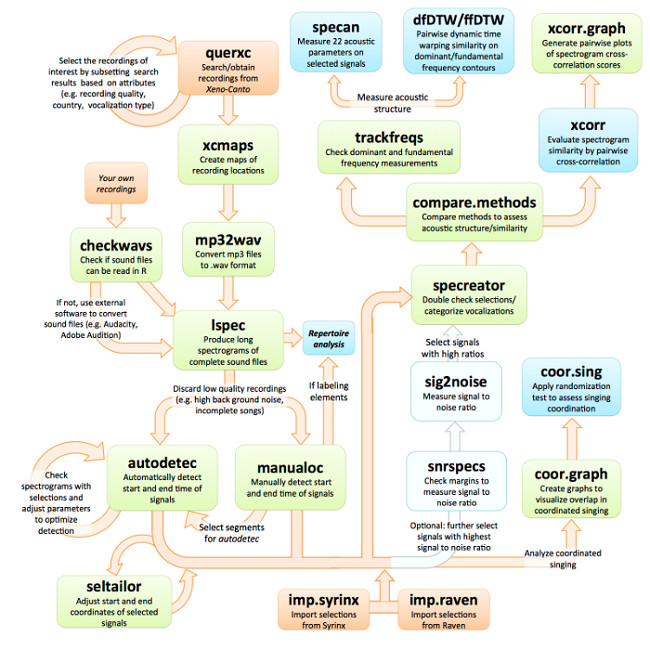

<br>

<center></center>

<center> <h1><b>Import sound files and select signals</h1></b> </center>
<center> <i><font size="4">Marcelo Araya-Salas and Grace Smith Vidaurre</font></i> </center>
<center> `r Sys.Date()` </center>
<br>


Here we present examples regarding how to begin the [`warbleR`](https://cran.r-project.org/package=warbleR) workflow by downloading recordings from _xeno-canto_, importing your own recordings, making spectrograms of whole recordings, selecting signals within recordings or importing selections already made in _Raven_ and _Syrinx_. For more details about function arguments, input or output, read the documentation for the function in question (e.g. `?querxc`). 

Please note that most tools in [`warbleR`](https://cran.r-project.org/package=warbleR) use functions from the [`seewave package`](https://cran.r-project.org/package=seewave) internally. [`warbleR`](https://cran.r-project.org/package=warbleR) has been designed to make the analyses more accessible to average R-users. However, acoustic analysis in R would not be possible without the tools provided by [`seewave`](https://cran.r-project.org/package=seewave). Both packages should be given credit when using [`warbleR`](https://cran.r-project.org/package=warbleR) by including the appropriate citations in publications (`citation("warbleR")` and `citation("seewave")`). 

This vignette can be run without an advanced understanding of R, as long as you know how to run code in your R console. However, knowing more about basic R coding would be very helpful in order to modify code to fit your research questions.

<center> </center> 

<br>
To start, we will use [`warbleR`](https://cran.r-project.org/package=warbleR) to download recordings from [xeno-canto](http://www.xeno-canto.org/). 
<br>


## **Prepare for acoustic analysis**

-----

First, we need to install and load [`warbleR`](https://cran.r-project.org/package=warbleR). You will need an R version ≥ 2.10 and seewave package version ≥ 2.0.1. Also, users using UNIX machines (Mac OSX or Linux), will need to install `fftw3`, `pkg-config` and `libsndfile` on their machines prior to installing `warbleR`. These external packages will need to be installed through a UNIX terminal. Installing these packages lies outside the scope of this vignette, but more details can be found using Google.

```{r, eval=FALSE}

# install warbleR from CRAN
install.packages("warbleR")

# or install warbleR from its GitHub repository, which contains the latest updates
# install.packages("devtools") # run this if devtools is not already installed
library(devtools)
install_github("maRce10/warbleR")

library(warbleR) # load warbleR into your global environment

```

<br>

Set up a working directory

```{r, eval=FALSE}

# Create a new directory
dir.create(file.path(getwd(),"warbleR_example"))
setwd(file.path(getwd(),"warbleR_example"))

# Check the location of the directory
getwd()

```

```{r, eval=TRUE, echo=FALSE, message=FALSE}

# this sets my working directory
library(warbleR)
library(knitr)

```

<br>

## What data do you need to use warbleR? Sound files and selections

Bioacoustics research encompasses a wide range of questions, species, geographic areas and methods, including software used for analysis. _warbleR_ accounts for this diversity by offering a variety of ways to import data for analysis. Regardless of the research question(s), _warbleR_ relies on the following two types of data:

  1. **Sound files:** Recordings in _wav_ or _mp3_ format, either from your own research or open-access databases like xeno-canto

  2. **Selections:** Selections are temporal coordinates (start and end points) of selected acoustic signals within recordings, often organized within a data frame called a selection table

We will give different examples of how to obtain recordings from the open-access database [xeno-canto](http://www.xeno-canto.org/), import recordings or selections other bioacoustics software, such as _Raven_ and _Syrinx_, as well as how to make selections using _warbleR_ functions. 


## Obtain metadata and recordings from [xeno-canto](http://www.xeno-canto.org/)

The open-access [xeno-canto](http://www.xeno-canto.org/) database is an excellent source of sound files across a broad selection of avian species. We can query this database for a species or genus of interest. The function `querxc` has two types of output:

  1. **Metadata of recordings:** geographic coordinates, recording quality, recorder, type of signal, etc.
  
  2. **Sound files:** Sound files in _mp3_ format are returned if the argument `download` is set to `TRUE` (default is `FALSE`).  
  
We recommend downloading metadata first from _xeno-canto_, as this data can be filtered in R to more efficiently download only the recordings important for your question.

<br>
**You can query [xeno-canto](http://www.xeno-canto.org/) by genus:**

```{r, eval=TRUE}

# Query xeno-canto for all recordings of the hummingbird genus Phaethornis
Phae <- querxc(qword = "Phaethornis", download = FALSE) 

# Print column names of data frame to explore metadata 
names(Phae) 

```

```{r, eval=FALSE}

# Check out the structure of the data frame
str(Phae)

```

<br>

**Or you can query by species:**

```{r, eval=FALSE}

# Query xeno-canto for all recordings of the species Phaethornis longirostris
Phae.lon <- querxc(qword = "Phaethornis longirostris", download = FALSE) 
str(Phae.lon)

```

```{r, eval=TRUE, echo=FALSE, message=FALSE}

Phae.lon <- querxc(qword = "Phaethornis longirostris", download = FALSE) 

```

<br>
If you're interested in the geographic spread of the recording locations, you can use the function `xcmaps` to visualize locations. `xcmaps` will create an image file of a map per species in your current directory if `img = TRUE`. If `img = FALSE`, maps will be displayed in the graphic device. 

```{r, eval=FALSE}

# Image type default is jpeg, but tiff files have better resolution

# When the data frame contains multiple species,
# you will have one map per species
xcmaps(X = Phae, img = TRUE, it = "tiff") 
xcmaps(X = Phae.lon, img = FALSE) 

```

```{r, eval=TRUE, echo=FALSE, message=FALSE}

xcmaps(X = Phae.lon, img = FALSE) 

```


### Filter [xeno-canto](http://www.xeno-canto.org/) recordings by signal type

In most cases, you will need to filter the _xeno-canto_ metadata by type of signal you want to analyze. When you subset the metadata, you can input the filtered metadata back into `querxc` to download only the selected recordings. There are many ways to filter data in R, and the example below can be modified to fit your own data. 

Some of the metadata is not quite consistent across recordings, such as signal type or recording quality. These are characteristics of the recordings that you will need to explore with downstream functions before proceeding with signal selection and analysis. However, if you are working with many recordings, we advise removing the lowest quality recordings (D quality) or selecting specific vocalization types.

For example, we are interested in assessing the microgeographic variation of long-billed hermit songs, _Phaethornis longirostris_. Variation at small geographic scales has been already described in this species <a href='#References'><sup>[1]</sup></a>. We should proceed by looking for a site with the highest number of songs. Our goal is to search for visible differences in song structure within a site, and then determine whether underlying differences in acoustic parameters are representative of spectrographic distinctiveness. 

<br>
```{r, eval=TRUE}

# Find out number of available recordings
nrow(Phae.lon) 

# Find out how many types of signal descriptions exist in the xeno-canto metadata
levels(Phae.lon$Vocalization_type)

# How many recordings per signal type?
table(Phae.lon$Vocalization_type)

```

<br>
```{r, eval=TRUE}

# There are many levels to the Vocalization_type variable. 
# Some are biologically relevant signals, but most just 
# reflect variation in data entry.

# Select just the signals we want
# Regular expression is always a good filtering option
Phae.lon.song <- Phae.lon[grep("song", Phae.lon$Vocalization_type, 
                                ignore.case = TRUE), ]

# Check resulting data frame
str(Phae.lon.song) 

```

```{r, eval=FALSE}

# In case you want more than one type of signals:
Phae.lon.sc <- Phae.lon[grep("song|call", Phae.lon$Vocalization_type,ignore.case = TRUE), ]

```

<br>
```{r, eval=FALSE}

# How many recordings per locatity?
table(Phae.lon.song$Locality)

```

Focus on high quality song recordings from La Selva Biological Station:

```{r, eval=TRUE}

# Filter by location
Phae.lon.LS <- Phae.lon.song[grep("La Selva Biological Station, Sarapiqui, Heredia", Phae.lon.song$Locality,
                              ignore.case = FALSE), ]

# Select highest quality recordings
Phae.lon.LS <- Phae.lon.LS[Phae.lon.LS$Quality == "A", ]

```

We can check if the location coordinates make sense (all recordings should be from a single place in Costa Rica) by making a map of these recordings using `xcmaps` 

```{r, eval=TRUE}

# map in the RStudio graphics device (img = FALSE)
xcmaps(Phae.lon.LS, img = FALSE)

```

```{r, eval=FALSE, echo=FALSE}

# Not working as of 01 Aug 2017
# This copies the selected sound files to a dropbox folder so they can be shared
# do not show this code
fn <- with(Phae.lon.LS, paste(paste(Genus, Specific_epithet, Recording_ID, sep = "-"), ".wav", sep = " "))
file.copy(from = file.path("/home/m/Documents/Biblioteca de cantos/Trochilidae/XC/wavs",fn), to = file.path("/home/m/Dropbox/Projects/warbleR package/vignette files", fn), overwrite = TRUE)

wlist <- lapply(fn,function(x) downsample(readWave(file.path("/home/m/Dropbox/Projects/warbleR package/vignette files", x)), samp.rate = 22500))

names(wlist) <- fn

saveRDS(wlist, file = "/home/m/Dropbox/Sharing/warbleR/recs.RDS")

```

<br>

Once you're sure you want the recordings, use `querxc` to download the files. It's also a good idea to save the metadata as .csv files.

```{r, eval=FALSE}

# Download sound files
querxc(X = Phae.lon.LS) 

# Save each data frame object as a .csv file 
write.csv(Phae.lon.LS, "Phae_lon.LS.csv", row.names = FALSE)

```

<br>

### Convert [xeno-canto](http://www.xeno-canto.org/) _mp3_ recordings to _wav_ format

[xeno-canto](http://www.xeno-canto.org/) maintains recordings in _mp3_ format due to file size restrictions. However, we require _wav_ format for all downstream analyses. Compression from _wav_ to _mp3_ and back involves information losses, but recordings that have undergone this transformation have been successfully used in research <a href='#References'> <sup>[2]</sup></a>.

To convert _mp3_ to _wav_, we can use the warbleR function `mp32wav`, which relies on a underlying function from the [`tuneR package`](https://cran.r-project.org/package=tuneR). This function does not always work (and it remains unclear as to why!). This bug should be fixed in future versions of tuneR. If RStudio aborts when running `mp32wav`, use an _mp3_ to _wav_ converter online, or download the open source software `Audacity` (available for Mac, Linux and Windows users). We have made the selected _wav_ files available for download (see next section).

After _mp3_ files have been converted, we need to check that the _wav_ files are not corrupted and can be read into RStudio (some _wav_ files can't be read due to format or permission issues).

```{r, eval=FALSE}

# Neither of these functions requires arguments
# Always check you're in the right directory beforehand
# getwd()
mp32wav() 

# Use checkwavs to see if wav files can be read
checkwavs() 

# Create a list of all the recordings in the directory
wavs <- list.files(pattern = "wav$")

# Downsample the wav files and speed up downstream analyses
lapply(wavs, function(x) writeWave(downsample(readWave(x), samp.rate = 22500),
                                  filename = x))
```

```{r, eval=FALSE, echo=FALSE}

# Not working 01 Aug 2017

### If you were unable to convert _mp3_ to _wav_ format:
  + download the file in [this link](https://www.dropbox.com/s/htpbxbdw8s4i23k/recs.RDS?dl=0) and put it in your working directory
  + then run the following code:


recs <- readRDS(file = "recs.RDS")

for(i in 1:length(recs))
  writeWave(recs[[i]], filename = names(recs)[i])

*Note: In case you have your own recordings in _wav_ format and have skipped previous sections, you must specify the location of your sound files prior to running downstream functions.* 

```

<br>

## **Make long spectrograms of whole recordings**

The function `lspec` produces image files with spectrograms of whole sound files split into multiple rows. It is a useful tool for filtering by visual inspection.

`lspec` allows you to visually inspect the quality of the recording (e.g. amount of background noise) or the type, number, and completeness of the vocalizations of interest. You can discard the image files and recordings that you no longer want to analyze. 

We should first adjust the function arguments to fit our recording characteristics. We can work on a subset of the recordings by specifying their names with the `flist` argument.

```{r, eval=FALSE}

# Create a list of all the recordings in the directory
wavs <- list.files(pattern = "wav$")

# Select a subset of recordings to explore lspec() arguments 
# Based on the list of wav files we created above
sub <- wavs[c(1,3)]

# How long are these files? will determine number of pages returned by lspec
wavdur(sub)

# ovlp = 10 to speed up function
# tiff image files are better quality and are faster to produce
lspec(flist = sub, ovlp = 10, it = "tiff")

# We can zoom in on the frequency axis by changing flim, 
# the number of seconds per row, and number of rows
lspec(flist = sub, flim = c(2, 11), sxrow = 6, rows = 15, ovlp = 10, it = "tiff")

```

Once satisfied with the argument settings we can run all files

```{r, eval=FALSE}

# highlight selected signals
lspec(flim = c(2, 11), ovlp = 10, sxrow = 6, rows = 15, it = "jpeg")

# concatenate lspec image files into a single PDF per recording
# lspec images must be jpegs 
lspec2pdf(keep.img = FALSE, overwrite = TRUE)

```

The pdf image file (in the working directory) should look like this:

```{r, eval=FALSE, echo=FALSE}

# make all page-size images 700 pxls width
```


Note that the sound file name and page number are placed in the top right corner. Also, the dimensions of the image are made to letter paper size for printing and subsequent visual inspection.

Recording _154123_ has a lot of background noise. Delete the _wav_ file for this recording to remove it from subsequent analyses. 

## **Select signals in _warbleR_**

_warbleR_ has two main functions for selecting acoustic signals within recordings:
  *`autodetec` - automatically detects the start and end of signals in sound files based on amplitude, duration, and frequency range attributes
  *`manualoc` - provides an interactive interface in the RStudio graphics device to manually select signals
  
Both functions work fastest with shorter recordings, but there are ways to deal with larger recordings (an hour long or more). In this section we have expanded on some important function arguments, but check out the function documentation for more information.

### Automatically detect signals with `autodetec`

Keep these points in mind when using `autodetec`:

  1. **`autodetec` has 2 types of output:** 
    + data frame with recording name, selection, start and end times. The last two are temporal coordinates that will be passed on to downstream functions to measure acoustic parameters. Save this output as an object or it will not be saved in the environment, but rather printed in the console. 
    + a spectrogram per recording, with red dotted lines marking the start and end of each detected signal, saved in your working directory. In the case of long recordings, it's preferable to create long spectrograms (`ls = TRUE`). For shorter recordings, spectrograms of individual selections may work better (`ls = FALSE`).
 <br>
 
  2. **Important detection parameters:** 
    + `threshold` controls detection by relative amplitude (%) 
    + `bp` serves as a frequency bandpass filter 
    + `ssmooth` controls combination of window length and overlap to smooth signals that have many peaks and would otherwise be detected as multiple signals
    + `mindur` & `maxdur` determine the minimum and maximum duration of the signals to be detected
    + `set` dictates whether settings of the autodetection process are included in the image file name. If `set = TRUE`, threshold (th), envelope (envt), bandpass (bp), power (pw), smooth (smo), maxdur (mxdu), and mindur (midu) are included in image file names. This helps compare the performance of different detection setttings.
    
To set detection parameters we need to know the frequency range and duration of the signals we want to detect. _Phaenthornis longirostris_ songs have frequencies between 2 and 10 kHz and durations between 0.05 and 0.5 s. Detecting signals is not a linear process. You will often need to run detection functions several times, and in the process you will get to know your signals better (if you don't already). 

If you need to detect all or most of the signals within the recording, play around with different arguments to increase detection accuracy. Since you may need to do several rounds of optimization, we recommend using subsets of your recordings to speed up the process. If the species you study produces stereotyped signals, like _Phaethornis longirostris_, just a few signals are needed per recording, and a low-accuracy detection could yield enough selections.

Finally, although `autodetec` performs automatic signal detection, it does not replace visual inspection of selected signals. Ensure that you set aside the time to inspect all selected signals for accuracy. 


```{r, eval=FALSE}

# Select a subset of the recordings
wavs <- list.files(pattern = ".wav$", ignore.case = TRUE)

# Set a seed so we all have the same results
set.seed(1)
sub <- wavs[sample(1:length(wavs), 3)]

# Run autodetec() on subset of recordings
autodetec(flist = sub, bp = c(1, 10), threshold = 10, mindur = 0.05, maxdur = 0.5, envt="abs",
          ssmooth = 300, ls = TRUE, res = 100, 
          flim = c(1, 12), wl = 300, set =TRUE, sxrow = 6, rows = 15, 
          redo = FALSE, it = "tiff")

```

The image files (in the working directory) should look like this (shown below is recording ID 154161):


Note that some songs were correctly detected but other undersired sounds were also detected. In most cases, the undesired selections have a shorter duration than our target signals.

We won't save the `autodetec` ouput in an object until we're satisfied with the detection. To improve our detection we should play around with argument values. Below are some detection parameters that work well for these _Phaethornis longirotris _ recordings:

```{r, eval=FALSE}

autodetec(flist = sub, bp = c(2, 9), threshold = 20, mindur = 0.09, maxdur = 0.22, 
                     envt = "abs", ssmooth = 900, ls = TRUE, res = 100, 
                     flim= c(1, 12), wl = 300, set =TRUE, sxrow = 6, rows = 15, 
                     redo = TRUE, it = "tiff", img = TRUE, smadj = "end")
```

This seems to provide a good detection for most recordings (recording ID 154161):


Once we're satisfied with the detection, we can run the `autodetec` on all the recordings, removing the argument `flist` (so `autodetec` runs over all _wav_ files in the working directory). We will also save the temporal output in an object.

```{r, eval=FALSE}

Phae.ad <- autodetec(bp = c(2, 9), threshold = 20, mindur = 0.09, maxdur = 0.22, 
                     envt = "abs", ssmooth = 900, ls = TRUE, res = 100, 
                     flim= c(1, 12), wl = 300, set =TRUE, sxrow = 6, rows = 15, 
                     redo = TRUE, it = "tiff", img = TRUE, smadj = "end")

```

Let's look at the number of selections per sound file:

```{r, eval=FALSE}

table(Phae.ad$sound.files)

```


```{r, eval=TRUE, echo=FALSE}

Phae.snr <- Phae.ad <- read.csv("Phae_snr.csv")

# Look at the number of selections per sound file 
table(Phae.ad$sound.files)

```

<br>

### Select automatically detected signals using signal-to-noise ratio

<br>

Signal-to-noise ratio (SNR) can be a useful filter for automated signal detection. When background noise is detected as a signal it will have a low SNR, and this characteristic can be used to remove background noise from the `autodetec` selection table. SNR = 1 means the signal and background noise have the same amplitude, so signals with SNR <= 1 are poor quality. SNR calculations can also be used for different purposes throughout your analysis workflow. 

#### Use `snrspecs` to optimize SNR measurements

`snrspecs` is another function in the family of spectrogram creators that allows you to pick a margin for measuring noise. These margins are very important for calculating SNR, especially when working with signals separated by short gaps (e.g. duets).

```{r, eval=FALSE}

# A margin that's too large causes other signals to be included in the noise measurement
# Re-initialize X as needed, for either autodetec or manualoc output

# Try this with 10% of the selections first
# Set a seed first, so we all have the same results
set.seed(5)

X <- Phae.ad[sample(1:nrow(Phae.ad),(nrow(Phae.ad)*0.1)), ]

snrspecs(X = X, flim = c(2, 11), snrmar = 0.5, mar = 0.7, it = "tiff")

```

The image files should look like this:


This margin overlaps signals, a smaller margin would be better.

```{r, eval=FALSE}

# This smaller margin is better
snrspecs(X = X, flim = c(2, 11), snrmar = 0.04, mar = 0.7, it = "tiff")

```


<br>

#### Calculate signal to noise ratio for recordings

Once we've picked an SNR margin we can move forward with the SNR calculation. We will measure SNR on every other selection to speed up the process.
```{r, eval=FALSE}

Phae.snr <- sig2noise(X = Phae.ad[seq(1, nrow(Phae.ad), 2), ], mar = 0.04)

```

As we just need a few songs to characterize each sound file and individual, we can choose selections with the highest SNR per sound file. In this example, we will choose 5 selections per recording with the highest SNRs.  

```{r, eval=TRUE}

Phae.hisnr <- Phae.snr[ave(-Phae.snr$SNR, Phae.snr$sound.files, FUN = rank) <= 5, ]

# Double check the number of selection per sound files 
table(Phae.hisnr$sound.files)

```

At this point would be a good idea to save the selections as a file

```{r, eval=FALSE}

write.csv(Phae.hisnr, "Phae_hisnr.csv", row.names = FALSE)

```

<br>

### Manually select signals with `manualoc`

`manualoc` is a function that provides an interactive interface to select signals. We recommend reading the documentation for `manualoc` prior to running this example. Once you've done so, here are some points to keep in mind:
  
  1. **The sole output for this function is a .csv file**:
    + contains the time coordinates, selection information and any comments made 
  
  2. **Be very precise with your clicks**
    + stray clicks will cause `manualoc` to fail
    + don't double-click, instead click once and wait for blue bubble to pop up before clicking again
    + suspect a stray click when `manualoc` starts responding to single clicks
    + if so, stop `manualoc` with `Stop` button
    + `manualoc` retains all previous selections in the .csv file and will start up where 
    you left off
  
  3. **Selections can be deleted directly in the `manualoc` interface** 
    + use `Del-sel` button
  
  4. **Selections can also be deleted in the `manualoc_output.csv`** 
    + stop `manualoc`, open the .csv 
    + delete the rows corresponding to the unwanted selection(s) prior to starting `manualoc` again 

  6. **Run `manualoc` within the expected frequency range for your species** 
    + use argument `flim` to facilitate signal selection
    
  7. **Run `manualoc` with oscillograms enabled to improve signal selection**
    + when `osci = TRUE`, the oscillogram or waveform serves as a visual aid 
    + use changes in amplitude to select start and end of the signal
    + the oscillogram will print to screen when the resolution of the projected spectrogram    
    improves (depends on the `seltime` argument)
    + `seltime ` determines the time interval in seconds at which the spectrograms are produced with higher resolution and oscillograms 

Some other uses for `manualoc`:

  1. **`manualoc` can be used in combination with `autodetec` if you have large recordings:**
    + you can select specific time points to break up the recording and speed up `autodetec`
    + then you can feed these time coordinates to `autodetec` using the data frame argument `X`
    
  2. **`manualoc` can also be used for visual classification:** 
    + run `manualoc` with `selcomm = TRUE`
    + tag individual selections with song or element types using `selcomm`
    + use `specreator` to create spectrograms with `selcomm` text and check visual classifications

You can stop the function at any point by clicking twice on the `stop` button.

```{r, eval=FALSE}

# Run manualoc() with frequency range set for Phaethornis longirostris
# Recording comments are enabled to mark recording quality
# Selection comments enabled to include visual classifications
manualoc(flim = c(1, 11), reccomm = TRUE, selcomm = TRUE, osci = TRUE, seltime = 2)

# Read manualoc() output back into RStudio as an object
# This data frame object can be used as input for the functions that follow
manualoc_out <- read.csv("manualoc_output.csv", header = TRUE)

```

The graphic device will look similar to this:


<br>

## **_warbleR_ interface with other bioacoustics software**

_warbleR_ is compatible with _Raven_ and _Syrinx_. You may already work with these bioacoustics programs, and they are a valuable subset of the software available to a wide user base. One of the most difficult part of any biological analysis is transitioning between software, as this often involves writing customized code to change file formats accordingly. _warbleR_ now contains functions that allow you to start an analysis outside of _R_, or take the analysis outside of _R_ when necessary. Check out the following functions:

  * `exp_raven` - export selections made in _warbleR_ to _Raven_ 
  * `imp.raven` - import selection tables from _Raven_ 
  * `imp.syinx` - import selection tables from _Syrinx_
  * `run_raven` - open sound files in Raven from the R interface
  
The function `exp_raven` lets you take the analysis outside of _R_ after making selections in _warbleR_. 

### **Export selections made in _warbleR_ to _Raven_**

```{r, eval=FALSE}

Phae.hisnr <- read.csv("Phae_hisnr.csv", header = TRUE)

# remove SNR column
Phae.hisnr <- Phae.hisnr[, -grep("SNR", names(Phae.hisnr))]

exp_raven(Phae.hisnr[Phae.hisnr$sound.files == levels(Phae.hisnr$sound.files)[1], ], file.name = "Phae hisnr Raven format")

``` 

###**Open sound files in Raven from the R interface**

The function `run_raven` is particularly useful. It allows you to call _Raven_ from _warbleR_ and import selections you make in _Raven_ directly back to _warbleR_ as a data frame.

```{r, eval=FALSE}

# xeno-canto mp3 files must be remade into wav files with the correct atrributes to work in Raven 
mp3 <- lapply(list.files(pattern = "mp3$"), readMP3)

invisible(lapply(1:length(mp3), function(x){
  writeWave(mp3[[x]], filename = paste(strsplit(list.files(pattern = "mp3$")[x], split = ".m")[[1]][1], ".wav", sep = ""), extensible = FALSE)
}))

# the object sels will contain selections you made in the target recordings
sels <- run_raven(raven.path = "~/opt/Raven-1.5.0.0035/", sound.files = c("Phaethornis-longirostris-154072.wav", "Phaethornis-longirostris-154070.wav"), at.the.time = 2, import = TRUE)
sels

# set working directory back if necessary
``` 


```{r, eval=TRUE, echo=FALSE}

# write.csv(sels, "Raven_sels.csv", row.names = FALSE)

# xeno-canto mp3 files must be remade into wav files with the correct atrributes to work in Raven 
sels <- read.csv("./Raven_sels.csv", header = TRUE)

sels

``` 


###**Next vignette: Visual inspection and classification of signals**

Here we have given examples of how to obtain recordings from the _xeno-canto_ open-access database, how to perform automated or manual signal selections in _warbleR_ and how to make selections in programs outside of _R_, namely _Raven_ and _Syrinx_. After running the code in this first vignette, you should now have an idea of:

  * data used in _warbleR_ 
  * how to obtain publicly accessible recordings
  * how to select signals for analysis in either:
    * recordings downloaded from _xeno-canto_ 
    * your own sound files

The next vignette will cover the second phase of the _warbleR_ workflow, which includes methods to visualize signals for quality control and classification. 


