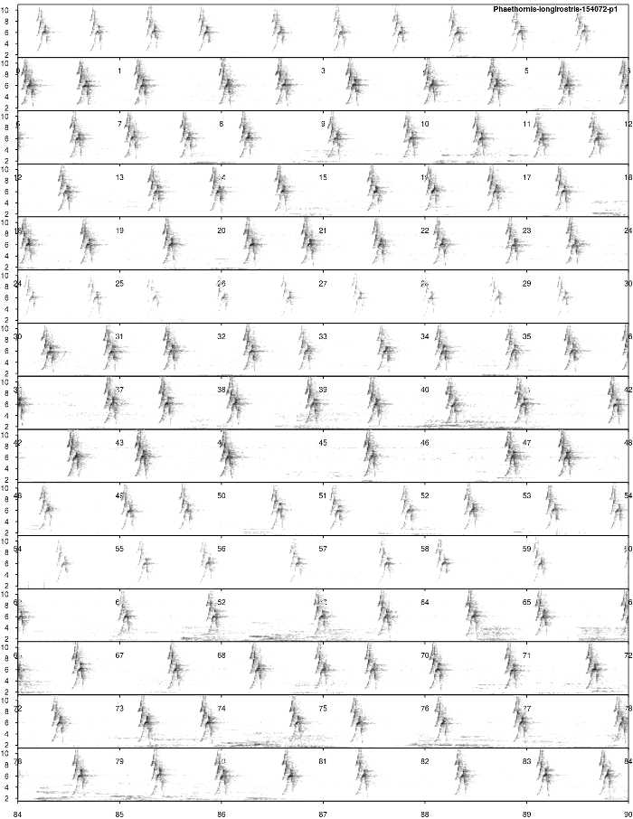
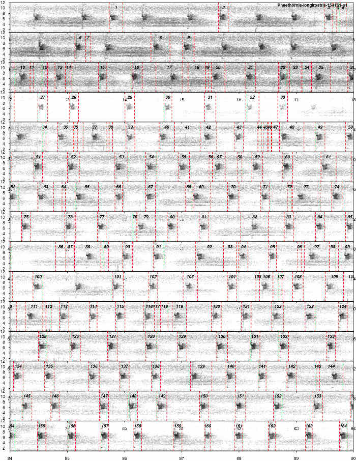
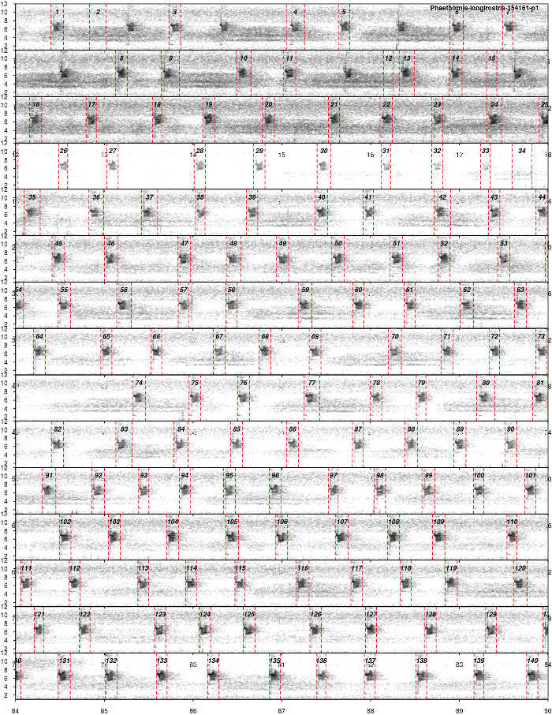
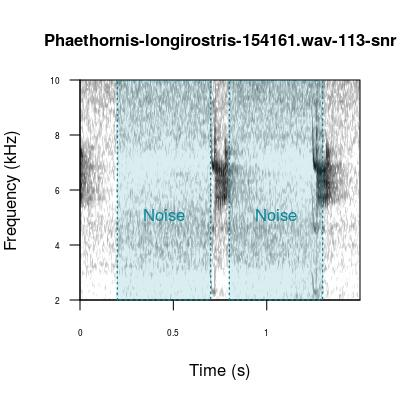
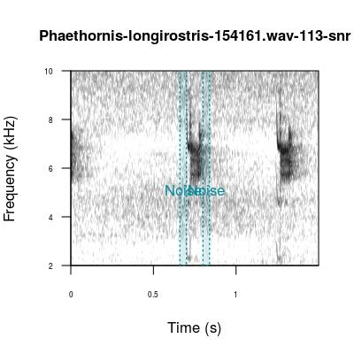

<script>
   $(document).ready(function() {
     $head = $('#header');
     $head.prepend('')
   });
</script>

&nbsp; 


<center></center>


&nbsp; 

## Bioacoustics in R with `warbleR` and `Rraven`

Bioacoustics research encompasses a wide range of questions, study systems and methods, including the software used for analyses. The `warbleR` and `Rraven` packages leverage the flexibility of the `R` environment to offer a broad and accessible bioinformatics tool set. These packages fundamentally rely upon two types of data to perform bioacoustics analyses in R:

  1. **Sound files:** Recordings in _wav_ or _mp3_ format, either from your own research or open-access databases like _xeno-canto_

  2. **Selection tables:** Selection tables contain the temporal coordinates (start and end points) of selected acoustic signals within recordings

### Official `warbleR` and `Rraven` repositories

These packages are both available on _CRAN_: [`warbleR`](https://cran.r-project.org/package=warbleR), [`Rraven`](https://CRAN.R-project.org/package=Rraven), as well as on _GitHub_: [`warbleR`](https://github.com/maRce10/warbleR), [`Rraven`](https://github.com/maRce10/Rraven). The GitHub repository will always contain the latest functions and updates. You can also check out an article in _Methods in Ecology and Evolution_ documenting the `warbleR` package <a href='#References'><sup>[1]</sup></a>.

We welcome all users to provide feedback, contribute updates or new functions and report bugs to warbleR's GitHub repository.

Please note that `warbleR` and `Rraven` use functions from the [`seewave`](https://cran.r-project.org/package=seewave), [`monitoR`](https://cran.r-project.org/package=monitoR), [`tuneR`](https://cran.r-project.org/package=tuneR) and [`dtw`](https://cran.r-project.org/package=dtw]) packages internally. `warbleR` and `Rraven` have been designed to make bioacoustics analyses more accessible to `R` users, and such analyses would not be possible without the tools provided by the packages above. These packages should be given credit when using `warbleR` and `Rraven` by including citations in publications as appropriate (e.g. `citation("seewave")`).

### Parallel processing in `warbleR`

Parallel processing, or using multiple cores on your machine, can greatly speed up analyses. All iterative `warbleR` functions now have parallel processing for Linux, Mac and Windows operating systems. These functions also contain progress bars to visualize progress during normal or parallel processing. See <a href='#References'><sup>[1]</sup></a> for more details about improved running time using parallel processing.

## **Vignette introduction**

Below we present a case study of microgeographic vocal variation in long-billed hermit hummingbirds, _Phaethornis longirostris_. Variation at small geographic scales has been already described in this species <a href='#References'><sup>[2]</sup></a>. Our goal is to search for visible differences in song structure within a site, and then determine whether underlying differences in acoustic parameters are representative of spectrographic distinctiveness. In this vignette, we will demonstrate how to:

  1. Prepare for bioacoustics analyses by downloading `warbleR` and `Rraven`
  
  2. Use `Rraven` to import _Raven_ selection tables for your own recordings
  
  3. Obtain recordings from the open-access database [_xeno-canto_](http://www.xeno-canto.org/)
  
  4. Select signals using `warbleR` functions 


This vignette can be run without an advanced understanding of `R`, as long as you know how to run code in your console. However, knowing more about basic `R` coding would be very helpful to modify the code for your research questions.

For more details about function arguments, input or output, read the documentation for the function in question (e.g. `?querxc`). 
&nbsp; 

## **Prepare for analyses**

### Install and load packages

First, we need to install and load `warbleR` and `Rraven`. You will need an `R` version ≥ 3.2.1 and `seewave` version ≥ 2.0.1. Also, users using `UNIX` machines (Linux or Mac operating systems), may need to install `fftw3`, `pkg-config` and `libsndfile` on their machines prior to installing `warbleR`. These external packages will need to be installed through a `UNIX` terminal. Installing these packages lies outside the scope of this vignette, but you can find more information on _Google_.

```{r, echo = FALSE, message = FALSE}

# remove all objects
rm(list = ls())

# unload all non-based packages
out <- sapply(paste('package:', names(sessionInfo()$otherPkgs), sep = ""), function(x) try(detach(x, unload = FALSE, character.only = TRUE), silent = TRUE))

# load packages
X <- c("warbleR", "Rraven", "knitr")
invisible(lapply(X, library, character.only = TRUE))
# library(kableExtra)

options(knitr.table.format = "html") 
opts_chunk$set(comment = "")
# opts_knit$set(root.dir = tempdir())
options(width = 150, max.print = 100)

# for vignette checking and image file output
# setwd("~/Desktop/R/warbleR_example2/")

#website to fix gifs
#https://ezgif.com/optimize

```


```{r, eval=FALSE}

### Install packages from CRAN
# Note that if you install from CRAN, then don't run the code to install from GitHub below, and vice versa
install.packages("warbleR")
install.packages("Rraven")

### Alternatively, install warbleR and Rraven from GitHub repositories, which contain the latest updates
# Run this ONLY if devtools is not already installed
install.packages("devtools")

# Load devtools to access the install_github function
library(devtools)

# Install packages from GitHub
# install_github("maRce10/warbleR")
# install_github("maRce10/Rraven")
# install_github("maRce10/NatureSounds")

# Load warbleR and Rraven into your global environment
X <- c("warbleR", "Rraven")
invisible(lapply(X, library, character.only = TRUE))

```

&nbsp; 

### Make a new directory and set your working directory

```{r, eval=FALSE}

# Create a new directory and set your working directory (assuming that you are in your /home/username directory)
dir.create(file.path(getwd(),"warbleR_example"))
setwd(file.path(getwd(),"warbleR_example"))

# Check your location
getwd()

```

&nbsp; 


## **Import selection tables using `Rraven`**

`Rraven` is an interface between _Raven_ and `R` that allows you to import selection tables for your own recordings. This is very useful if you prefer to select signals in recordings outside of `R`. Once you have selection tables imported into `R` and the corresponding sound files in your working directory, you can move on to making spectrograms or performing analyses (see the next vignette in this series).

The sound files and selection tables loaded here correspond to male long-billed hermit hummingbird songs recorded at La Selva Biological Station in Costa Rica. Later, we will add to this data set by searching for more recordings on the _xeno-canto_ open-access database. 

Check out the `Rraven` package documentation for more functions and information (although you will need _Raven_ or _Syrinx_ installed on your computer for some functions).

```{r, eval=FALSE, echo=FALSE}

data("selection_files")

# x <- 1
# need to provide these selection tables to workshop participants and also place in the warbleR directory for vignette to be built properly
invisible(lapply(1:4, function(x){
  write.table(selection_files[[x]], names(selection_files[x]), row.names = FALSE, quote = FALSE, sep = "\t", col.names = FALSE)
}))
# list.files()

```

```{r, eval=FALSE, echo=TRUE}

# load .wav files corresponding to Raven selection tables from the NatureSounds package
data(list = c("Phae.long1", "Phae.long2", "Phae.long3", "Phae.long4"))

# write these out as physical .wav files
writeWave(Phae.long1, "Phae.long1.wav")
writeWave(Phae.long2, "Phae.long2.wav")
writeWave(Phae.long3, "Phae.long3.wav")
writeWave(Phae.long4, "Phae.long4.wav")

# import selections
sels <- imp_raven(sound.file.col = "Begin.File", ext.case = "lower", all.data = FALSE, freq.cols = FALSE)
str(sels)

# write out the imported selections as a .csv for later use
write.csv(sels, "Raven_sels.csv", row.names = FALSE)

``` 


### Make your data frame into a selection table

Downstream `warbleR` functions require selection tables in order to run correctly. Use the function `make.selection.table` to convert your data frame into an object of class `selection.table`.

```{r, echo=TRUE, eval=FALSE}

# this is a data frame with metadata for the NatureSounds sound files we loaded above
data(selec.table)

st <- make.selection.table(X = selec.table)

class(st)

```


```{r, eval=FALSE, echo=FALSE}

# xeno-canto mp3 files must be remade into wav files with the correct atrributes to work in Raven 
sels <- read.csv("Raven_sels.csv", header = TRUE)

# str(sels)

``` 


## **Obtain metadata and recordings from [xeno-canto](http://www.xeno-canto.org/)**

The open-access [xeno-canto](http://www.xeno-canto.org/) database is an excellent source of sound files across avian species. You can query this database by a species or genus of interest. The function `querxc` has two types of output:

  1. **Metadata of recordings:** geographic coordinates, recording quality, recordist, type of signal, etc.
  
  2. **Sound files:** Sound files in _mp3_ format are returned if the argument `download` is set to `TRUE`.  
  
We recommend downloading metadata first from _xeno-canto_, as this data can be filtered in R to more efficiently download recordings (e.g. only those relevant to your question).

Here, we will query the _xeno-canto_ database to download more _Phaethornis longirostris_ sound files for our question of how male songs vary at a microgeographic scale.

&nbsp; 

```{r, eval=FALSE}

# Query xeno-canto for all Phaethornis recordings (e.g., by genus)
Phae <- querxc(qword = "Phaethornis", download = FALSE) 

# Check out the structure of resulting the data frame
str(Phae)

# Query xeno-canto for all Phaethornis longirostris recordings
Phae.lon <- querxc(qword = "Phaethornis longirostris", download = FALSE) 

# Check out the structure of resulting the data frame
str(Phae.lon)

```

```{r, eval=TRUE, echo=FALSE, message=FALSE}

Phae.lon <- querxc(qword = "Phaethornis longirostris", download = FALSE) 

```

&nbsp; 

You can then use the function `xcmaps` to visualize the geographic spread of the queried recordings. `xcmaps` will create an image file of a map per species in your current directory if `img = TRUE`. If `img = FALSE`, maps will be displayed in the graphics device. 

```{r, eval=FALSE}

# Image type default is jpeg, but tiff files have better resolution

# When the data frame contains multiple species, this will yield one map per species
xcmaps(X = Phae, img = TRUE, it = "tiff") # all species in the genus
xcmaps(X = Phae.lon, img = FALSE) # a single species

```

```{r, eval=TRUE, echo=FALSE, message=FALSE}

xcmaps(X = Phae.lon, img = FALSE) 

```


### Filter [xeno-canto](http://www.xeno-canto.org/) recordings by quality, signal type and locality

In most cases, you will need to filter the _xeno-canto_ metadata by type of signal you want to analyze. When you subset the metadata, you can input the filtered metadata back into `querxc` to download only the selected recordings. There are many ways to filter data in R, and the example below can be modified to fit your own data. 

Here, before downloading the sound files themselves from _xeno-canto_, we want to ensure that we select high quality sound files that contain songs (rather than other acoustic signal types) and were also recorded at La Selva Biological Station in Costa Rica. 

&nbsp; 
```{r, eval=TRUE, echo=TRUE}

# How many recordings are available for Phaethornis longirostris?
nrow(Phae.lon) 

# How many signal types exist in the xeno-canto metadata?
levels(Phae.lon$Vocalization_type)

# How many recordings per signal type?
table(Phae.lon$Vocalization_type)

```

&nbsp; 
```{r, eval=TRUE, echo=TRUE}

# Filter the metadata to select the signals we want to retain

# First by quality
Phae.lon <- Phae.lon[Phae.lon$Quality == "A", ]
nrow(Phae.lon)

# Then by signal type
Phae.lon.song <- Phae.lon[grep("song", Phae.lon$Vocalization_type, ignore.case = TRUE), ]
nrow(Phae.lon.song)

# Finally by locality
Phae.lon.LS <- Phae.lon.song[grep("La Selva Biological Station, Sarapiqui, Heredia", Phae.lon.song$Locality, ignore.case = FALSE), ]

# Check resulting data frame, 6 recordings remain
str(Phae.lon.LS)

```

&nbsp; 

We can check if the location coordinates make sense (all recordings should be from a single place in Costa Rica) by making a map of these recordings using `xcmaps`.

```{r, eval=TRUE, echo=TRUE}

# map in the RStudio graphics device (img = FALSE)
xcmaps(Phae.lon.LS, img = FALSE)

```

```{r, eval=FALSE, echo=FALSE}

# Not working as of 01 Aug 2017
# This copies the selected sound files to a dropbox folder so they can be shared
# do not show this code
fn <- with(Phae.lon.LS, paste(paste(Genus, Specific_epithet, Recording_ID, sep = "-"), ".wav", sep = " "))
file.copy(from = file.path("/home/m/Documents/Biblioteca de cantos/Trochilidae/XC/wavs",fn), to = file.path("/home/m/Dropbox/Projects/warbleR package/vignette files", fn), overwrite = TRUE)

wlist <- lapply(fn,function(x) downsample(readWave(file.path("/home/m/Dropbox/Projects/warbleR package/vignette files", x)), samp.rate = 22500))

names(wlist) <- fn

saveRDS(wlist, file = "/home/m/Dropbox/Sharing/warbleR/recs.RDS")

```

&nbsp; 

Once you're sure you want the recordings, use `querxc` to download the files. Also, save the metadata as a _.csv_ file.

```{r, eval=FALSE}

# Download sound files
querxc(X = Phae.lon.LS) 

# Save the metadata object as a .csv file 
write.csv(Phae.lon.LS, "Phae_lon.LS.csv", row.names = FALSE)

```

&nbsp; 

### Convert [xeno-canto](http://www.xeno-canto.org/) _mp3_ recordings to _wav_ format

[xeno-canto](http://www.xeno-canto.org/) maintains recordings in _mp3_ format due to file size restrictions. However, we require _wav_ format for all downstream analyses. Compression from _wav_ to _mp3_ and back involves information losses, but recordings that have undergone this transformation have been successfully used in research <a href='#References'> <sup>[3]</sup></a>.

To convert _mp3_ to _wav_, we can use the warbleR function `mp32wav`, which relies on a underlying function from the [`tuneR`](https://cran.r-project.org/package=tuneR) package. This function does not always work (and it remains unclear as to why!). This bug should be fixed in future versions of `tuneR`. If RStudio aborts when running `mp32wav`, use an _mp3_ to _wav_ converter online, or download the open source software `Audacity` (available for Mac, Linux and Windows users). 

After _mp3_ files have been converted, we need to check that the _wav_ files are not corrupted and can be read into RStudio (some _wav_ files can't be read due to format or permission issues).

```{r, eval=FALSE}

# Always check you're in the right directory beforehand
# getwd()

# here we are downsampling the original sampling rate of 44.1 kHz to speed up downstream analyses in the vignette series
mp32wav(samp.rate = 22050) 

# Use checkwavs to see if wav files can be read
checkwavs() 

```

```{r, eval=FALSE, echo=FALSE}

# Not working 01 Aug 2017

### If you were unable to convert _mp3_ to _wav_ format:
  # + download the file in [this link](https://www.dropbox.com/s/htpbxbdw8s4i23k/recs.RDS?dl=0) and put it in your working directory
  # + then run the following code:


# recs <- readRDS(file = "recs.RDS")
# 
# for(i in 1:length(recs))
#   writeWave(recs[[i]], filename = names(recs)[i])

```

&nbsp; 

## **A note on combining data from different sources**

We now have _.wav_ files for existing recordings ( _Phae.long1.wav_ through _Phae.long4.wav_, representing recordings made in the field) as well as 6 recordings downloaded from _xeno-canto_. The existing Phae.long*.wav recordings have associated selection tables that were made in _Raven_, but the _xeno-canto_ have no selection tables, as we have not yet parsed these sound files to select signals within them. 

We will move forwards by treating these sound files from different sources as a single data set. This is made possible by the fact that `warbleR` functions will read in all sound files present in the working directory. Later on in this vignette we will use `warbleR` functions to select signals for the _xeno-canto_ sound files.

In case you have your own recordings in _wav_ format and have skipped previous sections, you must specify the location of the sound files you will use prior to running downstream functions by setting your working directory again.

Since `warbleR` handles sound files in working directories, it's good practice to keep sound files associated with the same project in a single directory. If you're someone who likes to make a new directory for every batch of recordings or new analysis associated with the same project, you may find the `consolidate` function useful.


```{r, echo=TRUE, eval = FALSE, message=FALSE}

# For this example, set your working directory to an empty temporary directory
setwd(tempdir())

# Here we will simulate the problem of having files scattered in multiple directories

# Load .wav file examples from the NatureSounds package
data(list = c("Phae.long1", "Phae.long2", "Phae.long3"))

# Create first folder inside the temporary directory and write new .wav files inside this new folder
dir.create("folder1")
writeWave(Phae.long1, file.path("folder1","Phae_long1.wav"))
writeWave(Phae.long2, file.path("folder1","Phae_long2.wav"))

# Create second folder inside the temporary directory and write new .wav files inside this second new folder
dir.create("folder2")
writeWave(Phae.long3, file.path("folder2","Phae_long3.wav"))

# Consolidate the scattered files into a single folder, and make a .csv file that contains metadata (location, old and new names in the case that files were renamed)
invisible(consolidate(path = tempdir(), save.csv = TRUE))

list.files(path = "./consolidated_folder")

# set your working directory back to "/home/user/warbleR_example" for the rest of the vignette, or to whatever working directory you were using originally

```

## **Make long spectrograms of whole recordings**

`lspec` produces image files with spectrograms of whole sound files split into multiple rows. It is a useful tool for filtering by visual inspection.

`lspec` allows you to visually inspect the quality of the recording (e.g. amount of background noise) or the type, number, and completeness of the vocalizations of interest. You can discard the image files and recordings that you no longer want to analyze. 

First, adjust the function arguments as needed. We can work on a subset of the recordings by specifying their names with the `flist` argument.

```{r, eval=FALSE}

# Create a vector of all the recordings in the directory
wavs <- list.files(pattern = "wav$")

# Print this object to see all sound files
# As noted above, we have 10 sound files, 6 of which are from xeno-canto
wavs 

# Select a subset of recordings to explore lspec() arguments 
# Based on the list of wav files we created above
sub <- wavs[c(1, 5)]

# How long are these files? this will determine number of pages returned by lspec
wavdur(sub)

# ovlp = 10 to speed up function
# tiff image files are better quality and are faster to produce
lspec(flist = sub, ovlp = 10, it = "tiff")

# We can zoom in on the frequency axis by changing flim, 
# the number of seconds per row, and number of rows
lspec(flist = sub, flim = c(2, 10), sxrow = 6, rows = 15, ovlp = 10, it = "tiff")

```

Once satisfied with the argument settings we can make long spectrograms for all the sound files.

```{r, eval=FALSE}

# Reinitialize sels in the imp_raven section above as needed
sels <- read.csv("Raven_sels.csv", header = TRUE)
fl <- wavs[grep("Phae.lon*", wavs)]

# Make long spectrograms for the recordings with Raven selections to highlight the selected signals
# The resulting image files have dotted red lines indicating the temporal coordinates (start, end) of selected signals
lspec(X = sels, flim = c(2, 10), ovlp = 10, sxrow = 6, rows = 15, it = "jpeg", flist = fl)

# Make long spectrograms for the xeno-canto recordings, which do not have selections
fl <- wavs[grep("Phae.lon*", wavs, invert = TRUE)]
lspec(flim = c(2, 10), ovlp = 10, sxrow = 6, rows = 15, it = "jpeg", flist = fl)

# concatenate lspec image files into a single PDF per recording
# lspec images must be jpegs to do this
lspec2pdf(keep.img = FALSE, overwrite = TRUE)

```

The pdf image files (in the working directory) for the _xeno-canto_ recordings should look like this:

```{r, eval=FALSE, echo=FALSE}

# make all page-size images 700 pxls width

```

<center> </center> 
&nbsp; 

The sound file name and page number are placed in the top right corner. The dimensions of the image are made to letter paper size for printing and subsequent visual inspection.

Recording _154123_ has a lot of background noise. Delete the _wav_ file for this recording to remove it from subsequent analyses. 

```{r, eval=FALSE, echo=FALSE}

### Remove silence in sound files

# The function below removes silent segments of sound files. This can help reduce file size, which can speed up functions (in particular, `manualoc`).

# giving error: Error in file.copy(from = wv, to = file.path(getwd(), "removed_silence_files",  : 
  # more 'from' files than 'to' files

# here we will produce spectrograms of the silent gaps that were removed
# perform this on only the longer xeno-canto recordings
rm_sil(flist = wavs[grep("Phae.lon*", wavs, invert = TRUE)], min.sil.dur = 0.2, img = TRUE, it = "jpeg", flim = c(0, 12))

```

## **Select signals in _warbleR_**

_warbleR_ has two main functions for selecting acoustic signals within recordings. `autodetec` automatically detects the start and end of signals in sound files based on amplitude, duration, and frequency range attributes. `manualoc` provides an interactive interface in the graphics device to manually select signals
  
Both functions are fastest with shorter recordings, but there are ways to deal with larger recordings (an hour long or more). In this section we have expanded on some important function arguments, but check out the function documentation for more information.

### Automatically detect signals with `autodetec`

Keep these points in mind when using `autodetec`:

  1. **`autodetec` has 2 types of output:** 
    + data frame with recording name, selection, start and end times. The last two are temporal coordinates that will be passed on to downstream functions to measure acoustic parameters. Save this output as an object or it will not be saved in the environment, but rather printed in the console. 
    + a spectrogram per recording, with red dotted lines marking the start and end of each detected signal, saved in your working directory. In the case of long recordings, it's preferable to create long spectrograms (`ls = TRUE`). For shorter recordings, spectrograms of individual selections may work better (`ls = FALSE`).
 &nbsp; 
 
  2. **Important detection parameters:** 
    + `threshold` controls detection by relative amplitude (%) 
    + `bp` serves as a frequency bandpass filter 
    + `ssmooth` controls combination of window length and overlap to smooth signals that have many peaks and would otherwise be detected as multiple signals
    + `mindur` & `maxdur` determine the minimum and maximum duration of the signals to be detected
    + `set` dictates whether settings of the autodetection process are included in the image file name. If `set = TRUE`, threshold (th), envelope (envt), bandpass (bp), power (pw), smooth (smo), maxdur (mxdu), and mindur (midu) are included in image file names. This helps compare the performance of different detection setttings.
    
To set detection parameters we need to know the frequency range and duration of the signals we want to detect. _Phaenthornis longirostris_ songs have frequencies between 2 and 10 kHz and durations between 0.05 and 0.5 s. 

If you need to detect all or most of the signals within the recording, play around with different arguments to increase detection accuracy. Since you may need to do several rounds of optimization, we recommend using subsets of your recordings to speed up the process. If the species you study produces stereotyped signals, like _Phaethornis longirostris_, just a few signals are needed per recording, and a low-accuracy detection could yield enough selections.

Finally, although `autodetec` performs automatic signal detection, it does not replace visual inspection of selected signals. Ensure that you set aside the time to inspect all selected signals for accuracy. You will often need to run detection functions several times, and in the process you will get to know your signals better (if you don't already). 


```{r, eval=FALSE, echo=TRUE}

# Select a subset of sound files
# Here we will focus on the sound files downloaded from xeno-canto, as these do not have selections
# Reinitialize the wav object
wavs <- list.files(pattern = ".wav$", ignore.case = TRUE)
fl <- wavs[grep("Phae.lon*", wavs, invert = TRUE)]

# Set a seed so we all have the same results
set.seed(1)
sub <- fl[sample(1:length(fl), 3)]

# Run autodetec() on subset of recordings
# The data frame object output is printed to the console, we are not saving this in an object yet, since we are just playing around with argument settings
# you can run this in parallel to speed up computation time
autodetec(flist = sub, bp = c(1, 10), threshold = 10, mindur = 0.05, maxdur = 0.5, envt="abs", ssmooth = 300, ls = TRUE, res = 100, flim = c(1, 12), wl = 300, set = TRUE, sxrow = 6, rows = 15, redo = FALSE)

```

The image files (in the working directory) should look like this (shown below is recording ID 154161):

<center> </center> 
&nbsp; 

Note that some songs were correctly detected but other undesired sounds were also detected. In most cases, the undesired selections have a shorter duration than our target signals.

We won't save the `autodetec` ouput in an object until we're satisfied with the detection. To improve our detection we should play around with argument values. Also note that the image files produced by `autodetec` contain the values used for the different arguments, which can help you better compare between runs. Below are some detection parameters that work well for these _Phaethornis longirotris _ recordings:

```{r, eval=FALSE, echo = TRUE}

autodetec(flist = sub, bp = c(2, 10), threshold = 20, mindur = 0.09, maxdur = 0.22, envt = "abs", ssmooth = 900, ls = TRUE, res = 100, flim= c(1, 12), wl = 300, set =TRUE, sxrow = 6, rows = 15, redo = TRUE, it = "tiff", img = TRUE, smadj = "end")

```

This seems to provide a good detection for most recordings (recording ID 154161):

<center> </center>
&nbsp; 

Once we're satisfied with the detection, we can run the `autodetec` on all the recordings, removing the argument `flist` (so `autodetec` runs over all _wav_ files in the working directory). We will also save the temporal output in an object.

```{r, eval=FALSE, echo=TRUE}

Phae.ad <- autodetec(bp = c(2, 10), threshold = 20, mindur = 0.09, maxdur = 0.22, envt = "abs", ssmooth = 900, ls = TRUE, res = 100, flim = c(2, 10), wl = 300, set =TRUE, sxrow = 6, rows = 15, redo = TRUE, it = "tiff", img = TRUE, smadj = "end")

```

Let's look at the number of selections per sound file:

```{r, eval=FALSE, echo=TRUE}

table(Phae.ad$sound.files)

```

&nbsp; 

### Use SNR to filter automatically selected signals

&nbsp; 

Signal-to-noise ratio (SNR) can be a useful filter for automated signal detection. When background noise is detected as a signal it will have a low SNR, and this characteristic can be used to remove background noise from the `autodetec` selection table. SNR = 1 means the signal and background noise have the same amplitude, so signals with SNR <= 1 are poor quality. SNR calculations can also be used for different purposes throughout your analysis workflow. 

#### Optimize SNR measurements

`snrspecs` is a function in the family of spectrogram creators that allows you to pick a margin for measuring noise. These margins are very important for calculating SNR, especially when working with signals separated by short gaps (e.g. duets).


```{r, eval=FALSE}

# A margin that's too large causes other signals to be included in the noise measurement
# Re-initialize X as needed, for either autodetec or manualoc output

# Try this with 10% of the selections first
# Set a seed first, so we all have the same results
set.seed(5)

X <- Phae.ad[sample(1:nrow(Phae.ad),(nrow(Phae.ad)*0.05)), ]
nrow(X)

snrspecs(X = X, flim = c(2, 10), snrmar = 0.5, mar = 0.7, it = "jpeg")

```

The image files should look like this:

<center> </center>
&nbsp; 

This margin overlaps signals, so a smaller margin would be better.

```{r, eval=FALSE}

# This smaller margin is better
snrspecs(X = X, flim = c(2, 10), snrmar = 0.04, mar = 0.7, it = "jpeg")

```

<center>  </center>
&nbsp; 

#### Calculate SNR for automatically selected signals

Once we've picked an SNR margin we can move forward with the SNR calculation. We will measure SNR on every other selection to speed up the process.
```{r, eval=FALSE}

Phae.snr <- sig2noise(X = Phae.ad[seq(1, nrow(Phae.ad), 2), ], mar = 0.04)

```

As we just need a few songs to characterize individual (here sound files are equivalent to different individuals), we can choose selections with the highest SNR per sound file. In this example, we will choose 5 selections per recording with the highest SNRs.  

```{r, eval=FALSE}

Phae.hisnr <- Phae.snr[ave(-Phae.snr$SNR, Phae.snr$sound.files, FUN = rank) <= 5, ]

# save the selections as a physical file
write.csv(Phae.hisnr, "Phae_hisnr.csv", row.names = FALSE)

# Double check the number of selection per sound files
# Only the xeno-canto sound files will have 5 selections, the other sound files started off with less than 5 selections
table(Phae.hisnr$sound.files)

```

```{r, eval=TRUE, echo=FALSE}

Phae.hisnr <- read.csv("Phae_hisnr.csv", header = TRUE)
table(Phae.hisnr$sound.files)

```

&nbsp; 

### Manually select signals with `manualoc`

Note: `manualoc` will be deprecated in future versions of `warbleR`

`manualoc` is a function that provides an interactive interface to select signals. We recommend reading the documentation for `manualoc` prior to running this example. Once you've done so, here are some points to keep in mind:
  
  1. **The sole output for this function is a .csv file**:
    + contains the time coordinates, selection information and any comments made 
  
  2. **Be very precise with your clicks**
    + stray clicks will cause `manualoc` to fail
    + don't double-click, instead click once and wait for blue bubble to pop up before clicking again
    + suspect a stray click when `manualoc` starts responding to single clicks
    + if so, stop `manualoc` with `Stop` button
    + `manualoc` retains all previous selections in the .csv file and will start up where you left off
  
  3. **Selections can be deleted directly in the `manualoc` interface** 
    + use `Del-sel` button
  
  4. **Selections can also be deleted in the `manualoc_output.csv`** 
    + stop `manualoc`, open the .csv 
    + delete the rows corresponding to the unwanted selection(s) prior to starting `manualoc` again 

  6. **Run `manualoc` within the expected frequency range for your species** 
    + use argument `flim` to facilitate signal selection
    
  7. **Run `manualoc` with oscillograms enabled to improve signal selection**
    + when `osci = TRUE`, the oscillogram or waveform serves as a visual aid 
    + use changes in amplitude to select start and end of the signal
    + the oscillogram will print to screen when the resolution of the projected spectrogram    
    improves (depends on the `seltime` argument)
    + `seltime ` determines the time interval in seconds at which the spectrograms are produced with higher resolution and oscillograms 

Some other uses for `manualoc`:

  1. **`manualoc` can be used in combination with `autodetec` if you have large recordings:**
    + you can select specific time points to break up the recording and speed up `autodetec`
    + then you can feed these time coordinates to `autodetec` using the data frame argument `X`
    
  2. **`manualoc` can also be used for visual classification:** 
    + run `manualoc` with `selcomm = TRUE`
    + tag individual selections with song or element types using `selcomm`
    + use `specreator` to create spectrograms with `selcomm` text and check visual classifications

You can stop the function at any point by clicking twice on the `stop` button.

```{r, eval=FALSE}

# Run manualoc() with frequency range set for Phaethornis longirostris
# Recording comments are enabled to mark recording quality
# Selection comments enabled to include visual classifications
manualoc(flim = c(2, 10), reccomm = TRUE, selcomm = TRUE, osci = TRUE, seltime = 2)

# Read manualoc() output back into R as an object
# This data frame object can be used as input for later functions
manualoc_out <- read.csv("manualoc_output.csv", header = TRUE)

```

The graphics device will look similar to this:

<center> </center>
&nbsp; 

##**Next vignette: Visual inspection and signal classification**

Here we have given examples of how to begin the `warbleR` workflow. Note that there are many different ways to begin the workflow, depending on your question and source of data. After running the code in this first vignette, you should now have an idea of:

  * the type of data used in _warbleR_ (sound files and selections)
  * how to import _Raven_ selection tables for your own sound files
  * how to obtain open-access _xeno-canto_ sound files
  * how to create long spectrograms of recordings for visual inspection
  * how to select signals within sound files in `warbleR`
      - automatic selection
      - filtering automatically selected signals using SNR
      - manual selection

The next vignette will cover the second phase of the _warbleR_ workflow, which includes methods to visualize signals for quality control and classification. 


##**Citation**

Please cite `warbleR` when you use the package: 

Araya-Salas, M. and Smith-Vidaurre, G. (2017), warbleR: an R package to streamline analysis of animal acoustic signals. Methods Ecol Evol. 8, 184-191.

##**Reporting bugs**
Please report any bugs [here](https://github.com/maRce10/warbleR/issues). 
&nbsp; 

##<font size="5"><a name="References">References</a></font> 

1. Araya-Salas, M. and G. Smith-Vidaurre. 2016. warbleR: an R package to streamline analysis of animal
acoustic signals. _Methods in Ecology and Evolution_. doi: 10.1111/2041-210X.12624

2. Araya-Salas, M. and T. Wright. 2013. Open-ended song learning in a hummingbird. _Biology Letters_. 9 (5). doi: 10.1098/rsbl.2013.0625 

3. Medina‐García, Angela, M. Araya‐Salas, and T. Wright. 2015. Does vocal learning accelerate acoustic diversification? Evolution of contact calls in Neotropical parrots. _Journal of Evolutionary Biology_. doi: 10.1111/jeb.12694

&nbsp; 


