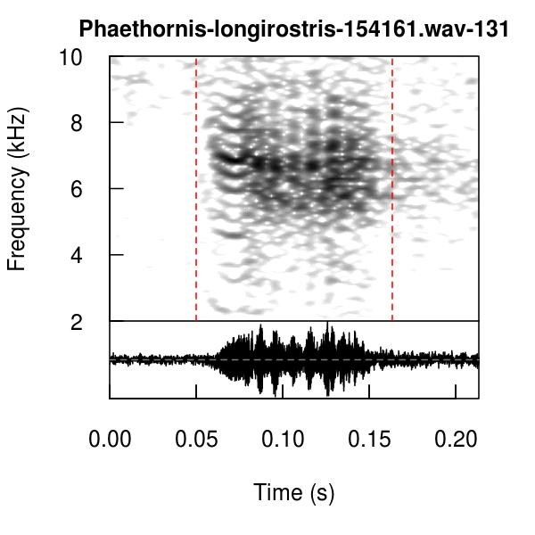
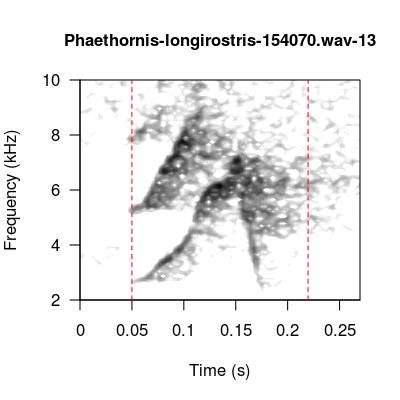
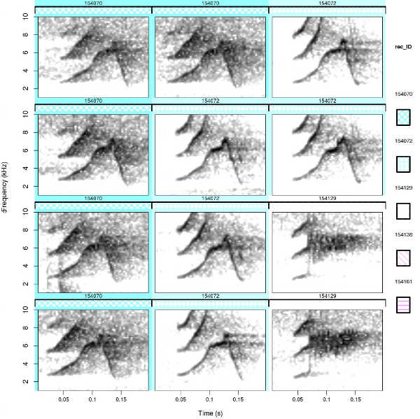
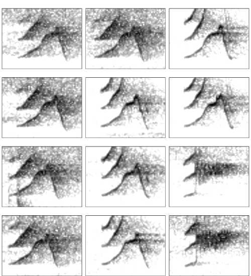

<br>

<center></center>

<center> <h1><b>Visual inspection and classification of signals</h1></b> </center>
<center> <i><font size="4">Marcelo Araya-Salas and Grace Smith Vidaurre</font></i> </center>
<center> `r Sys.Date()` </center>
<br>

The [`warbleR`](https://cran.r-project.org/package=warbleR) workflow continues with visualization of selection signals for quality control filtering and classification. For more details about function arguments, input or output, please read the documentation for the function in question (e.g. `?lspec`). `warbleR` is available on both [`CRAN`](https://cran.r-project.org/package=warbleR) and [`GitHub`](https://github.com/maRce10/warbleR). The GitHub repository will always contain the latest functions and updates. We also published an article on `warbleR` documenting the package workflow <a href='#References'><sup>[1]</sup></a>.

Please note that most tools in `warbleR` use functions from the [`seewave`](https://cran.r-project.org/package=seewave), [`monitoR`](https://cran.r-project.org/package=monitoR), [`tuneR`](https://cran.r-project.org/package=tuneR) and [`dtw`](https://cran.r-project.org/package=dtw]) packages internally. `warbleR` has been designed to make the analyses more accessible to average R-users. However, acoustic analysis with `warbleR` would not be possible without the tools provided by these additional packages. These packages should be given credit when using `warbleR` by including the appropriate citations in publications (e.g. `citation("seewave")`).

Nearly all `warbleR` functions contain options for parallel processing, which can greatly speed up analyses. See <a href='#References'><sup>[1]</sup></a> for more details about parallel processing performance. Use parallel processing with caution, particularly if you use a Windows operating system. `warbleR` dependencies for parallel processing have not yet been optimized for Windows.

This vignette can be run without an advanced understanding of R, as long as you know how to run code in your R console. However, knowing more about basic R coding would be very helpful to modify the code for your research questions.

In the previous vignette we downloaded and filtered recordings from the open-access `xeno-canto` database, and discussed methods of automated and manual signal selection, as well as options to use _warbleR_ with other bioacoustics software. Make sure to set your working directory prior to running this vignette, especially if RStudio has been closed since running the last vignette. 

```{r, eval=FALSE}

library(warbleR)

# set your working directory appropriately
# setwd("/path/to/working directory")

# run this if you have restarted RStudio between vignettes without saving your workspace
# assumes that you are in your /home/username directory
setwd(file.path(getwd(),"warbleR_example"))

# Check your location
getwd()

```

<br>

```{r, eval=TRUE, echo=FALSE, message=FALSE}

# this sets my working directory if necessary
# knitted output will be saved to a temp dir instead of warbleR local repo
# setwd(tempdir())

library(warbleR)
library(knitr)

```

## **Quality control filtering of selections**

## Short spectrograms of selections

`specreator` generates spectrograms of individual selected signals. These image files are a great way to filter out selections that were poorly made or represent signals that are not relevant to your analysis. This filtering step is particularly important after running `autodetec`, or if signals were manually selected by various users.


```{r, eval=FALSE}

Phae.hisnr <- read.csv("Phae_hisnr.csv", header = TRUE)

specreator(Phae.hisnr, wl = 300, flim = c(2, 10), it = "jpeg", res = 150, osci = TRUE, ovlp = 90)

```

Inspect spectrograms and throw away image files that are poor quality to prepare for later steps. Make sure you are working in a directory that only has image files associated with this vignette. Delete the image files corresponding to recording _154138_ selection _39_ and _154161_ selection _145_, as the start coordinates for these selections are not accurate.

## Use `filtersels` to remove selections with missing image files

```{r, eval=FALSE}

# remove selections after deleting corresponding image files
Phae.hisnr2 <- filtersels(Phae.hisnr, it = "jpeg", incl.wav = TRUE)
nrow(Phae.hisnr2) # 23 selections left

```

After removing the poorest quality selections or signals, there are some other quality control steps that may be helpful.

<br>

## Check that selections can be read, and if not, fix sound files

Can selections be read by downstream functions? The function `checksels` also yields a data frame with columns for duration, minimum samples, sampling rate, channels and bits. 
```{r, eval=FALSE}

# if selections can be read, "OK" will be printed to check.res column
checksels(Phae.hisnr2, check.header = FALSE)

```

If selections cannot be read, it is possible the sound files are corrupt. If so, use the `fixwavs` function to repair _wav_ files. 

## Cut selections into individual sound files 

Hearing is as important as seeing for acoustic analysis, and the function `cut_sels` can be very useful for aural comparison of selected signals. Selected signals can be played as individual sounds rather than having to open up entire sound files. As a word of caution, generating cuts of sound files will also propagate any naming errors present in the original files. In general, it is usually better to avoid creating many cuts, but if you must do so, just proceed carefully. 

`cut_sels` can also be used to your advantage if your original recordings are long (over 10-15 minutes). Some _warbleR_ functions, in particular `manualoc` will run slowly with long recordings, so input of shorter duration is desirable. You can make selections of shorter pieces of long original recordings, either in _Raven_ or _Syrinx_, and use `cut_sels` to generate shorter segments for smoother signal detection in `warbleR`.
```{r, eval=FALSE}

cut_sels(Phae.hisnr2, labels = c("sound.files", "selec"))

```


```{r, eval=FALSE, echo+FALSE}

# bug in the above cut_sels code

# Error in apply(X[, sapply(X, is.factor)], 2, as.character) : 
#   dim(X) must have a positive length
```

## Tailor selections that were not well-selected 

Sometimes the start and end times of selected signals need fine-tuned adjustments. This is particularly true when signals are found within bouts of closely delivered sounds that may be hard to pull apart, such as duets, or if multiple researchers use different rules-of-thumb to select signals. `seltailor` provides an interactive interface similar to `manualoc` for tailoring the temporal coordinates of selections.

If you check out the image files generated by running `specreator` above, you'll see that some of the selections made during the automatic detection process with `autodetec` do not have accurate start and/or end coordinates. 

For instance:

The start of this signal is not well selected.
<center> </center>
<br> 

The end of this signal is not well selected.
<center> </center>
<br>

The temporal coordinates for the tailored signals will be saved in a _ .csv_ file called `seltailor_output.csv` that can be read back into `R` to continue downstream analyses. 

```{r, eval=FALSE}

seltailor(Phae.hisnr2, wl = 300, flim = c(2,10), wn = "hanning", mar = 0.1,
 osci = TRUE, title = c("sound.files", "selec"))

Phae.hisnrt <- read.csv("seltailor_output.csv", header = TRUE)
str(Phae.hisnrt)

```

```{r, eval=FALSE, echo=FALSE}

# bug in above seltailor code
# two warnings per signal (2 freqs)
# In is.na(X$high.freq[j]) :
#   is.na() applied to non-(list or vector) of type 'NULL'


```

```{r, eval=TRUE, echo=FALSE}

Phae.hisnrt <- read.csv("seltailor_output.csv", header = TRUE)
str(Phae.hisnrt)

```

## **Visual classification of selected signals** 

Visual classification of signals is fundamental to vocal repertoire analysis, and can also be useful for other studies. If your research focuses on assessing variation between individuals or groups, several `warbleR` functions can provide you with important information about how to steer your analysis. If there is obvious variation in vocalization structure across groups (e.g. treatments or geographic regions), you can focus your analysis on visual classification of vocalizations.

### Print long spectrograms with `lspec`

The function `lspec`that we used in the last vignette can also be a tool for visually classifying signals. Long spectrograms can be printed to classify signals by hand, or comments accompanying the selections can be printed over selected signals (for instance, if you used with `manualoc` argument `selcomm` during the selection process). 

Here, we print the start and end of selections with a red dotted line, and the selection number printed over the signal. If a selection data frame contains a comments column, these will be printed with the selection number.
```{r, eval=FALSE}

# highlight selected signals
lspec(Phae.hisnrt, wl = 300, flim = c(2, 10), ovlp = 10, sxrow = 6, rows = 15, it = "jpeg")

# concatenate lspec image files into a single PDF per recording
# lspec images must be jpegs 
lspec2pdf(keep.img = FALSE, overwrite = TRUE)

```

The image file (in the working directory) should look like this:

<center> </center>
<br>

### Highlight spectrogram regions with `color.spectro`

`color.spectro` allows you to highlight selections you've made within a short region of a spectrogram. In the example below we will use `color.spectro` to highlight neighboring songs. This function has a wide variety of uses, and could be especially useful for analysis of duets or coordinated singing bouts. This example is taken directly from the `color.spectro` documentation. If working with your own data frame of selections, make sure to calculate the frequency range for your selections beforehand using the function `frange`, which will come up in the next vignette.

```{r, eval=FALSE}

# we will use Phaethornis songs and selections from the warbleR package
data(list = c("Phae.long1", "selec.table"))
writeWave(Phae.long1, "Phae.long1.wav") #save sound files 

# subset selection table
# already contains the frequency range for these signals
st <- selec.table[selec.table$sound.files == "Phae.long1.wav",]
 
# read wave file as an R object
sgnl <- tuneR::readWave(as.character(st$sound.files[1]))
 
# create color column
st$colors <- c("red2", "blue", "green")
 
# highlight selections
color.spectro(wave = sgnl, wl = 300, ovlp = 90, flim = c(1, 8.6), collevels = seq(-90, 0, 5), 
              dB = "B", X = st, col.clm = "colors", base.col = "skyblue",  t.mar = 0.07, f.mar = 0.1)

```

```{r, eval = FALSE, echo = FALSE}

# was getting bugs using the xeno-canto recordings
# but code sort of works for the following code:
# problem is that code takes a while to run and then shows the whole long spectrogram
# suggestion for color spctro - argument to zoom in on section of x-axis?

X <- Phae.hisnrt[Phae.hisnrt$sound.files == "Phaethornis-longirostris-154072.wav", ]
X$colors <- c("red2", "blue", "green", "yellow", "orange")

X2 <- frange(X)
 View(X2)

color.spectro(wave = readWave("Phaethornis-longirostris-154072.wav"), wl = 300, ovlp = 90, flim = c(1, 8.6), collevels = seq(-90, 0, 5), 
              dB = "B", X = X2, col.clm = "colors", base.col = "skyblue",  t.mar = 0.07, f.mar = 0.1)

```

### Create lexicons with `catalog`

This section on `catalog` is taken directly from [Marcelo Araya-Salas's bioacoustics GitHub blog](https://marce10.github.io/2017/03/17/Creating_song_catalogs.html) with slight modifications. 
When we are interested in geographic variation of acoustic signals, we usually want to compare spectrograms from different individuals and sites. This can be challenging when working with large numbers of signals, individuals and/or sites. `catalog` aims to simplify this task.

This is how it works:

  * `catalog` plots a matrix of spectrograms from signals listed in a selection table
    * similar to the example data frame `selec.table` in `warbleR`, run `data(selec.table)` after loading `warbleR`
  * Graphs are saved as image files in the working directory (or path provided)
  * Several images are generated if the number of signals do not fit in a single file
  * Spectrograms can be labeled or color-tagged to facilitate exploring variation related to the parameter of interest (e.g. site or song type if already classified) 
  * A legend can be added to help match colors with tag levels
    * different color palettes can be used for each tag
  * The duration of the signals can be "fixed" such that all the spectrograms have the same duration 
    * faciltates comparisons 
  * You can control the number of rows and columns as well as the width and height of the output image

Recent updates to `catalog` allow you to group signals into biologically relevant groups by coloring the background of selected spectrograms accordingly. There is also an option to add hatching to tag labels, as well as filling the catalog with spectrograms by rows or columns of the selection table data frame, among other additional arguments. Check out [Marcelo's post on new updates](https://marce10.github.io/2017/07/31/Updates_on_catalog_function.html) to the `catalog` function. 

Note the use of the `move.imgs` function, which can come in handy when creating multiple catalogs to avoid overwriting previous image files, or when working through rounds of other image files. In this case, the first catalog we create has signals labeled, tagged and grouped with respective color and hatching levels. The second catalog we create will not have any grouping of signals whatsoever, and could be used for a test of inter-observer reliability. `move.imgs` helps us move the first catalog into another directory to save it from being overwritten when creating the second catalog.

```{r, eval=FALSE}

# create a column of recording IDs for friendlier catalog labels
rec_ID <- sapply(1:nrow(Phae.hisnrt), function(x){
  strsplit(strsplit(as.character(Phae.hisnrt$sound.files[x]), split = "-")[[1]][[3]], split = ".w")[[1]][1]
})

Phae.hisnrt$rec_ID <- rec_ID
str(Phae.hisnrt)

# set color palette
# alpha controls transparency for softer colors
cmc <- function(n) cm.colors(n, alpha = 0.8)

catalog(X = Phae.hisnrt, flim = c(1, 10), nrow = 4, ncol = 3, height = 10, width = 10, tag.pal = list(cmc), cex = 0.8, same.time.scale = TRUE, mar = 0.01, wl = 300, gr = FALSE, labels = "rec_ID", tags = "rec_ID", hatching = 1, group.tag = "rec_ID", spec.mar = 0.4, lab.mar = 0.8, max.group.cols = 5)

catalog2pdf(keep.img = FALSE, overwrite = TRUE)

# assuming we are working from the warbleR_example directory
# the ~/ format does not apply to Windows
# make sure you have already moved or deleted all other pdf files
move.imgs(from = ".", it = "pdf", create.folder = TRUE, folder.name = "Catalog_image_files")

```

```{r, eval = FALSE, echo = FALSE}

# suggestion for move.imgs
# add argument for regex so as not to delete/move all image files of a given type
# and be able to move just "Cat*.pdf"...etc
```

<center> </center>
<br>

```{r, eval=FALSE}
# now create a catalog without labels, tags, groups or axes
Phae.hisnrt$no_label <- ""

catalog(X = Phae.hisnrt, flim = c(1, 10), nrow = 4, ncol = 3, height = 10, width = 10, cex = 0.8, same.time.scale = TRUE, mar = 0.01, wl = 300, spec.mar = 0.4, rm.axes = TRUE, labels = "no_label")

catalog2pdf(keep.img = FALSE, overwrite = TRUE)

```

<center> </center>
<br>

###**Next vignette: Acoustic (dis)similarity and coordinated singing**

Here we have finished the second phase of the `warbleR` workflow, which includes many options for quality control filtering or visualization that can be used to your advantage during acoustic analysis. After running the code in this second vignette, you should now have an idea of how to:

  * use spectrograms for quality control filtering
  * check selections for _wav_ file compatibility
  * create _wav_ files of selections
  * tailor temporal coordinates of selections
  * use different methods for visual classification of signals, including:
    * long spectrograms
    * highlighted regions within spectrograms
    * catalogues or lexicons of individual signals

The next vignette will cover the third phase of the _warbleR_ workflow, which includes methods to perform acoustic mesaurements as a batch process, an example of how to use these measurements for an analysis of geographic variation, and coordinated singing analysis.

<br>

<font size="5"><a name="References">References</a></font> 

1. Araya-Salas, M. and G. Smith-Vidaurre. 2016. warbleR: an R package to streamline analysis of animal
acoustic signals. _Methods in Ecology and Evolution_. doi: 10.1111/2041-210X.12624

<br>


