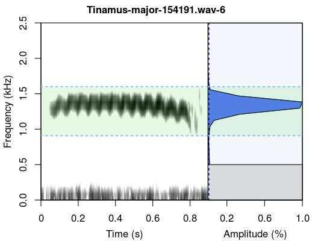
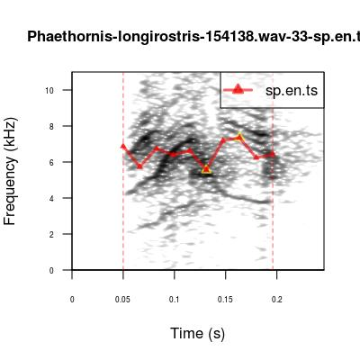
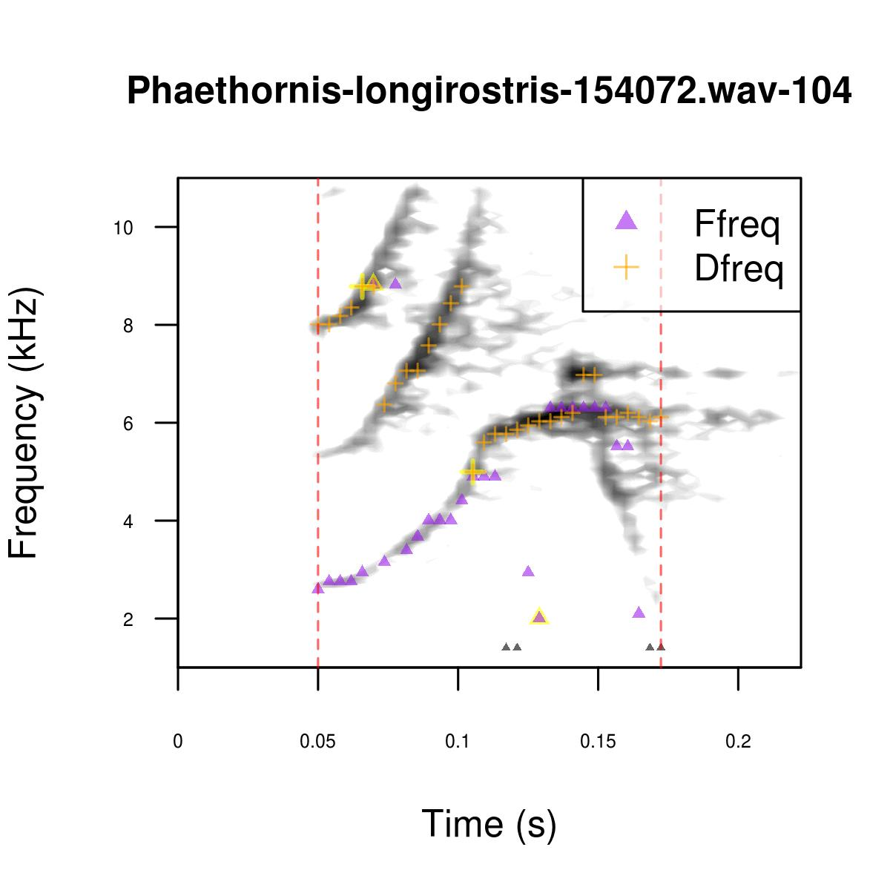
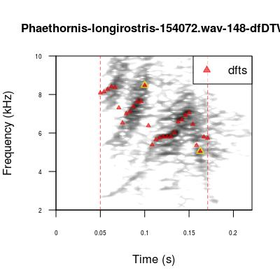
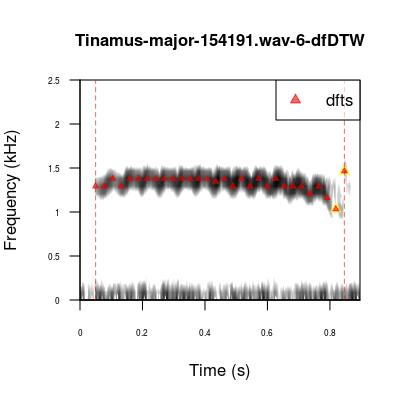
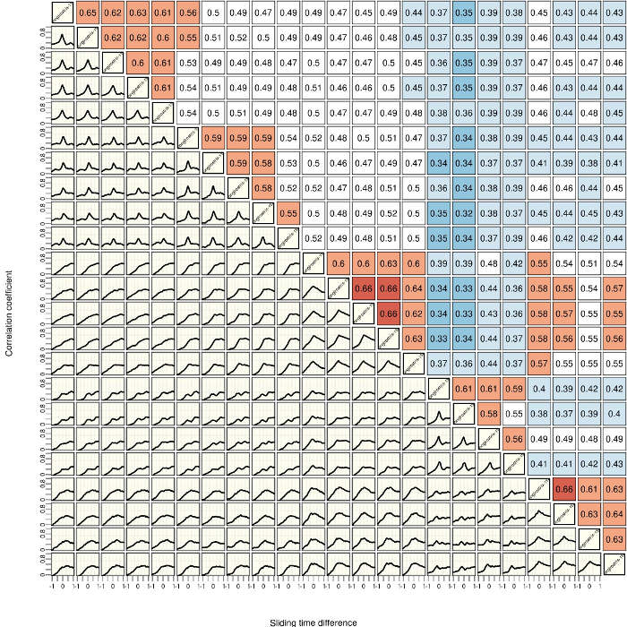

<br>

<center></center>

<center> <h1><b>Acoustic (dis)similarity and coordinated singing</h1></b> </center>
<center> <i><font size="4">Marcelo Araya-Salas and Grace Smith Vidaurre</font></i> </center>
<center> `r Sys.Date()` </center>
<br>

The [warbleR](https://cran.r-project.org/package=warbleR) workflow ends with performing automated measurements of meters, analyzing acoustic (dis)similarity of selected signals, and analysis of coordinated singing bouts. For more details about function arguments, input or output, please read the documentation for the function in question (e.g. `?xcorr`). `warbleR` is available on both [CRAN](https://cran.r-project.org/package=warbleR) and [GitHub](https://github.com/maRce10/warbleR). The GitHub repository will always contain the latest functions and updates. We also published an article on `warbleR` documenting the package workflow <a href='#References'><sup>[1]</sup></a>.

Please note that most tools in `warbleR` use functions from the [seewave](https://cran.r-project.org/package=seewave), [monitoR](https://cran.r-project.org/package=monitoR), [tuneR](https://cran.r-project.org/package=tuneR) and [dtw](https://cran.r-project.org/package=dtw) packages internally. `warbleR` has been designed to make the analyses more accessible to average R-users. However, acoustic analysis with `warbleR` would not be possible without the tools provided by these additional packages. These packages should be given credit when using `warbleR` by including the appropriate citations in publications (e.g. `citation("seewave")`).

Nearly all `warbleR` functions contain options for parallel processing, which can greatly speed up analyses. See <a href='#References'><sup>[1]</sup></a> for more details about parallel processing performance. Use parallel processing with caution, particularly if you use a Windows operating system. `warbleR` dependencies for parallel processing have not yet been optimized for Windows.

This vignette can be run without an advanced understanding of R, as long as you know how to run code in your R console. However, knowing more about basic R coding would be very helpful to modify the code for your research questions.

```{r, eval=FALSE}

library(warbleR)

# set your working directory appropriately
# setwd("/path/to/working directory")

# run this if you have restarted RStudio between vignettes without saving your workspace
# assumes that you are in your /home/username directory
setwd(file.path(getwd(),"warbleR_example"))

# Check your location
getwd()

```

```{r, eval=TRUE, echo=FALSE, message=FALSE}

# this sets my working directory if necessary
# knitted output will be saved to a temp dir instead of warbleR local repo
# setwd(tempdir())

library(warbleR)
library(knitr)

```

## **Quantitative acoustic measurements and (dis)similarity methods**

### Frequency domain measurements

The function `frange.detec` can also help you figure out the frequency range in your signals. Note that if used for a whole recording, `frange.detec` will pick up _all_ sounds in the recording. 

Although we have been using _Phaethornis longirostris_ vocalizations throughout these vignettes, these signals are harmonically structured. The functions for detecting frequency ranges, `frange` and `frange.detec` work best on tonal signals, so for this example we will use Great Tinamou ( _Tinamus major_) songs. We will download a tinamou recording from _xeno-canto_, make selections and visualize/detect frequency ranges.


```{r, eval=FALSE}

tin <- querxc(qword = 'Tinamus', download = FALSE)

# select a single recording
tin <- tin[tin$Recordist == "Marcelo Araya-Salas", ]

# download this recording
querxc(X = tin, download = TRUE)
mp32wav()

```

Now use _Raven_ to make selections. Make sure to include arguments from imp.raven to ensure selection table is imported with the correct columns for downstream functions

```{r, eval=FALSE}

Tin.sels <- run_raven(raven.path = "/home/gsvidaurre/opt/Raven-1.5.0.0035/", sound.files = "Tinamus-major-154191.wav", import = TRUE, all.data = FALSE, name.from.file = TRUE, ext.case = "lower", freq.cols = FALSE)
str(Tin.sels)

# write selections as a physical file you you can read them back in at any time
# good way to save all your work
write.csv(Tin.sels, "Tinamus-major-154191_sels.csv", row.names = FALSE)

# generate individual cuts for freqeuency range measurements below
cut_sels(Tin.sels, mar = 0.05, labels = c("sound.files", "selec"))

```

```{r, eval=TRUE, echo=FALSE}

# Tin.sels <- read.csv("Tinamus-major-154191_sels.csv", header = TRUE)

```

_Raven_ selection tables can return low and high frequencies in your selections (e.g. if `all.data` or `freq.cols` in `run_raven` or `imp.raven` is TRUE), but the accuracy of these frequency selections depends on how the signals themselves were selected. Below we demonstrate how to visualize and detect the frequency range in your selected signals using the new functions `frange.detec` and `frange`, which have options for setting bandpass filters to exclude background noise or other non-target acoustic signals. 

`frange.detec` creates a plot that will print to your graphics device, and also outputs a data frame per recording with the frequency range. This data frame can be used in subsequent analyses if saved as an object. `frange.detect` works best with single signals.

```{r, eval=FALSE}

# note that changing the threshold argument in combination with the bandpass argument can improve the detection
frange.detec(readWave("Tinamus-major-154191-6.wav"), flim = c(0, 2.5), bp = c(0, 3), threshold = 15)

```

```{r, eval=FALSE}

# here, giving a strict bandpass with very low threshold improves frange detection
# since the curving end of the tinamou signal is lower amplitude than the rest of the signal
frange.detec(readWave("Tinamus-major-154191-6.wav"), flim = c(0, 2.5), bp = c(0, 3), threshold = 1)

```

<center> </center>
<br>


The function `frange` allows you to simultaneously return the frequency ranges for all signals in a selection table, including the graphical output as `frange.detec`. In addition to image files, this function returns the original selection table, as a data frame with the newly calculated low and high frequency measurements. 

```{r, eval=FALSE}

# use arguments from frange.detec above
fr <- frange(Tin.sels, threshold = 1, res = 100, flim = c(0, 2.5), bp = c(0.5, 2.5))
str(fr)

```

## Extract spectral entropy as a time series 

Spectral entropy can be calculated as time series in selected signals and plotted onto image files. Previously, spectral entropy was only available as a sole measurement across a selection, as an meter measured by `specan`.

```{r, eval=FALSE}

se <- sp.en.ts(Phae.hisnrt, wl = 300, length.out = 10, threshold = 10, img = TRUE, img.suffix = "sp.en.ts", type = "b", ovlp = 90, sp.en.range = c(-25, 10))

```

<center> </center>
<br>


```{r, eval=FALSE, echo=FALSE}

# 03 Aug 17 GSV sp.en.ts sometimes yields null entropy and symbols w/o lines for both Phae.hisnrt and Tin.sels, 
# but works for selec.table
# disappeared for Tin.sels when I removed the bp argument, still getting one warning for Phae.hisnrt

# sp.en.ts bug? stretching the range to negative yields drastic differences using the code above
# e.g. when sp.en.range default the time series is high above the signal


se <- sp.en.ts(Phae.hisnrt, wl = 300, length.out = 10, threshold = 10, img = TRUE, img.suffix = "sp.en.ts", type = "b")

se <- sp.en.ts(Tin.sels, length.out = 10, threshold = 10, img = TRUE, img.suffix = "sp.en.ts", type = "b", sp.en.range = c(-25, 10))

# without clip edges
names(selec.table)
sp.en.ts(X = selec.table, threshold = 10, bp = NULL, clip.edges = F, length.out = 10,
 type = "b", sp.en.range = c(-25, 10))


```

### Compare methods for quantitative analysis across time and frequency domain measurements

This section on `compare.methods` is taken directly from [Marcelo Araya-Salas's bioacoustics GitHub blog](https://marce10.github.io/2017/02/17/Choosing_the_right_method_for_measuring_acoustic_signal_structure.html) with slight modifications. 

Bioacoustic research relies on quantifying the structure of acoustic signals and comparing that structure across behavioral/ecological contexts, groups or species. However, measuring signal structure in a way that fully accounts for the variation in the signals could be a tricky task. Some of the differences that are apparent by visual inspection of spectrograms might not be picked up by some analyses. Hence, choosing the most appropriate analytical approach is a critical step.

The `warbleR` function `compare.methods` attempts to facilitate method selection. This function produces graphs (as image files in the working directory) with spectrograms from 4 signals that allow visual inspection of the performance of acoustic analysis methods at comparing those signals. The signals are randomly picked up from the provided data frame (`X` argument), and the function compares 2 `warbleR`methods at a time. The methods available are: 
  * cross-correlation by warbleR function `xcorr`
  * dynamic time warping on dominant frequency time series with `dfDTW`
  * dynamic time warping on fundamental frequency time series with `ffDTW`
  * spectral parameters with `specan`
  
In the last vignette, we tailored selections of _Phaethornis longirostris_ songs that were originally downloaded from _xeno-canto_, detected by `autodetec`and filtered by signal-to-noise ratio (SNR). Here we will pick up the workflow with these filtered and tailored selections, using the data frame `Phae.hisnrt`.
```{r, eval=FALSE}

Phae.hisnrt <- read.csv("seltailor_output.csv", header = TRUE)

compare.methods(X = Phae.hisnrt, flim = c(0, 10), bp = c(0, 10), 
                wl = 300, n = 10, methods = c("XCORR", "dfDTW"))

```


`compare.methods` will produce 10 image files in the working directory (since we specified `n = 10`) that look like this:

<center> </center>
<br>

In this graphic, the acoustic pairwise distance between signals is shown next to the arrows linking them. The font color of a distance value corresponds to the font color of the method that generated it, as shown in the scatterplots (in this case black font represents XCORR distances). Distances are standardized, with 0 being the distance of a signal to itself and 1 the farthest pairwise distance in the pool of signals. Principal Component Analysis (`princomp` function) is applied to calculate distances when using spectral parameters (SP). In this case, the first 2 PC’s are used. Classical Multidimensional Scaling (also known as Principal Coordinates Analysis, `cmdscale` function) is used for all other methods. The image file name contains the methods being compared and the row number of the selections. This function internally uses a modified version of the `spectro` function from the `seewave` package to create spectrograms. Note that the spectrograms are all plotted with the same frequency and time scales.

Also note that the graphs contain 2 scatterplots (1 per method) of the acoustic space of all signals in the input data frame `X`. The position of the 4 signals in the spectrograms is highlighted in the acoustic space scatterplot. These graphics allow you to directly assess if the distances between signals in the acoustic space accurately represent the spectrographic similarity (e.g. how similar their acoustic structure looks in the spectrograms).

You can run `compare.methods` for any combination of the quantative methods for assessing acoustic (dis)similarity mentioned above. Importantly, to include the SP method (spectral parameters measured by the function `specan`), you need a large enough dataset, as the PCA that summarizes the spectral parameters needs more units (rows) that variables (columns).

We will move on to explaining each of the acoustic (dis)similarity methods in turn.

<br>

### Visualizing frequency parameters with`trackfreqs`

Prior to measuring meters, it's good practice to visualize the accuracy of some important parameters. The function `trackfreqs` allows you to create spectrograms with dominant frequency and fundamental frequency measurements plotted on top of each selected signal. 

Use `trackfreqs` on all the recordings for which you want to measure meters. Scroll through all the spectrograms to get a feeling for how well the frequency measurements will be performed across your recordings.

Running `trackfreqs` can allow you to decide which frequency parameters to use in subsequent analyses, namely `specan` and dynamic time warping methods. Also, ff the frequency measurements look acceptable with the bandpass setting used in `trackfreqs`, use that same bandpass while running `specan`.

```{r, eval=FALSE}

# Note that the dominant frequency measurements are almost always more accurate
trackfreqs(Phae.hisnrt, wl = 300, flim = c(2, 10), bp = c(1, 12), it = "jpeg")

# We can change the lower end of bandpass to make the frequency measurements more precise
trackfreqs(Phae.hisnrt, wl = 300, flim = c(1, 10), bp = c(2, 12), col = c("purple", "orange"),
           pch = c(17, 3), res = 300, it = "jpeg")

```

<center> </center>
<br>

Note that the fundamental frequency measurements are not always very accurate. We will remove fundamental frequency measurements from subsequent analyses.

### Measuring meters with `specan`

We can now perform acoustic measurements with the function `specan`. This function relies on the temporal coordinates in selection tables to measure 29 meters meters across selections. `specan` is a batch process that is faster than calculating measurements manually, e.g. one selection and recording at a time. `specan` uses and customizes several functions available in the [`seewave package`](https://cran.r-project.org/package=seewave). 

Use the bandpass filter to your advantage here, to filter out low or high background noise before performing measurements. Also note that changing the amplitude threshold will change the amplitude at which noises (including non-target signals) are detected for measurements.

```{r, eval=TRUE, echo=FALSE}

Phae.hisnrt <- read.csv("seltailor_output.csv")
params <- read.csv("acoustic_parameters.csv")

```

```{r, eval=FALSE}

params <- specan(Phae.hisnrt, bp = c(2, 10), threshold = 15)

```

```{r, eval=FALSE}

# As always, it's a good idea to write .csv files to your working directory
write.csv(params, "acoustic_parameters.csv", row.names = FALSE)

```

Make sure to remove parameters derived from fundamental frequency (based on `trackfreqs` results).
```{r, eval=FALSE}

params <- params[, grep("fun|peakf", colnames(params), invert = TRUE)]

```

<br>

## Dynamic time warping methods calculate acoustic dissimilarity of frequency contours

This section on dynamic time warping methods is taken directly from [Marcelo Araya-Salas's bioacoustics GitHub blog](https://marce10.github.io/2016/09/12/Similarity_of_acoustic_signals_with_dynamic_time_warping_(DTW).html) with slight modifications. 

The dynamic time warping methods in `warbleR` all rely on functions from the `dtw` package, and are available for both dominant and fundamental frequencies. `dfDTW` and `ffDTW` calculate the dominant and fundamental frequency contours, respectively, of each signal and compares using dynamic time warping. You can interpolate measurements across the frequency time series using the `length.out` argument. 

These functions return a matrix of pairwise acoustic dissimilarity (e.g. acoustic "distance") measurements that can be used in analyses of acoustic similarity, as well as image files with the frequency contours plotted over the spectrograms. If you require only the time series without the dynamic time warping analysis for either the dominant or fundamental frequency, check out the functions `dfts`and `ffts`.

Note that as the `frange` and `frange.detec` functions, the dynamic time warping functions tend to work best on more tonal signals.
```{r, eval=FALSE}

# Harmonic Phaethornis signals 
dm <- dfDTW(Phae.hisnrt, length.out = 30, flim = c(2, 10), bp = c(2, 9), wl = 300, img = TRUE)

```

<center> </center>
<br>

```{r, eval=FALSE}
# Tonal Tinamou signals
Tin.sels <- read.csv("Tinamus-major-154191_sels.csv", header = TRUE)
dm <- dfDTW(Tin.sels, length.out = 30, flim = c(0, 2.5), bp = c(0.5, 2.5), wl = 512, img = TRUE)

```

<center> </center>
<br>


Check out [Marcelo's blog](https://marce10.github.io/2016/09/12/Similarity_of_acoustic_signals_with_dynamic_time_warping_(DTW).html) for a great example of how to evaluate whether or not the dynamic time warping (dis)similiarty measurements accurately represents acoustic differences. 

## Cross-correlation compares spectrograms over sliding steps

Cross-correlation calculates the pairwise similarity of multiple signals by spectrogram cross-correlation. `xcorr` calculates a correlation of the amplitude values at each step by sliding one spectrogram over the other. This function is a modified version of the `corMatch` and `makeTemplate` functions from the package `monitoR`. `xcorr` runs over multiple signals and returns a list of output, including:

  * a correlation statistic for each "sliding" step
  * the maximum (peak) correlation for each pairwise comparison 

`xcorr` requires margins half the duration of the signal on either side of the signal (e.g. before and after the start and end coordinates). Signals that are very close to either the start or end of a recording may throw errors. Additionally, when sound files have been modified by bandpass filters, some pairwise cross-correlations may not work and the correlation matrix may contain `NA` values. `xcorr` now contains an argument to remove columns of the matrix that contain `NA` values, which will reduce the data in the matrix but also allow the matrix to be used in subsequent analyses.

Here our output is a matrix of peak correlation per pairwise comparison, with the recording-selection names as the matrix dimension names.

```{r, eval=FALSE}

xc <- xcorr(Phae.hisnrt, wl = 300, na.rm = FALSE, frange = c(2,10))
str(xc)

```

To visualize the cross-correlation across all pairwise comparisons, we need to feed the function `xcorr.graph` a list of `xcorr` output (`xcorr`must be run with `cor.mat = FALSE`). Here we save the graphical output of `xcorr.graph` for better ease of visualization. 

```{r, eval=FALSE} 

xc <- xcorr(Phae.hisnrt, wl = 300, na.rm = FALSE, frange = c(2,10), cor.mat = FALSE)

jpeg("xcorr_graph.jpeg", width = 30, height = 30, units = "cm", res = 200)
xcorr.graph(xc, cex.cor = 1, cex.lab = 1, cex.axis.lab = 1)
dev.off()

```

<center> </center>
<br>

In this image, red values in the upper triangle indicate high peak correlations and therefore greater similiarty between signals. The faceted line plots in the lower triangle are another way of visualizing similarity between signals. The x-axis is the time difference between signals at each sliding step of the cross-correlation, with 0 representing perfectly centered signals. Plots with peaks at 0 represent signals that are more similar. 


## Analysis of geographic variation using `specan` measurements

-----

We can evaluate whether or not the observed variation in song structure is reflected by the meters we just measured. For this we will conduct a Principal Component Analysis on scaled (z-transformed) meters and look at the grouping of songs (data points) in the scatter plot.

```{r, eval=TRUE, dpi=220}

# Run the PCA with only numeric variables of params
pca <- prcomp(x = params[, sapply(params, is.numeric)], scale. = TRUE)

# Check loadings
summary(pca)

# Extract PCA scores
pcascor <- as.data.frame(pca[[5]])

# Plot the 2 first PCs
plot(pcascor[, 1], pcascor[, 2], col = as.numeric(params$sound.files), pch = 20, 
     cex = 1, xlab = "PC1", ylab = "PC2")

# Add recordings/individuals labels 
x <- tapply(pcascor[, 1], params$sound.files, mean)
y <- tapply(pcascor[, 2], params$sound.files, mean)

labs <- gsub(".wav", "", unique(sapply(as.character(params$sound.files), function(x){
  strsplit(x, split = "-", fixed = TRUE)[[1]][3]
  }, USE.NAMES = FALSE)))

text(x, y, labs, cex = 0.75)

```

Songs are grouped by sound file. As each sound file represents a single individual, this suggests that songs have individual signatures. Let's look at the song type level. First, we need to classify the songs by song type. We can check the spectrograms we previously created to do this.

<center> </center>
<br>

Songs from sound files 154070 and 154072 seem to belong to the same song type. Sound files 154129 and 154161 represent a different song type. Finally, the songs from each of the other 2 sound files have a unique structure, so each one represents a different song type. We can add this information to the plot by using symbols to represent song types.

```{r, eval=TRUE, dpi=220}

# Create a song type variable

# First, extract recording ID
songtype <- gsub(".wav", "", sapply(as.character(params$sound.files), function(x){
  strsplit(x, split = "-", fixed = TRUE)[[1]][3]
  }, USE.NAMES = FALSE))

# Now change IDs for letters representing song types
songtype <- gsub("154070|154072", "A", songtype)
songtype <- gsub("154129|154161", "B", songtype)
songtype <- gsub("154138", "C", songtype)

# Add song type as a variable representing symbol type
plot(pcascor[, 1], pcascor[, 2], col = as.numeric(params$sound.files), 
pch = as.numeric(as.factor(songtype)), 
     cex = 1, xlab = "PC1", ylab = "PC2")

# Add song type labels 
x <- tapply(pcascor[, 1], songtype, mean)
y <- tapply(pcascor[, 2], songtype, mean)

text(x, y, unique(songtype), cex = 1)

```

Songs of the same song type are more similar (they cluster together). This PCA confirms that the visually obvious differences in the song structures are well described by the meters measured in [`warbleR`](https://cran.r-project.org/package=warbleR). Likewise, it also confirms that we can detect biologically relevant differences from sound files that have undergone _mp3_ compression and conversion back to _wav_ format (see also <a href='#References'> <sup>[2]</sup></a>). Importantly, if this analysis were for publication we would have to run other filtering steps on the acoustic parameters generated by `specan`, including removing any collinear variables. 

## Coordinated singing analysis 

`warbleR` contains functions to visualize and test whether or not singing bouts between individuals can be considered coordinated singing. The function `coor.graph` plots signals as polygons to better visualize overlap between these signals.

The function `coor.test` uses a Monte Carlo randomization test to determine whether or not the probability of finding overlapping songs in a singing event is less than or more than what you would expect by chance. `coor.test` can be run simultaneously for many singing events, if all are contained in a single data frame (see `coor.test` documentation for more information).

```{r, eval=TRUE, echo=TRUE}

data(sim.coor.sing)
str(sim.coor.sing)

```

The `sim.coor.sing` dataset contains three types of singing bouts:
```{r, eval=FALSE}

# save plots in a list
g <- coor.graph(sim.coor.sing, it = "jpeg", img = FALSE, res = 300)

# print list of plots to graphics device
g

```

We can test for overlapping or alternating coordinated singing using the `less.than.chance` argument in `coor.test`. Here we will test for alternating coordinated singing, since `less.than.chance` is set to `TRUE`.
```{r, eval=TRUE, echo=TRUE}

cs <- coor.test(sim.coor.sing, iterations = 1000, less.than.chance = TRUE, cutoff = 10)
str(cs)

```

<br>

This concludes the `warbleR` vignette series. After running the code in this third vignette, you should now have an idea of how to:

  * measure frequency range in different signals
  * measure spectral entropy in different signals 
  * compare and choose methods for acoustic (dis)similarity analysis
  * use different methods for acoustic (dis)similarity analysis
    * `specan`- 29 meters 
    * `dfDTW`and `ffDTW` - dynamic time warping
    * `xcorr`- spectrographic cross-corrrelation
  * carry out steps for an analysis of geographic variation in vocalizations
  * use functions for coordinated singing analysis

In these vignettes we have done our best to demonstrate how the `warbleR` functions can be used in a streamlined workflow for flexible and rigorous bioacoustics analysis. The output of `warbleR` functions can be used in other packages for statistical analyses, such as machine learning functions that can be applied to bioacoustics. 

In keeping with the nature of writing code, we have attempted to make our code (in particular the code used between functions) as general as possible. In keeping with the open-source nature of R, we welcome all users to provide feedback, updates to functions, comments about bugs or contribute new functions to [`warbleR's GitHub repository`](https://github.com/maRce10/warbleR).

<font size="5"><a name="References">References</a></font> 

1. Araya-Salas, M. and G. Smith-Vidaurre. 2016. warbleR: an R package to streamline analysis of animal
acoustic signals. _Methods in Ecology and Evolution_. doi: 10.1111/2041-210X.12624

<br>
