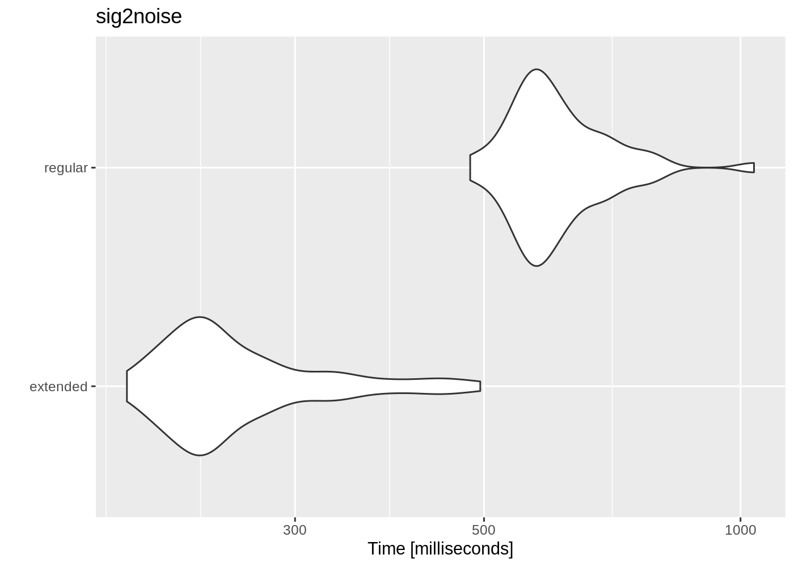

<!-- <script> -->
<!--    $(document).ready(function() { -->
<!--      $head = $('#header'); -->
<!--      $head.prepend('') -->
<!--    }); -->
<!-- </script> -->

<!-- &nbsp;  -->
```{css, echo = FALSE}

div#header h1.title, div#header h3.subtitle, div#header h4.author, div#header h4.date {
  text-align: center
}

```


The [warbleR](https://cran.r-project.org/package=warbleR) package is intended to facilitate the analysis of the structure of the animal acoustic signals in R. Users can enter their own data into a workflow that facilitates spectrographic visualization and measurement of acoustic parameters **warbleR** makes use of the fundamental sound analysis tools of the **seewave** package, and offers new tools for acoustic structure analysis. These tools are available for batch analysis of acoustic signals.

&nbsp;

<font size = "3">The main features of the package are:

 - The use of loops to apply tasks through acoustic signals referenced in a selection table
 - The production of image files with spectrograms that let users organize data and verify acoustic analyzes </font>

&nbsp;

<center></center>

&nbsp;


The package offers functions for:

- Browse and download recordings of [Xeno-Canto](https://www.xeno-canto.org/)
- Explore, organize and manipulate multiple sound files
- Detect signals automatically (in frequency and time)
- Create spectrograms of complete recordings or individual signals
- Run different measures of acoustic signal structure
- Evaluate the performance of measurement methods
- Catalog signals
- Characterize different structural levels in acoustic signals
- Statistical analysis of duet coordination
- Consolidate databases and annotation tables


Most of the functions allow the parallelization of tasks, which distributes the tasks among several cores to improve computational efficiency. Tools to evaluate the performance of the analysis at each step are also available. All these tools are provided in a standardized workflow for the analysis of the signal structure, making them accessible to a wide range of users, including those without much knowledge of R. **warbleR** is a young package (officially published in 2017) currently in a maturation stage.

&nbsp;

## Selection tables

These objects are created with the `selection_table()` function. The function takes data frames containing selection data (name of the sound file, selection, start, end ...), verifies if the information is consistent (see the function `checksels()` for details) and saves the 'diagnostic' metadata as an attribute. The selection tables are basically data frames in which the information contained has been corroborated so it can be read by other **warbleR** functions. The selection tables must contain (at least) the following columns:

1. sound files (sound.files)
1. selection (select)
1. start
1. end

The sample data "lbh_selec_table" contains these columns:
```{r extn_sel_2, echo = FALSE, message = FALSE}

# load packages
library(warbleR)
library(knitr)

cf <- read.csv("function_descrip_table.csv", stringsAsFactors = FALSE)


data(list = c("Phae.long1", "Phae.long2", "Phae.long3", "Phae.long4"))
writeWave(Phae.long1, file.path(tempdir(), "Phae.long1.wav"))
writeWave(Phae.long2, file.path(tempdir(), "Phae.long2.wav"))
writeWave(Phae.long3, file.path(tempdir(), "Phae.long3.wav"))
writeWave(Phae.long4, file.path(tempdir(), "Phae.long4.wav"))


warbleR_options(wav.path = tempdir())

options(knitr.table.format = "html")
opts_chunk$set(comment = "")
opts_knit$set(root.dir = tempdir())
options(width = 100, max.print = 100)
```

```{r extn_sel_4.1, eval=FALSE}

data("lbh_selec_table")

lbh_selec_table
```

```{r extn_sel_4.2, echo=FALSE, eval = TRUE}

library(kableExtra)
kbl <- kable(lbh_selec_table, align = "c", row.names = F, format = "html")

kbl <- kable_styling(kbl, bootstrap_options = "striped", font_size = 14)

kbl <- scroll_box(kbl,
  width = "740px",
  box_css = "border: 1px solid #ddd; padding: 1px; ", extra_css = NULL
)

kbl
```


&nbsp;
 
... and can be converted to the *selection_table* format like this (after saving the corresponding sound files):

```{r extn_sel_4.32, eval = FALSE}

data(list = c("Phae.long1", "Phae.long2", "Phae.long3", "Phae.long4"))
writeWave(Phae.long1, file.path(tempdir(), "Phae.long1.wav"))
writeWave(Phae.long2, file.path(tempdir(), "Phae.long2.wav"))
writeWave(Phae.long3, file.path(tempdir(), "Phae.long3.wav"))
writeWave(Phae.long4, file.path(tempdir(), "Phae.long4.wav"))

# parametros globales
warbleR_options(wav.path = tempdir())

st <- selection_table(X = lbh_selec_table, pb = FALSE)

st
```

```{r, eval = TRUE, echo = FALSE}

st <- selection_table(X = lbh_selec_table, pb = FALSE)
```

```{r, eval = TRUE, echo = FALSE}

st
```


Note that the path to the sound files has been provided. This is necessary in order to verify that the data provided conforms to the characteristics of the audio files.

Selection tables have their own class in R:

```{r}

class(st)
```
&nbsp;


### Extended selection tables

When the `extended = TRUE` argument the function generates an object of the *extended_selection_table* class that also contains a list of 'wave' objects corresponding to each of the selections in the data. Therefore, the function **transforms the selection table into self-contained objects** since the original sound files are no longer needed to perform most of the acoustic analysis in **warbleR**. This can greatly facilitate the storage and exchange of (bio)acoustic data. In addition, it also speeds up analysis, since it is not necessary to read the sound files every time the data is analyzed.

Now, as mentioned earlier, you need the `selection_table()` function to create an extended selection table. You must also set the argument `extended = TRUE` (otherwise, the class would be a selection table). The following code converts the sample data into an extended selection table:

```{r extn_sel_4.3, eval = FALSE}

#  global parameters
warbleR_options(wav.path = tempdir())


ext_st <- selection_table(
  X = lbh_selec_table, pb = FALSE,
  extended = TRUE, confirm.extended = FALSE
)
```

```{r extn_sel_4.33, eval = TRUE, echo = FALSE}

ext_st <- selection_table(
  X = lbh_selec_table, pb = FALSE,
  extended = TRUE, confirm.extended = FALSE
)
```
&nbsp;

And that is. Now the acoustic data and the selection data (as well as the additional metadata) are all together in a single R object.

&nbsp;
 
### Handling extended selection tables

Several functions can be used to deal with objects of this class. You can test if the object belongs to the *extended_selection_table*:

```{r extn_sel_5}

is_extended_selection_table(ext_st)
```
&nbsp;

You can subset the selection in the same way that any other data frame and it will still keep its attributes:

```{r extn_sel_6}

ext_st2 <- ext_st[1:2, ]

is_extended_selection_table(ext_st2)
```

There is also a generic version of `print()` for this class of objects:

```{r extn_sel_7}

## print
print(ext_st)
```

... which is equivalent to:

```{r extn_sel_7.1, eval=FALSE}

ext_st
```

```{r extn_sel_7/2, echo=FALSE}

print(ext_st)
```
&nbsp;

You can also join them in rows. Here the original *extended_selection_table* is divided into 2 and bound again using `rbind()`:

```{r extn_sel_8, eval = FALSE}

ext_st3 <- ext_st[1:5, ]

ext_st4 <- ext_st[6:11, ]

ext_st5 <- rbind(ext_st3, ext_st4)

# print
ext_st5
```

```{r extn_sel_8.1, echo=FALSE}

ext_st3 <- ext_st[1:5, ]

ext_st4 <- ext_st[6:11, ]

ext_st5 <- rbind(ext_st3, ext_st4)

# print
print(ext_st5)
```

```{r extn_sel_8.2}

# igual q el original
all.equal(ext_st, ext_st5)
```
&nbsp;

The 'wave' objects can be read individually using `read_wave()`, a wrapper for the `readWave()` function of **tuneR**, which can handle extended selection tables:

```{r extn_sel_8.21}

wv1 <- read_wave(X = ext_st, index = 3, from = 0, to = 0.37)
```
&nbsp;

These are regular 'wave' objects:

```{r extn_sel_8.22, out.width= 750}

class(wv1)

wv1

spectro(wv1, wl = 150, grid = FALSE, scale = FALSE, ovlp = 90)
```

&nbsp; 

```{r extn_sel_8.23, out.width= 750}
par(mfrow = c(3, 2), mar = rep(0, 4))

for (i in 1:6) {
  wv <- read_wave(X = ext_st, index = i, from = 0.05, to = 0.32)

  spectro(wv,
    wl = 150, grid = FALSE, scale = FALSE, axisX = FALSE,
    axisY = FALSE, ovlp = 90
  )
}
```
&nbsp;

The `read_wave()` function requires the selection table, as well as the row index (i.e. the row number) to be able to read the 'wave' objects. It can also read a regular 'wave' file if the path is provided.

Note that other functions that modify data frames are likely to delete the attributes in which the 'wave' objects and metadata are stored. For example, the merge and the extended selection box will remove its attributes:

```{r extn_sel_8.24}

# create new data frame
Y <- data.frame(sound.files = ext_st$sound.files, site = "La Selva", lek = c(rep("SUR", 5), rep("CCL", 6)))

# combine
mrg_ext_st <- merge(ext_st, Y, by = "sound.files")

# check class
is_extended_selection_table(mrg_ext_st)
```
&nbsp;

In this case, we can use the `fix_extended_selection_table()` function to transfer the attributes of the original extended selection table:

```{r extn_sel_8.25}

# fix est
mrg_ext_st <- fix_extended_selection_table(X = mrg_ext_st, Y = ext_st)

# check class
is_extended_selection_table(mrg_ext_st)
```
&nbsp;

This works as long as some of the original sound files are retained and no other selections are added.

&nbsp;
 
### Analysis using extended selection tables

These objects can be used as input for most **warbleR** functions. Here are some examples of **warbleR** functions using *extended_selection_table*:

#### Spectral parameters

```{r extn_sel_12.1, eval=FALSE}

#  parametros espectrales
sp <- spectro_analysis(ext_st)

sp
```


```{r, extn_sel_12.2, echo= FALSE, eval = FALSE}

sp <- spectro_analysis(ext_st)

kbl <- kable(sp, align = "c", row.names = F, format = "html")

kbl <- kable_styling(kbl, bootstrap_options = "striped", font_size = 14)

kbl <- scroll_box(kbl,
  width = "740px",
  box_css = "border: 1px solid #ddd; padding: 1px; ", extra_css = NULL
)

kbl
```

&nbsp; 


#### Signal-to-noise ratio

```{r extn_sel_12.5, eval=FALSE}

snr <- sig2noise(ext_st, mar = 0.05)

snr
```


```{r, extn_sel_12.6, echo= FALSE, eval = FALSE}

snr <- sig2noise(ext_st, mar = 0.05)

kbl <- kable(snr, align = "c", row.names = F, format = "html")

kbl <- kable_styling(kbl, bootstrap_options = "striped", font_size = 14)

kbl <- scroll_box(kbl,
  width = "740px",
  box_css = "border: 1px solid #ddd; padding: 1px; ", extra_css = NULL
)

kbl
```

&nbsp; 

#### Dynamic time warping (DTW)

```{r extn_sel_12.7, eval=FALSE}

dtw.dist <- freq_DTW(ext_st, img = FALSE)

dtw.dist
```


```{r, extn_sel_12.8, echo= FALSE, eval = FALSE}

dtw.dist <- freq_DTW(ext_st, img = FALSE)

kbl <- kable(dtw.dist, align = "c", row.names = T, format = "html")

kbl <- kable_styling(kbl, bootstrap_options = "striped", font_size = 14)

kbl <- scroll_box(kbl,
  width = "740px",
  box_css = "border: 1px solid #ddd; padding: 1px; ", extra_css = NULL
)

kbl
```

&nbsp; 

### Performance

The use of *extended_selection_table* objects can improve performance (in our case, measured as time). Here we use **microbenchmark** to compare the performance of `sig2noise()` and **ggplot2** to plot the results. First, a selection table with 1000 selections is created simply by repeating the sample data frame several times and then is converted to an extended selection table:

```{r extn_sel_13, eval = FALSE}

# create long selection table
lng.selec.table <- do.call(rbind, replicate(10, lbh_selec_table,
  simplify = FALSE
))

# relabels selec
lng.selec.table$selec <- 1:nrow(lng.selec.table)

# create extended selection table
lng_ext_st <- selection_table(
  X = lng.selec.table, pb = FALSE,
  extended = TRUE, confirm.extended = FALSE
)


# load packages
library(microbenchmark)
library(ggplot2)

# check performance
mbmrk.snr <- microbenchmark(extended = sig2noise(lng_ext_st,
  mar = 0.05
), regular = sig2noise(lng.selec.table,
  mar = 0.05
), times = 50)

autoplot(mbmrk.snr) + ggtitle("sig2noise")
```
&nbsp;

<center> </center>

&nbsp;


The function runs much faster in the extended selection tables. Performance gain is likely to improve when longer recordings and data sets are used (that is, to compensate for computing overhead).

&nbsp;

### Sharing acoustic data

This new object class allows to share complete data sets, including acoustic data. For example, the **NatureSounds** package contains an extended selection table with long-billed hermit hummingbirds vocalizations from 10 different song types:
  
```{r}

data("Phae.long.est")

Phae.long.est

table(Phae.long.est$lek.song.type)
```

The ability to compress large data sets and the ease of performing analyzes that require a single R object can simplify the exchange of data and the reproducibility of bioacoustic analyzes.

&nbsp;

## **warbleR** functions and the workflow of analysis in bioacoustics

Bioacoustic analyzes generally follow a specific processing sequence and analysis. This sequence can be represented schematically like this:

```{r, eval = FALSE, echo = FALSE}

library(warbleR)

wf <- ls("package:warbleR")

wf <- wf[-c(2, 7, 8, 10, 12, 16, 17, 19, 20, 23, 24, 28, 31, 32, 33, 38, 42, 43, 44, 47, 50, 53, 59, 64, 66, 68, 68, 72, 74, 80, 81, 85, 90, 93, 94, 96)]

df <- data.frame(funciones = wf, `Obtener-preparar grabaciones` = "", `Anotar` = "", `Medir` = "", `Revision` = "", `Inspeccion visual` = "", `Analisis estadistico` = "", `Otros` = "")

df2 <- edit(df)


df2$`organizar.anotaciones` <- ""

names(df2) <- names(df2)[c(1:3, 9, 4:8)]

df3 <- edit(df2)

df4 <- df3

df4[is.na(df4)] <- ""

df4 <- df4[df4$Obtener.preparar.grabaciones != "borrar", ]

names(df4) <- c("Funcion", "Obtener-preparar grabaciones", "Anotar", "Organizar anotaciones", "Medir estructura", "Verificar", "Inspeccion visual", "Analisis estadistico", "Otros")

rownames(df4) <- 1:nrow(df4)

df5 <- df4[order(df4$`Obtener-preparar grabaciones`, df4$Anotar, df4$`Organizar anotaciones`, df4$`Medir estructura`, df4$Verificar, df4$`Inspeccion visual`, df4$`Analisis estadistico`, df4$Otros, decreasing = TRUE), ]

df4 <- df4[c(5, 8, 18, 29, 34, 35, 37, 38, 39, 55, 56, 26, 1, 19, 40, 46, 4, 11, 16, 17, 24, 25, 32, 41, 45, 7, 12, 13, 14, 15, 23, 27, 30, 42, 47, 48, 57, 2, 3, 28, 44, 50, 51, 52, 58, 9, 10, 21, 22, 59, 6, 20, 31, 33, 36, 43, 49, 53, 54), ]

# write.csv(df4, "cuadro de funciones warbleR.csv", row.names = FALSE)
```

 

&nbsp; 

We can group **warbleR** functions according to the bioacoustic analysis stages.

&nbsp;

### Get and prepare recordings

The `query_xc()` function allows you to search and download sounds from the free access database [Xeno-Canto](https://www.xeno-canto.org/). You can also convert .mp3 files to .wav, change the sampling rate of the files and correct corrupt files, among other functions.

```{r, echo = FALSE, eval = TRUE}

library(kableExtra)

names(cf) <- gsub("\\.", " ", names(cf))

cf2 <- cf[cf$`Obtener preparar grabaciones` == "x", c("Function", "Description", "Works on", "Output")]

cf2$Function <- cell_spec(x = cf2$Function, link = paste0("https://marce10.github.io/warbleR/reference/", cf2$Function, ".html"))

kbl <- kable(cf2, align = "c", row.names = F, format = "html", escape = F)

kbl <- column_spec(kbl, 1, bold = TRUE)

kbl <- column_spec(kbl, 2:4, italic = TRUE)

kbl <- kable_styling(kbl, bootstrap_options = "striped", font_size = 14)

kbl
```

&nbsp; 

### Annotating sound

It is recommended to make annotations in other programs and then import them into R (for example in Raven and import them with the **Rraven** package). However, **warbleR** offers some functions to facilitate manual or automatic annotation of sound files, as well as the subsequent manipulation:

```{r, echo = FALSE, eval = TRUE}

cf2 <- cf[cf$Anotar == "x", c("Function", "Description", "Works on", "Output")]

cf2$Function <- cell_spec(x = cf2$Function, link = paste0("https://marce10.github.io/warbleR/reference/", cf2$Function, ".html"))

kbl <- kable(cf2, align = "c", row.names = F, format = "html", escape = F)

kbl <- column_spec(kbl, 1, bold = TRUE)

kbl <- column_spec(kbl, 2:4, italic = TRUE)

kbl <- kable_styling(kbl, bootstrap_options = "striped", font_size = 14)

kbl
```

&nbsp; 

### Organize annotations

The annotations (or selection tables) can be manipulated and refined with a variety of functions. Selection tables can also be converted into the compact format *extended selection tables*:

```{r, echo = FALSE, eval = TRUE}

cf2 <- cf[cf$`Organizar anotaciones` == "x", c("Function", "Description", "Works on", "Output")]

cf2$Function <- cell_spec(x = cf2$Function, link = paste0("https://marce10.github.io/warbleR/reference/", cf2$Function, ".html"))

kbl <- kable(cf2, align = "c", row.names = F, format = "html", escape = F)

kbl <- column_spec(kbl, 1, bold = TRUE)

kbl <- column_spec(kbl, 2:4, italic = TRUE)

kbl <- kable_styling(kbl, bootstrap_options = "striped", font_size = 14)

kbl
```

&nbsp; 

### Measure acoustic signal structure

Most **warbleR** functions are dedicated to quantifying the structure of acoustic signals listed in selection tables using batch processing. For this, 4 main measurement methods are offered:

1. Spectrographic parameters
1. Cross correlation
1. Dynamic time warping (DTW)
1. Statistical descriptors of cepstral coefficients

Most functions gravitate around these methods, or variations of these methods:

```{r, echo = FALSE, eval = TRUE}

cf2 <- cf[cf$`Medir estructura` == "x", c("Function", "Description", "Works on", "Output")]

cf2$Function <- cell_spec(x = cf2$Function, link = paste0("https://marce10.github.io/warbleR/reference/", cf2$Function, ".html"))

kbl <- kable(cf2, align = "c", row.names = F, format = "html", escape = F)

kbl <- column_spec(kbl, 1, bold = TRUE)

kbl <- column_spec(kbl, 2:4, italic = TRUE)

kbl <- kable_styling(kbl, bootstrap_options = "striped", font_size = 14)

kbl
```

&nbsp; 

### Verify annotations

Functions are provided to detect inconsistencies in the selection tables or modify selection tables. The package also offers several functions to generate spectrograms showing the annotations, which can be organized by annotation categories. This allows you to verify if the annotations match the previously defined categories, which is particularly useful if the annotations were automatically generated.

```{r, echo = FALSE, eval = TRUE}

cf2 <- cf[cf$Verificar == "x", c("Function", "Description", "Works on", "Output")]

cf2$Function <- cell_spec(x = cf2$Function, link = paste0("https://marce10.github.io/warbleR/reference/", cf2$Function, ".html"))

kbl <- kable(cf2, align = "c", row.names = F, format = "html", escape = F)

kbl <- column_spec(kbl, 1, bold = TRUE)

kbl <- column_spec(kbl, 2:4, italic = TRUE)

kbl <- kable_styling(kbl, bootstrap_options = "striped", font_size = 14)

kbl
```

&nbsp; 

### Visually inspection of annotations and measurements

```{r, echo = FALSE, eval = TRUE}

cf2 <- cf[cf$`Inspeccion visual` == "x", c("Function", "Description", "Works on", "Output")]

cf2$Function <- cell_spec(x = cf2$Function, link = paste0("https://marce10.github.io/warbleR/reference/", cf2$Function, ".html"))

kbl <- kable(cf2, align = "c", row.names = F, format = "html", escape = F)

kbl <- column_spec(kbl, 1, bold = TRUE)

kbl <- column_spec(kbl, 2:4, italic = TRUE)

kbl <- kable_styling(kbl, bootstrap_options = "striped", font_size = 14)

kbl
```

&nbsp; 

### Additional functions

Finally, **warbleR** offers functions to simplify the use of extended selection tables, organize large numbers of images with spectrograms and generate elaborated signal visualizations:

```{r, echo = FALSE, eval = TRUE}

cf2 <- cf[cf$`Analisis estadistico` == "x" | cf$Otros == "x", c("Function", "Description", "Works on", "Output")]

cf2$Function <- cell_spec(x = cf2$Function, link = paste0("https://marce10.github.io/warbleR/reference/", cf2$Function, ".html"))

kbl <- kable(cf2, align = "c", row.names = F, format = "html", escape = F)

kbl <- column_spec(kbl, 1, bold = TRUE)

kbl <- column_spec(kbl, 2:4, italic = TRUE)

kbl <- kable_styling(kbl, bootstrap_options = "striped", font_size = 14)

kbl
```

&nbsp;

---


## References

1. Araya-Salas M, G Smith-Vidaurre & M Webster. 2017. Assessing the effect of sound file compression and background noise on measures of acoustic signal structure. Bioacoustics 4622, 1-17
1. Araya-Salas M, Smith-Vidaurre G (2017) warbleR: An R package to streamline analysis of animal acoustic signals. Methods Ecol Evol 8:184-191.

&nbsp; 

---

<font size="4">Session information</font>

```{r session info, echo=F}

sessionInfo()
```
